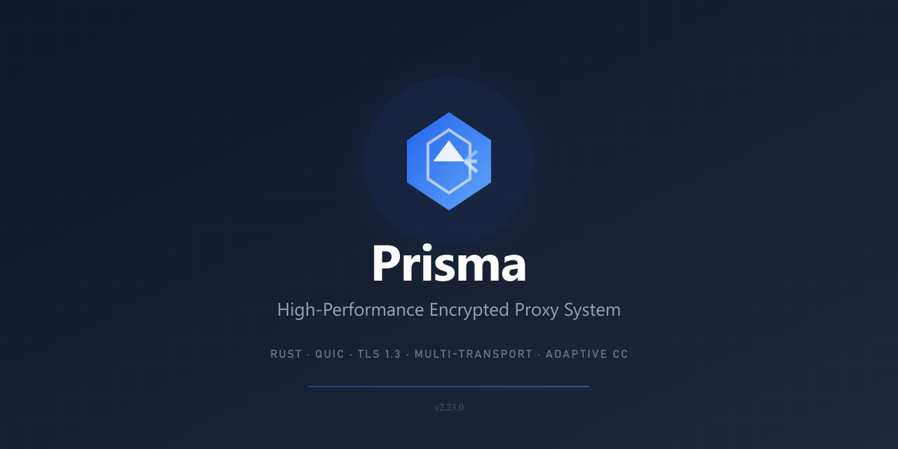

# Prisma

<p align="center">
  
</p>

<p align="center">
  <a href="https://github.com/prisma-proxy/prisma/releases/latest"></a>
  <a href="https://github.com/prisma-proxy/prisma/actions/workflows/ci.yml"></a>
  <a href="https://github.com/prisma-proxy/prisma/blob/master/LICENSE"></a>
</p>

<p align="center">
  <a href="./README_CN.md">简体中文</a> | <strong>English</strong>
</p>

A next-generation encrypted proxy infrastructure suite built in Rust. Prisma implements the **PrismaVeil v5** wire protocol — combining modern cryptography, multiple transport options, and advanced anti-censorship features.

## Highlights

- **PrismaVeil v5 protocol** — 1-RTT handshake, 0-RTT resumption, X25519 + BLAKE3 + ChaCha20/AES-256-GCM/Transport-Only, header-authenticated encryption (AAD), connection migration, enhanced KDF
- **8 transports** — QUIC v2, PrismaTLS, WebSocket, gRPC, XHTTP, XPorta, SSH, WireGuard
- **TUN mode** — system-wide proxy via virtual network interface (Windows/Linux/macOS)
- **GeoIP routing** — country and city-level smart routing via MaxMind MMDB, on both client and server
- **PrismaTLS** — active probing resistance replacing REALITY, with browser fingerprint mimicry + dynamic mask server pool
- **Traffic shaping** — bucket padding, timing jitter, chaff injection, frame coalescing to defeat encapsulated TLS fingerprinting
- **Anti-censorship** — Salamander UDP obfuscation, HTTP/3 masquerade, port hopping, TLS camouflage, entropy camouflage
- **Port forwarding** — frp-style reverse proxy over encrypted tunnels
- **SQLite backend** — users, clients, routing rules, and subscriptions stored in SQLite with automatic migration from TOML
- **Subscription system** — redemption codes (`PRISMA-XXXX`) and invite links for streamlined client onboarding
- **Web console** — real-time dashboard with first-run setup wizard, analytics, client sharing (TOML/URI/QR), multi-server management, routing templates, subscription management, role-based dashboard, config history (Next.js + shadcn/ui)
- **Smart DNS** — fake IP, tunnel, smart (GeoSite), and direct modes
- **CLI tools** — `prisma monitor` (TUI dashboard), `prisma validate` (config checker), `prisma profile new` (interactive wizard), batch client management
- **CLI self-update** — `prisma update` checks GitHub releases and self-replaces the binary
- **Native GUI clients** — Windows (Win32/GDI), Android (Jetpack Compose), iOS (SwiftUI), macOS (menu bar)
- **Cross-platform GUI** — speed test, split tunneling, network diagnostics, connection timeline, QR camera scanner, full backup/restore, system tray (Tauri 2 + React)
- **OpenAPI spec** — full API documentation at `/api/docs/openapi.json` for third-party integration

## Quick Start

### Install

```bash
# Linux / macOS
curl -fsSL https://raw.githubusercontent.com/prisma-proxy/prisma/master/scripts/install.sh | bash -s -- --setup

# Windows (PowerShell)
& ([scriptblock]::Create((irm https://raw.githubusercontent.com/prisma-proxy/prisma/master/scripts/install.ps1))) -Setup
```

The `--setup` flag generates credentials, TLS certificates, and example config files.

The installer also supports these options:

| Option | Description |
|--------|-------------|
| `--version v0.2.1` | Install a specific version |
| `--dir ~/.local/bin` | Custom install directory |
| `--config-dir DIR` | Config output directory for `--setup` |
| `--uninstall` | Remove prisma |
| `--no-verify` | Skip SHA256 checksum verification |
| `--force` | Overwrite existing installation without prompting |
| `--quiet` | Suppress informational output |

Run `install.sh --help` or `install.ps1 -Help` for the full list.

### Run

```bash
# Start server
prisma server -c server.toml

# Start client
prisma client -c client.toml

# Test
curl --socks5 127.0.0.1:1080 https://httpbin.org/ip
```

### Build from source

```bash
git clone https://github.com/prisma-proxy/prisma.git && cd prisma
cargo build --release
```

## Architecture

```
prisma/
├── crates/
│   ├── prisma-core/     # Shared library: crypto, protocol, config, DNS, routing, GeoIP
│   ├── prisma-server/   # Proxy server (TCP, QUIC, CDN inbound)
│   ├── prisma-client/   # Proxy client (SOCKS5, HTTP CONNECT, TUN inbound)
│   ├── prisma-mgmt/     # Management API (REST + WebSocket via axum)
│   ├── prisma-cli/      # CLI: server/client, monitor TUI, config validator, profile wizard
│   └── prisma-ffi/      # C FFI library for GUI clients
├── apps/
│   └── prisma-console/  # Web console (Next.js + shadcn/ui)
├── docs/                # Documentation site (Docusaurus)
├── tools/
│   └── prisma-mcp/      # MCP development server
└── scripts/             # Install scripts and benchmarks
```

> **GUI Client** -- The cross-platform desktop/mobile GUI (Tauri 2 + React) has moved to its own repository: [prisma-proxy/prisma-gui](https://github.com/prisma-proxy/prisma-gui).

## Documentation

Full documentation is available at **[yamimega.github.io/prisma](https://yamimega.github.io/prisma/)**, including:

- [Getting Started](https://yamimega.github.io/prisma/docs/getting-started) — first proxy session walkthrough
- [Installation](https://yamimega.github.io/prisma/docs/installation) — all platforms, Docker, Cargo
- [Server Configuration](https://yamimega.github.io/prisma/docs/configuration/server) — full config reference
- [Client Configuration](https://yamimega.github.io/prisma/docs/configuration/client) — full config reference
- [Routing Rules](https://yamimega.github.io/prisma/docs/features/routing-rules) — client/server routing + GeoIP
- [PrismaTLS](https://yamimega.github.io/prisma/docs/features/prisma-tls) — active probing resistance
- [Traffic Shaping](https://yamimega.github.io/prisma/docs/features/traffic-shaping) — anti-fingerprinting
- [TUN Mode](https://yamimega.github.io/prisma/docs/features/tun-mode) — system-wide proxy setup
- [Config Examples](https://yamimega.github.io/prisma/docs/deployment/config-examples) — 8 ready-to-use templates
- [PrismaVeil Protocol](https://yamimega.github.io/prisma/docs/security/prismaveil-protocol) — wire protocol specification
- [Console](https://yamimega.github.io/prisma/docs/features/console) — web UI setup
- [Management API](https://yamimega.github.io/prisma/docs/features/management-api) — REST/WebSocket API reference
- [GUI Clients](https://yamimega.github.io/prisma/docs/features/gui-clients) — Windows, Android, iOS, macOS apps

## Development

```bash
# Run tests
cargo test --workspace

# Lint
cargo fmt --all -- --check
cargo clippy --workspace -- -D warnings

# Build FFI library
cargo build --release -p prisma-ffi

# Build GUI (separate repo — https://github.com/prisma-proxy/prisma-gui)
# git clone https://github.com/prisma-proxy/prisma-gui.git && cd prisma-gui && npm install && npm run tauri build

# Build console
cd apps/prisma-console && npm ci && npm run build

# Build docs
cd docs && npm install && npm start
```

## License

GPLv3.0
