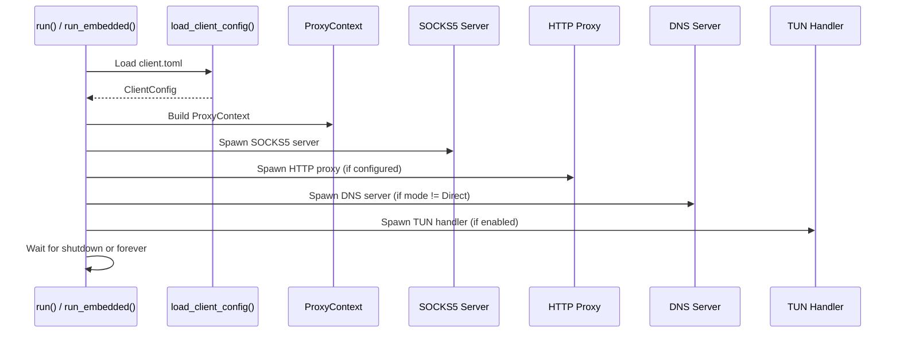
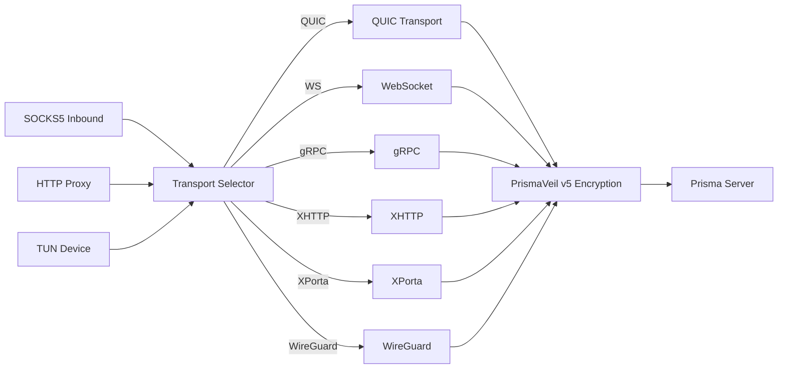

# prisma-client Reference

`prisma-client` is the client-side library crate. It provides SOCKS5 and HTTP proxy inbound handlers, transport selection, TUN mode, connection pooling, DNS resolution, PAC generation, port forwarding, and latency testing.

**Path:** `crates/prisma-client/src/`

---

## Client Startup Flow

---

## Module Map

| Module | Purpose |
|--------|---------|
| `proxy` | `ProxyContext` -- shared context for all proxy connections |
| `socks5` | SOCKS5 server (connect + UDP associate) |
| `http` | HTTP CONNECT proxy server |
| `tunnel` | PrismaVeil tunnel establishment (handshake + keys) |
| `transport_selector` | Select transport based on config |
| `connector` | TCP/TLS connection establishment |
| `relay` | Bidirectional data relay |
| `connection_pool` | Connection pool with XMUX multiplexing |
| `ws_stream` | WebSocket transport |
| `grpc_stream` | gRPC transport |
| `xhttp_stream` | XHTTP transport |
| `xporta_stream` | XPorta transport |
| `ssh_stream` | SSH transport |
| `wg_stream` | WireGuard transport |
| `tun` | TUN device mode |
| `dns_resolver` | DNS resolver (direct, tunnel, DoH) |
| `dns_server` | Local DNS server |
| `forward` | Port forwarding client |
| `latency` | Server latency testing |
| `pac` | PAC file generation and serving |
| `metrics` | Client-side metrics |

---

## Client Architecture

---

## Transport Selection

| Transport | Description |
|-----------|-------------|
| `quic` | QUIC v1/v2 via quinn. ALPN masquerade, congestion control |
| `prisma-tls` | TCP + PrismaTLS (replaces REALITY) |
| `ws` | WebSocket over HTTPS. CDN-compatible |
| `grpc` | gRPC bidirectional streaming. CDN-compatible |
| `xhttp` | HTTP-native chunked transfer. CDN-compatible |
| `xporta` | REST API simulation. CDN-compatible |
| `ssh` | SSH channel tunnel |
| `wireguard` | WireGuard-compatible UDP |

---

## TUN Mode

| Module | Description |
|--------|-------------|
| `tun::device` | Create and configure TUN device |
| `tun::handler` | Read IP packets, proxy through tunnel |
| `tun::process` | Per-app filtering |

Per-app filter config: `{"mode": "include"|"exclude", "apps": ["Firefox"]}`

---

## DNS Modes

| Mode | Behavior |
|------|----------|
| `Direct` | Use system resolver |
| `Tunnel` | Forward through encrypted tunnel |
| `Fake` | Return fake IPs from pool, resolve at server |
| `Smart` | Direct for local, tunnel for others |

---

## Entry Points

| Function | Use Case |
|----------|----------|
| `run(config_path)` | CLI standalone mode |
| `run_embedded(config_path, log_tx, metrics)` | GUI/FFI embedded mode |
| `run_embedded_with_filter(...)` | Embedded + per-app filter + shutdown |
