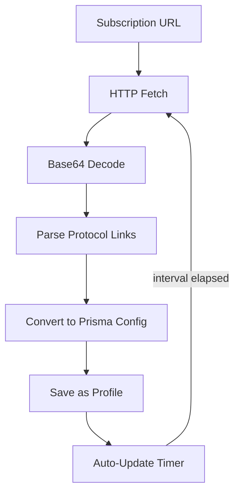

import Tabs from '@theme/Tabs';
import TabItem from '@theme/TabItem';

# GUI Clients

Prisma ships a unified GUI client for all major platforms. **prisma-gui** is a cross-platform **Tauri 2 + React** application that runs on Windows, macOS, Linux, Android, and iOS from a single codebase. Tauri 2's mobile support eliminates the need for separate native apps -- the same Rust backend and React frontend compile to all five targets.

```
prisma-gui  (Tauri 2 + React 19)
    │
    ├── Desktop:  Windows / macOS / Linux   (Tauri desktop targets)
    └── Mobile:   Android / iOS             (Tauri 2 mobile targets)
              │
              └── prisma-ffi  (C-ABI shared library, linked by Tauri mobile shell)
```

---

## prisma-gui (Desktop)

The primary desktop client is a **Tauri 2** application with a **React + TypeScript** frontend. It provides a full-featured GUI for managing Prisma connections across Windows, macOS, and Linux from a single codebase.

### Architecture

```
React (Vite + React Router) ─── Tauri IPC ─── Rust commands ─── prisma-ffi
                                                    │
                                            System tray (desktop)
```

The frontend uses **Zustand** for state management, **Recharts** for graphs, **Radix UI** for components, **react-i18next** for internationalization (English + Simplified Chinese), and **TailwindCSS** for styling.

### Pages

The app has **10 pages** accessible via sidebar navigation (collapsible) or bottom navigation on narrow viewports:

| Page | Description |
|------|-------------|
| **Home** | Connection toggle, real-time speed graph, session stats (upload/download speed, data transferred, uptime), proxy mode selector (SOCKS5/System Proxy/TUN/Per-App), connection quality indicator, daily data usage, connection history |
| **Profiles** | Profile list with search, sort (by name/last used/latency), per-profile metrics (latency, total data, session count, peak speed). Create/edit via a 5-step wizard (Connection, Auth, Transport, Routing & TUN, Review). Share profiles as TOML, prisma:// URI, or QR code. Import from QR or JSON file. Duplicate and bulk export/import. **Latency testing** — tap a server to run a real-time latency test; results are displayed inline and persisted for sorting |
| **Subscriptions** | Manage subscription URLs that auto-update server profiles. Add/edit/delete subscriptions with custom update intervals (1h-7d). Manual refresh, auto-refresh on launch, import from clipboard or QR. Subscription status indicators (last updated, server count, expiry date). Supports Prisma, Clash, and base64 subscription formats |
| **Proxy Groups** | Visual proxy group manager matching the [Routing Rules](/docs/features/routing-rules#proxy-groups-v090) configuration. Create Select/AutoUrl/Fallback/LoadBalance groups. Drag-and-drop server ordering. Real-time latency indicators per server. Manual server selection for Select groups. URL test configuration for AutoUrl/Fallback groups |
| **Import** | Unified import page for adding servers and profiles from multiple sources: QR code scan (camera on mobile, paste on desktop), `prisma://` URI, clipboard detection, TOML file, JSON file, subscription URL, and Clash YAML. Batch import with preview and selective add |
| **Connections** | Real-time active connections list showing destination, rule matched, proxy chain, upload/download speed, and total data per connection. Close individual connections. Filter by domain, IP, or rule. Sort by speed, data, or duration. Connection metadata (start time, transport, matched routing rule) |
| **Rules** | Routing rules editor with DOMAIN, IP-CIDR, GEOIP, and FINAL rule types. Actions: PROXY, DIRECT, REJECT, or proxy group name. Import/export rules as JSON. Rule provider management (add remote rule set URLs) |
| **Logs** | Real-time log viewer with virtualized scrolling, search with text highlighting, level filter (ALL/ERROR/WARN/INFO/DEBUG), level statistics badges, pause/resume auto-scroll, export to text file |
| **Speed Test** | Run speed tests through the proxy with configurable server (Cloudflare/Google) and duration (5-60s). Measures download, upload, and latency. Persistent test history with list and chart views, summary statistics (average/best) |
| **Settings** | Language (English/Chinese), theme (system/light/dark), start on boot, minimize to tray, proxy ports (HTTP/SOCKS5), DNS settings (direct/tunnel/fake-IP/smart), auto-reconnect with configurable delay and max attempts, data management (export/import settings and full backups), auto-update check and install |

### Subscription flow

The subscription system automatically fetches and updates server profiles from remote URLs:



### System tray integration

On desktop platforms, prisma-gui displays a **system tray icon** with the following features:

- **Status-aware icon** — changes between disconnected, connecting, and connected states
- **Connect/Disconnect toggle** — quick connect/disconnect from the tray menu
- **Profile switcher** — submenu listing all profiles, with the active profile marked
- **Copy Proxy Address** — copies the local proxy address to clipboard
- **Live tooltip** — shows real-time upload/download speeds (e.g., "Prisma Up: 1.2 MB/s Down: 4.5 MB/s")
- **Show Window / Quit** — standard window management actions

### Keyboard shortcuts

All shortcuts use `Cmd` (macOS) or `Ctrl` (Windows/Linux) as the modifier:

| Shortcut | Action |
|----------|--------|
| `Mod+1` through `Mod+6` | Navigate to Home, Profiles, Rules, Logs, Speed Test, Settings |
| `Mod+K` | Toggle connect/disconnect |
| `Mod+N` | Go to Profiles page |

### Connection management

- **Proxy modes** — selectable on the Home page: SOCKS5, System Proxy, TUN, Per-App (toggle multiple simultaneously)
- **Auto-reconnect** — configurable in Settings with retry delay (seconds) and maximum attempts
- **Connection history** — records connect/disconnect events with profile name, latency, session data transferred, and timestamps
- **Connection quality indicator** — real-time signal quality (Excellent/Good/Fair/Poor) based on speed stability
- **Daily data usage tracking** — persistent per-day upload/download tracking with automatic 90-day pruning

### Notifications

- **Status bar** — persistent bar at the bottom showing connection status, live speed/data stats, and toast notifications
- **Notification history** — bell icon with unread badge; click to view full notification history with timestamps and severity levels (error, warning, success, info)
- **Desktop notifications** — via Tauri notification plugin

### Clipboard import

When the app window gains focus, it automatically checks the clipboard for `prisma://` URIs and prompts the user to import the detected profile.

### Build

```bash
cd apps/prisma-gui

# Development
npm run dev
npm run tauri dev

# Production
npm run tauri build
# Output: platform-specific installer (MSI, DMG, AppImage, deb)
```

### Installation

Download the appropriate installer for your platform from the [releases page](https://github.com/Yamimega/prisma/releases/latest):

- **Windows**: `prisma-gui_x.y.z_x64-setup.exe` or `.msi`
- **macOS**: `prisma-gui_x.y.z_aarch64.dmg` or `_x64.dmg`
- **Linux**: `.AppImage`, `.deb`, or `.rpm`

---

## Feature comparison

| Feature | prisma-gui (Desktop) | Android | iOS |
|---------|---------------------|---------|-----|
| SOCKS5 proxy | ✓ | ✓ | ✓ |
| System proxy | ✓ | ✓ | — |
| TUN mode | ✓ | ✓ (VPN) | ✓ (NEPacketTunnel) |
| Per-app proxy | ✓ | ✓ | ✓ (NEAppProxy) |
| QR code import | ✓ (paste URI) | ✓ (camera) | ✓ (camera) |
| Profile sharing (TOML/URI/QR) | ✓ | ✓ | ✓ |
| Subscriptions | ✓ | ✓ | ✓ |
| Proxy groups | ✓ | ✓ | ✓ |
| Unified import page | ✓ | ✓ | ✓ |
| Active connections view | ✓ | ✓ | ✓ |
| Latency testing (server list) | ✓ | ✓ | ✓ |
| Speed graph | ✓ | ✓ | ✓ |
| Speed test with history | ✓ | ✓ | ✓ |
| Routing rules editor | ✓ | ✓ | ✓ |
| Rule providers (remote sets) | ✓ | ✓ | ✓ |
| Auto-update | ✓ | ✓ | App Store |
| System tray / menu bar | ✓ | — | — |
| Keyboard shortcuts | ✓ | — | — |
| Clipboard import | ✓ | ✓ | ✓ |
| Auto-reconnect | ✓ | ✓ | ✓ |
| Notification history | ✓ | ✓ | ✓ |
| i18n (English + Chinese) | ✓ | ✓ | ✓ |
| Full backup/restore | ✓ | ✓ | ✓ |
| Connection history | ✓ | ✓ | ✓ |
| Daily data usage tracking | ✓ | ✓ | ✓ |

---

## prisma-ffi

All GUI clients link against `prisma-ffi`, a `cdylib`/`staticlib` crate that exposes the complete Prisma client API over a stable C ABI. The header is at `crates/prisma-ffi/include/prisma_ffi.h`.

### Key functions

```c
// Lifecycle
PrismaHandle* prisma_create(void);
void          prisma_destroy(PrismaHandle* h);

// Connection
int  prisma_connect(PrismaHandle* h, const char* config_json, uint32_t modes);
int  prisma_disconnect(PrismaHandle* h);
int  prisma_get_status(PrismaHandle* h);

// Events (stats, logs, status changes — delivered as JSON)
void prisma_set_callback(PrismaHandle* h, PrismaCallbackFn cb, void* userdata);

// Profiles
char* prisma_profiles_list_json(void);
int   prisma_profile_save(const char* json);
int   prisma_profile_delete(const char* id);
void  prisma_free_string(char* s);

// QR
char* prisma_profile_to_qr_svg(const char* profile_json);
int   prisma_profile_from_qr(const char* data, char** out_json);

// System proxy
int prisma_set_system_proxy(const char* host, uint16_t port);
int prisma_clear_system_proxy(void);

// Auto-update
char* prisma_check_update_json(void);
int   prisma_apply_update(const char* url, const char* sha256);
```

### Mode flags

| Flag | Value | Description |
|------|-------|-------------|
| `PRISMA_MODE_SOCKS5` | `0x01` | Start local SOCKS5 listener on 127.0.0.1:1080 |
| `PRISMA_MODE_SYSTEM_PROXY` | `0x02` | Configure OS system proxy |
| `PRISMA_MODE_TUN` | `0x04` | Create TUN/VPN interface |
| `PRISMA_MODE_PER_APP` | `0x08` | Per-app routing (Android/iOS only) |

### Event JSON

The callback receives JSON events:

```json
// Status change
{"type":"status_changed","status":"connected"}

// Stats (delivered every 1s while connected)
{"type":"stats","bytes_up":1024,"bytes_down":4096,
 "speed_up_bps":512,"speed_down_bps":2048,"uptime_secs":60}

// Log entry
{"type":"log","level":"INFO","target":"prisma_client","msg":"Connected to server"}

// Update available
{"type":"update_available","version":"1.5.0","changelog":"..."}
```

### Building prisma-ffi

```bash
# Desktop (produces prisma_ffi.dll / libprisma_ffi.so / libprisma_ffi.dylib)
cargo build --release -p prisma-ffi

# Android targets (requires Android NDK)
cargo build --release -p prisma-ffi --target aarch64-linux-android
cargo build --release -p prisma-ffi --target armv7-linux-androideabi
cargo build --release -p prisma-ffi --target x86_64-linux-android

# iOS / macOS (on macOS with Xcode)
cargo build --release -p prisma-ffi --target aarch64-apple-ios
cargo build --release -p prisma-ffi --target aarch64-apple-darwin
```

---

## Mobile Support (Tauri 2)

As of v2.0.0, **prisma-gui** uses **Tauri 2 mobile targets** for Android and iOS. There are no longer separate native apps (`prisma-gui-android`, `prisma-gui-ios`). The same Tauri 2 + React codebase compiles to mobile targets, with `prisma-ffi` linked as the native backend through Tauri's mobile shell.

Mobile builds have full feature parity with the desktop client, including subscriptions, proxy groups, the unified import page, active connections view, latency testing, rule providers, and full i18n (English + Chinese).

### Mobile build targets

```bash
cd apps/prisma-gui

# Android (requires Android SDK + NDK)
npm run tauri android init
npm run tauri android dev
npm run tauri android build

# iOS (requires Xcode on macOS)
npm run tauri ios init
npm run tauri ios dev
npm run tauri ios build
```

### Platform-specific behavior

| Feature | Android | iOS |
|---------|---------|-----|
| VPN / TUN | `VpnService` via Tauri plugin | `NEPacketTunnelProvider` via Tauri plugin |
| Per-app proxy | `VpnService.Builder.addAllowedApplication()` | `NEAppProxyProvider` |
| System proxy | `VpnService.Builder.setHttpProxy()` | Not available |
| QR code import | Camera scan | Camera scan |
| Auto-update | In-app update | App Store |

### Proxy modes

| Mode | Android mechanism | iOS mechanism |
|------|-------------------|---------------|
| SOCKS5 | Direct SOCKS5 listener on 127.0.0.1:1080 | Direct SOCKS5 listener on 127.0.0.1:1080 |
| System Proxy | `ProxyInfo` set via `VpnService.Builder.setHttpProxy()` | -- |
| TUN | `VpnService.Builder.establish()` | `NEPacketTunnelProvider` |
| Per-App | `VpnService.Builder.addAllowedApplication()` | `NEAppProxyProvider` |

---

## Profile sharing via QR code

All clients support importing profiles by scanning a QR code. The QR payload is a `prisma://` URI where the path is the base64-encoded profile JSON:

```
prisma://<base64(profile_json)>
```

To generate a QR code from an existing profile JSON:

```bash
# Using the CLI
prisma profile export --id <id> --qr
# Outputs an SVG QR code to stdout

# Programmatically via FFI
char* svg = prisma_profile_to_qr_svg(profile_json);
```

---

## Troubleshooting

### prisma-gui: System proxy fails

Setting the system proxy requires platform-specific permissions. On macOS, the app calls `networksetup` which may prompt for administrator credentials. On Linux, system proxy configuration depends on your desktop environment.

### prisma-gui: Tray icon not visible

On Linux, system tray support depends on your desktop environment and compositor. Ensure a compatible system tray implementation (e.g., `libappindicator`) is installed. On GNOME, you may need the AppIndicator extension.

### Mobile: VPN permission denied

On Android, the system VPN consent dialog must be accepted. On iOS, the Network Extension entitlement must be configured in the Apple Developer portal and included in the provisioning profile.
