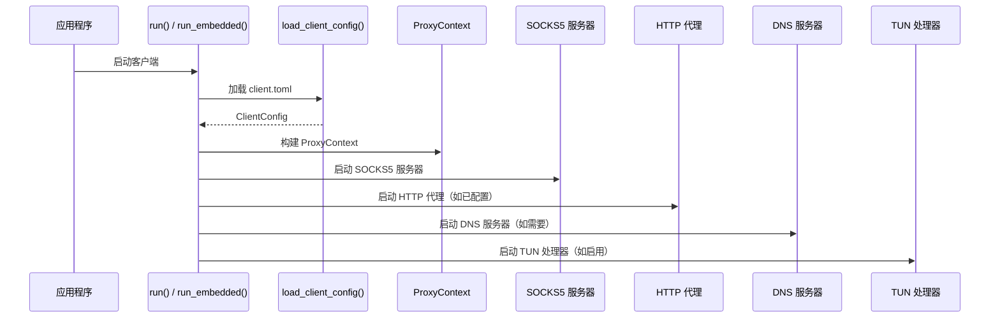
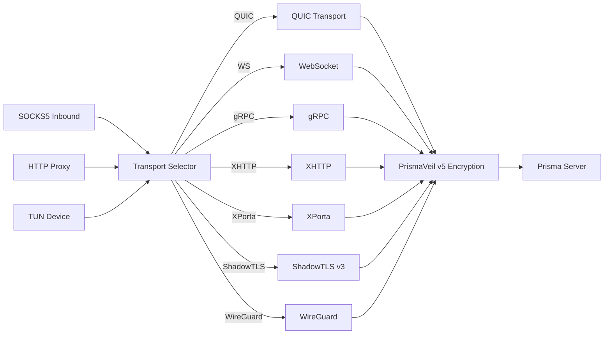

# prisma-client 参考

`prisma-client` 是客户端库 crate。提供 SOCKS5 和 HTTP 代理入站处理器、传输选择、TUN 模式、连接池、DNS 解析、PAC 生成、端口转发和延迟测试。

**路径：** `crates/prisma-client/src/`

---

## 客户端启动和连接流程



---

## 模块列表

| 模块 | 用途 |
|------|------|
| `proxy` | `ProxyContext` -- 所有代理连接的共享上下文 |
| `socks5` | SOCKS5 服务器实现（连接 + UDP 关联） |
| `http` | HTTP CONNECT 代理服务器 |
| `tunnel` | 建立 PrismaVeil 隧道（握手 + 密钥交换） |
| `transport_selector` | 根据配置选择和创建传输连接 |
| `connector` | 底层 TCP/TLS 连接建立 |
| `connection_pool` | 带 XMUX 多路复用的连接池 |
| `tun` | TUN 设备模式：设备创建、数据包处理、分应用过滤 |
| `dns_resolver` | DNS 解析器（直连、隧道、DoH） |
| `dns_server` | 本地 DNS 服务器 |
| `forward` | 端口转发客户端 |
| `latency` | 服务端延迟测试 |
| `pac` | PAC 文件生成和服务 |

---

## 客户端架构



---

## 传输选择

| 传输 | 描述 |
|------|------|
| `quic` | QUIC v1/v2（默认），支持 ALPN 伪装、拥塞控制 |
| `prisma-tls` | TCP + PrismaTLS（替代 REALITY） |
| `ws` | WebSocket over HTTPS，CDN 兼容 |
| `grpc` | gRPC 双向流，CDN 兼容 |
| `xhttp` | HTTP 原生分块传输，CDN 兼容 |
| `xporta` | REST API 模拟，CDN 兼容 |
| `shadow-tls` | ShadowTLS v3，真实 TLS 握手 |
| `ssh` | SSH 通道隧道 |
| `wireguard` | WireGuard 兼容 UDP 隧道 |

---

## TUN 模式

通过虚拟网络接口提供透明代理：

| 模块 | 描述 |
|------|------|
| `tun::device` | 创建和配置 TUN 设备 |
| `tun::handler` | 从 TUN 读取 IP 数据包，提取 TCP/UDP 流，通过隧道代理 |
| `tun::process` | 分应用过滤：`AppFilter`、`AppFilterConfig` |

**分应用过滤配置：**

```json
{"mode": "include", "apps": ["Firefox", "Chrome"]}
```

- `include` -- 仅列出的应用通过代理
- `exclude` -- 除列出的应用外都通过代理

---

## DNS 解析和服务

| 模式 | 行为 |
|------|------|
| `Direct` | 使用系统 DNS 解析器 |
| `Tunnel` | 通过加密隧道转发所有 DNS 查询 |
| `Fake` | 从地址池返回假 IP（默认 `198.18.0.0/15`），在服务端解析 |
| `Smart` | 本地/私有域名直连，其他通过隧道 |

---

## 客户端入口点

| 函数 | 用途 | 描述 |
|------|------|------|
| `run(config_path)` | CLI | 独立模式，自行设置日志 |
| `run_embedded(config_path, log_tx, metrics)` | GUI/FFI | 嵌入模式，使用广播日志和共享指标 |
| `run_embedded_with_filter(...)` | GUI/FFI | 嵌入模式 + 分应用过滤 + 关闭信号 |
