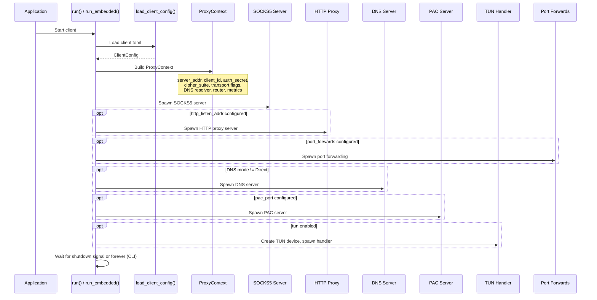

# prisma-client Reference

`prisma-client` is the client-side library crate. It provides SOCKS5 and HTTP proxy inbound handlers, transport selection, TUN mode, connection pooling, DNS resolution, PAC generation, port forwarding, and latency testing.

**Path:** `prisma-client/src/`

---

## Client Startup and Connection Flow



---

## Module Map

| Module | Path | Purpose |
|--------|------|---------|
| `proxy` | `proxy.rs` | `ProxyContext` -- shared context for all proxy connections |
| `socks5` | `socks5/` | SOCKS5 server implementation (connect + UDP associate) |
| `http` | `http/` | HTTP CONNECT proxy server |
| `tunnel` | `tunnel.rs` | Establish PrismaVeil tunnel (handshake + key exchange) |
| `transport_selector` | `transport_selector.rs` | Select and create transport connection based on config |
| `connector` | `connector.rs` | Low-level TCP/TLS connection establishment |
| `relay` | `relay.rs` | Bidirectional data relay |
| `connection_pool` | `connection_pool.rs` | Connection pool with XMUX multiplexing |
| `ws_stream` | `ws_stream.rs` | WebSocket transport stream |
| `grpc_stream` | `grpc_stream.rs` | gRPC transport stream |
| `xhttp_stream` | `xhttp_stream.rs` | XHTTP transport stream |
| `xporta_stream` | `xporta_stream.rs` | XPorta transport stream |
| `shadow_tls_stream` | `shadow_tls_stream.rs` | ShadowTLS v3 transport stream |
| `ssh_stream` | `ssh_stream.rs` | SSH transport stream |
| `wg_stream` | `wg_stream.rs` | WireGuard transport stream |
| `tun` | `tun/` | TUN device mode: device creation, packet handler, per-app filter |
| `dns_resolver` | `dns_resolver.rs` | DNS resolver (direct, tunnel, DoH) |
| `dns_server` | `dns_server.rs` | Local DNS server for Fake/Tunnel/Smart modes |
| `forward` | `forward.rs` | Port forwarding client |
| `latency` | `latency.rs` | Server latency testing |
| `pac` | `pac.rs` | PAC file generation and serving |
| `metrics` | `metrics.rs` | Client-side metrics collection |
| `udp_relay` | `udp_relay.rs` | UDP relay client |

---

## Proxy Flow

### SOCKS5 (`socks5/server.rs`)

1. Accept TCP connection on `socks5_listen_addr`
2. Perform SOCKS5 handshake (auth negotiation, command parsing)
3. For `CONNECT` command:
   - Extract destination address and port
   - Evaluate routing rules (`Router::evaluate`)
   - If `Direct`: connect directly to destination
   - If `Block`: reject with SOCKS5 error
   - If `Proxy`: select transport, establish tunnel, relay data
4. For `UDP ASSOCIATE`: set up UDP relay through the tunnel

### HTTP (`http/server.rs`)

1. Accept TCP connection on `http_listen_addr`
2. Parse HTTP `CONNECT` request
3. Send `200 Connection Established`
4. Follow the same routing / transport / relay flow as SOCKS5

---

## Transport Selection

The `transport_selector` module creates the appropriate transport connection based on the `transport` config field:

| Transport | Module | Description |
|-----------|--------|-------------|
| `quic` | `connector.rs` | QUIC v1/v2 via quinn. Supports ALPN masquerade, congestion control (BBR/Brutal/Adaptive) |
| `prisma-tls` | `connector.rs` | TCP + PrismaTLS (replaces REALITY). Padding-beacon authentication |
| `ws` | `ws_stream.rs` | WebSocket over HTTPS. CDN-compatible. Supports custom headers |
| `grpc` | `grpc_stream.rs` | gRPC bidirectional streaming over HTTPS. CDN-compatible |
| `xhttp` | `xhttp_stream.rs` | HTTP-native chunked transfer. CDN-compatible |
| `xporta` | `xporta_stream.rs` | REST API simulation. CDN-compatible. Looks like normal API traffic |
| `shadow-tls` | `shadow_tls_stream.rs` | ShadowTLS v3. Real TLS handshake with cover server |
| `ssh` | `ssh_stream.rs` | SSH channel tunnel |
| `wireguard` | `wg_stream.rs` | WireGuard-compatible UDP tunnel |

All transports implement `AsyncRead + AsyncWrite` and are pluggable via the `transport_selector`.

---

## Connection Pool and XMUX

`connection_pool.rs` provides connection reuse with optional XMUX multiplexing:

- **Pool size:** Configurable number of idle connections
- **Health checks:** Periodic pings to keep connections alive
- **XMUX:** When enabled, multiplexes multiple proxy requests over a single transport connection using `MuxSession` from `prisma-core::mux`
- **Automatic reconnection:** Failed connections are removed from the pool and re-established

---

## Latency Testing

`latency.rs` provides server latency measurement:

| Type | Description |
|------|-------------|
| `ServerInfo` | Server name + address |
| `LatencyTestConfig` | Timeout, retry count, concurrency |
| `LatencyResult` | Name, address, latency_ms, success, error |

| Function | Description |
|----------|-------------|
| `test_all_servers(servers, config) -> Vec<LatencyResult>` | Test all servers concurrently, return sorted by latency |

---

## TUN Mode

`tun/` provides transparent proxy via a virtual network interface:

| Module | Description |
|--------|-------------|
| `tun::device` | Create and configure TUN device. Sets up routes based on `include_routes` and `exclude_routes` |
| `tun::handler` | Read IP packets from TUN, extract TCP/UDP flows, proxy through the Prisma tunnel |
| `tun::process` | Per-app filtering: `AppFilter`, `AppFilterConfig`, `list_running_apps()` |

**`AppFilterConfig` (JSON):**

```json
{"mode": "include", "apps": ["Firefox", "Chrome"]}
```

- `include` -- only listed apps go through the proxy
- `exclude` -- everything except listed apps goes through the proxy

**TUN configuration fields:**

| Field | Type | Default | Description |
|-------|------|---------|-------------|
| `enabled` | `bool` | `false` | Enable TUN mode |
| `device_name` | `String` | `"utun9"` | TUN device name |
| `mtu` | `u16` | `1500` | Maximum Transmission Unit |
| `include_routes` | `Vec<String>` | `[]` | CIDRs to route through the tunnel |
| `exclude_routes` | `Vec<String>` | `[]` | CIDRs to exclude from the tunnel |

---

## DNS Resolver and Server

### DnsResolver (`dns_resolver.rs`)

Resolves DNS queries using the configured mode:

| Mode | Behavior |
|------|----------|
| `Direct` | Use system DNS resolver |
| `Tunnel` | Forward all DNS queries through the encrypted tunnel (`CMD_DNS_QUERY` / `CMD_DNS_RESPONSE`) |
| `Fake` | Return fake IPs from a pool (default `198.18.0.0/15`), resolve at server side |
| `Smart` | Direct for local/private/matching domains, tunnel for everything else |

### DNS Server (`dns_server.rs`)

Local UDP DNS server (port from config, default 53). Receives queries from the system or TUN and resolves them using the configured `DnsResolver`. Required for Fake, Tunnel, and Smart modes.

---

## PAC Server

`pac.rs` generates and serves Proxy Auto-Configuration files:

| Function | Description |
|----------|-------------|
| `generate_pac(rules, proxy_directive, default_action) -> String` | Generate PAC JavaScript from routing rules |
| `build_proxy_directive(socks5_addr, http_addr) -> String` | Build the `PROXY` / `SOCKS` directive string |
| `serve_pac(addr, content) -> Result<()>` | Serve PAC file over HTTP at `/proxy.pac` |

---

## Port Forwarding Client

`forward.rs` manages port forwarding from local services through the tunnel:

1. For each configured forward: send `CMD_REGISTER_FORWARD` to server
2. Wait for `CMD_FORWARD_READY` acknowledgment
3. When `CMD_FORWARD_CONNECT` arrives: open local connection, relay data
4. Supports dynamic add/remove via `ForwardControl` channel

| Type | Description |
|------|-------------|
| `ForwardControl` | Enum: `Add(config)`, `Remove(port)` |
| `ForwardManager` | Manages forward lifecycle with control channel |
| `PortForwardConfig` | Config: `name`, `local_addr`, `remote_port`, `enabled` |

| Function | Description |
|----------|-------------|
| `run_port_forwards(ctx, forwards) -> Result<()>` | Start all configured port forwards |
| `global_forward_manager() -> Option<Arc<ForwardManager>>` | Get the global manager (for FFI dynamic add/remove) |
| `get_forward_metrics_json() -> String` | Get JSON metrics for all active forwards |

---

## Client Metrics

`metrics.rs` provides `ClientMetrics` for tracking:

- Bytes uploaded / downloaded
- Active connection count
- Connection duration
- Per-destination stats

Shared with the FFI layer for GUI display.

---

## Client Entry Points

| Function | Use Case | Description |
|----------|----------|-------------|
| `run(config_path)` | CLI | Standalone mode. Sets up its own logging |
| `run_embedded(config_path, log_tx, metrics)` | GUI/FFI | Embedded mode. Uses broadcast logging and shared metrics |
| `run_embedded_with_filter(config_path, log_tx, metrics, app_filter, shutdown)` | GUI/FFI | Embedded with per-app filter and graceful shutdown signal |

The `TaskGuard` struct ensures all spawned service tasks (SOCKS5, HTTP, TUN, DNS, PAC, forwards) are aborted when the client stops, preventing leaked background work.
