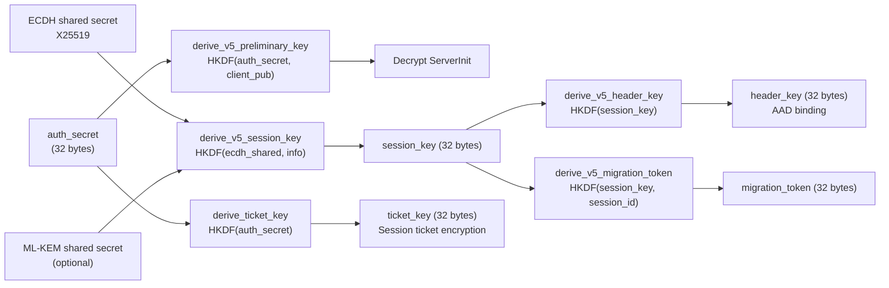
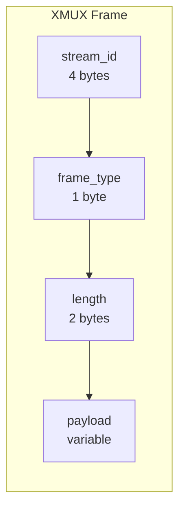

# prisma-core Reference

`prisma-core` is the shared foundation library used by every other crate in the workspace. It provides cryptography, the PrismaVeil v5 protocol, configuration parsing, routing, DNS, multiplexing, access control, proxy groups, subscriptions, import parsers, and common types.

**Path:** `prisma-core/src/`

---

## Module Map

| Module | Path | Purpose |
|--------|------|---------|
| `crypto` | `crypto/` | AEAD ciphers, KDF, ECDH, PQ-KEM, padding, ticket key ring |
| `protocol` | `protocol/` | PrismaVeil handshake, codec, frame types, anti-replay |
| `config` | `config/` | Client and server config parsing, validation |
| `router` | `router/` | Rule-based routing engine |
| `dns` | `dns/` | DNS modes, DoH resolver, Fake IP |
| `mux` | `mux.rs` | XMUX stream multiplexing |
| `acl` | `acl.rs` | Access control lists |
| `proxy_group` | `proxy_group.rs` | Proxy group manager |
| `subscription` | `subscription.rs` | Subscription fetch and parse |
| `rule_provider` | `rule_provider.rs` | External rule provider manager |
| `import` | `import/` | URI parsers (SS/VMess/Trojan/VLESS/Prisma) |
| `buffer_pool` | `buffer_pool.rs` | Pooled buffer allocator |
| `state` | `state.rs` | Server state, metrics, connection tracking |
| `shadow_tls` | `shadow_tls.rs` | ShadowTLS v3 protocol |
| `wireguard` | `wireguard.rs` | WireGuard packet format |
| `types` | `types.rs` | Protocol constants, CipherSuite, ClientId, ProxyAddress |
| `bandwidth` | `bandwidth/` | Rate limiter, traffic quota |
| `util` | `util.rs` | Hex encoding, constant-time equality, auth token computation |
| `congestion` | `congestion/` | Congestion control modes (BBR, Brutal, Adaptive) |
| `entropy` | `entropy.rs` | Entropy camouflage for GFW evasion |
| `fec` | `fec.rs` | Forward Error Correction (Reed-Solomon) |
| `geodata` | `geodata/` | GeoIP database loading and matching |
| `cache` | `cache.rs` | DNS cache |
| `logging` | `logging.rs` | Logging initialization with broadcast support |
| `port_hop` | `port_hop.rs` | HMAC-based port hopping |
| `traffic_shaping` | `traffic_shaping.rs` | Chaff, jitter, coalescing |
| `prisma_auth` | `prisma_auth/` | PrismaAuth authentication extensions |
| `prisma_flow` | `prisma_flow/` | PrismaFlow traffic analysis resistance |
| `prisma_fp` | `prisma_fp/` | Browser fingerprint mimicry |
| `prisma_mask` | `prisma_mask/` | Entropy camouflage masks |
| `salamander` | `salamander.rs` | Salamander v2 UDP obfuscation |
| `utls` | `utls/` | uTLS fingerprinting support |
| `xporta` | `xporta/` | XPorta REST API simulation transport |
| `error` | `error.rs` | Unified error types |
| `proto` | `proto/` | Protobuf definitions (gRPC) |

---

## crypto -- Cryptography

### crypto::aead

AEAD cipher abstraction layer supporting multiple cipher suites.

**Key types:**

| Type | Description |
|------|-------------|
| `AeadCipher` (trait) | Trait for authenticated encryption: `encrypt(nonce, plaintext, aad) -> ciphertext`, `decrypt(nonce, ciphertext, aad) -> plaintext` |
| `ChaCha20Poly1305Cipher` | ChaCha20-Poly1305 implementation (default cipher) |
| `Aes256GcmCipher` | AES-256-GCM implementation |
| `TransportOnlyCipher` | BLAKE3 keyed MAC for integrity only (no encryption); safe when the transport already provides confidentiality (TLS/QUIC) |

**Key functions:**

| Function | Signature | Description |
|----------|-----------|-------------|
| `create_cipher` | `fn create_cipher(suite: CipherSuite, key: &[u8; 32]) -> Box<dyn AeadCipher>` | Factory function that creates the appropriate cipher from a suite enum and key |

### crypto::kdf

Key derivation functions using HKDF-SHA256 with domain-separated labels.

**Key functions:**

| Function | Description |
|----------|-------------|
| `derive_v5_preliminary_key(auth_secret, client_pub) -> [u8; 32]` | Derives the key used to encrypt the ServerInit message. Uses HKDF-SHA256 with domain label `"prisma-v5-preliminary"` |
| `derive_v5_session_key(ecdh_shared, pq_shared, info) -> [u8; 32]` | Derives the session key from ECDH (and optionally PQ-KEM) shared secrets. Domain label `"prisma-v5-session"` |
| `derive_v5_header_key(session_key) -> [u8; 32]` | Derives the header authentication key from the session key. Domain label `"prisma-v5-header-auth"` |
| `derive_v5_migration_token(session_key, session_id) -> [u8; 32]` | Derives a connection migration token for seamless reconnection. Domain label `"prisma-v5-migration"` |
| `derive_ticket_key(auth_secret) -> [u8; 32]` | Derives the key used to encrypt session tickets for 0-RTT resumption |

### crypto::ecdh

X25519 ephemeral key exchange.

| Type | Description |
|------|-------------|
| `EphemeralKeyPair` | Generates an X25519 keypair and computes shared secrets |

| Function | Description |
|----------|-------------|
| `EphemeralKeyPair::generate() -> Self` | Generate a new random X25519 keypair |
| `EphemeralKeyPair::public_key_bytes() -> [u8; 32]` | Get the public key bytes |
| `EphemeralKeyPair::diffie_hellman(peer_public: &[u8; 32]) -> [u8; 32]` | Compute the ECDH shared secret |

### crypto::pq_kem

Hybrid post-quantum key exchange using ML-KEM-768 (Kyber).

| Type | Description |
|------|-------------|
| `MlKemKeypair` | ML-KEM-768 keypair containing encapsulation key (`ek_bytes`: 1184 bytes) and decapsulation key |

| Function | Description |
|----------|-------------|
| `generate_mlkem_keypair() -> MlKemKeypair` | Generate a new ML-KEM-768 keypair |
| `encapsulate(ek_bytes: &[u8]) -> (Vec<u8>, [u8; 32])` | Encapsulate to produce ciphertext (1088 bytes) and shared secret (32 bytes) |
| `decapsulate(keypair: &MlKemKeypair, ciphertext: &[u8]) -> [u8; 32]` | Decapsulate to recover the shared secret |

### crypto::ticket_key_ring

Automatic session ticket key rotation for 0-RTT resumption.

| Type | Description |
|------|-------------|
| `TicketKeyRing` | Manages active and retired ticket keys with automatic rotation |

| Method | Description |
|--------|-------------|
| `TicketKeyRing::new(initial_key, rotation_interval, retain_count) -> Self` | Create with initial key, rotation period (default 6h), and number of retired keys to retain (default 3) |
| `current_key() -> [u8; 32]` | Get the active encryption key |
| `try_decrypt(data) -> Option<Vec<u8>>` | Try decrypting with the current key, then retired keys |

### crypto::padding

| Function | Description |
|----------|-------------|
| `generate_padding(max_len: usize) -> Vec<u8>` | Generate random padding bytes up to `max_len` |
| `generate_padding_range(range: PaddingRange) -> Vec<u8>` | Generate padding within a configured min/max range |

---

## protocol -- PrismaVeil v5

See the dedicated [Protocol Reference](./protocol) for full wire format details.

### protocol::types

**Constants -- Command bytes:**

| Constant | Value | Direction | Description |
|----------|-------|-----------|-------------|
| `CMD_CONNECT` | `0x01` | C->S | Open a proxy connection to a destination |
| `CMD_DATA` | `0x02` | Both | Relay data |
| `CMD_CLOSE` | `0x03` | Both | Close a stream |
| `CMD_PING` | `0x04` | Both | Keepalive ping |
| `CMD_PONG` | `0x05` | Both | Keepalive pong |
| `CMD_REGISTER_FORWARD` | `0x06` | C->S | Register a port forward |
| `CMD_FORWARD_READY` | `0x07` | S->C | Acknowledge a port forward |
| `CMD_FORWARD_CONNECT` | `0x08` | S->C | New inbound connection on a forwarded port |
| `CMD_UDP_ASSOCIATE` | `0x09` | C->S | Set up UDP relay |
| `CMD_UDP_DATA` | `0x0A` | Both | UDP datagram |
| `CMD_SPEED_TEST` | `0x0B` | Both | Bandwidth measurement |
| `CMD_DNS_QUERY` | `0x0C` | C->S | Encrypted DNS query |
| `CMD_DNS_RESPONSE` | `0x0D` | S->C | Encrypted DNS response |
| `CMD_CHALLENGE_RESP` | `0x0E` | C->S | Challenge-response verification |
| `CMD_MIGRATION` | `0x0F` | C->S | Connection migration request (v5) |

**Constants -- Flag bits (2-byte little-endian):**

| Constant | Value | Description |
|----------|-------|-------------|
| `FLAG_PADDED` | `0x0001` | Frame contains random padding |
| `FLAG_FEC` | `0x0002` | Frame includes FEC data |
| `FLAG_PRIORITY` | `0x0004` | High-priority frame |
| `FLAG_DATAGRAM` | `0x0008` | UDP datagram mode |
| `FLAG_COMPRESSED` | `0x0010` | Payload is compressed |
| `FLAG_0RTT` | `0x0020` | 0-RTT resumed frame |
| `FLAG_BUCKETED` | `0x0040` | Bucket padding (anti-TLS fingerprinting) |
| `FLAG_CHAFF` | `0x0080` | Chaff traffic (dummy) |
| `FLAG_HEADER_AUTHENTICATED` | `0x0100` | Header bound as AAD in encryption (v5) |
| `FLAG_MIGRATION` | `0x0200` | Carries migration token (v5) |

**Constants -- Server feature flags:**

| Constant | Value | Description |
|----------|-------|-------------|
| `FEATURE_UDP_RELAY` | `0x0001` | UDP relay support |
| `FEATURE_FEC` | `0x0002` | Forward Error Correction |
| `FEATURE_PORT_HOPPING` | `0x0004` | HMAC-based port hopping |
| `FEATURE_SPEED_TEST` | `0x0008` | Speed test support |
| `FEATURE_DNS_TUNNEL` | `0x0010` | Encrypted DNS tunnel |
| `FEATURE_BANDWIDTH_LIMIT` | `0x0020` | Per-client bandwidth limits |
| `FEATURE_TRANSPORT_ONLY_CIPHER` | `0x0040` | Transport-only cipher mode |
| `FEATURE_EXTENDED_ANTI_REPLAY` | `0x0080` | 2048-bit anti-replay window (v5) |
| `FEATURE_V5_KDF` | `0x0100` | v5 key derivation with domain separation (v5) |
| `FEATURE_HEADER_AUTH` | `0x0200` | Header-authenticated encryption (v5) |
| `FEATURE_CONNECTION_MIGRATION` | `0x0400` | Connection migration tokens (v5) |
| `FEATURE_PQ_KEM` | `0x0800` | Hybrid post-quantum key exchange (v5) |

**Key types:**

| Type | Description |
|------|-------------|
| `PrismaClientInit` | Client hello: version, flags, ephemeral public key, client ID, timestamp, cipher suite, auth token, optional ML-KEM encap key, padding |
| `PrismaServerInit` | Server hello: status, session ID, ephemeral public key, challenge, padding range, server features, session ticket, bucket sizes, optional PQ ciphertext |
| `PrismaClientResume` | 0-RTT resumption message: version, flags, ephemeral public key, session ticket, encrypted 0-RTT data |
| `SessionTicket` | Opaque ticket: client ID, session key, cipher suite, issued timestamp, padding range |
| `DataFrame` | Wire frame: command, 2-byte flags, 4-byte stream ID |
| `SessionKeys` | Post-handshake keys: session key, cipher suite, session ID, nonce counters, padding range, challenge, ticket, header key, migration token |
| `AtomicNonceCounter` | Lock-free atomic nonce counter for high-throughput relay |
| `Command` | Enum of all command variants (Connect, Data, Close, Ping, Pong, RegisterForward, ForwardReady, ForwardConnect, UdpAssociate, UdpData, SpeedTest, DnsQuery, DnsResponse, ChallengeResponse, Migration) |
| `AcceptStatus` | Handshake result: Ok, AuthFailed, ServerBusy, VersionMismatch, QuotaExceeded |

### protocol::handshake

State machine for the PrismaVeil 2-step handshake.

| Type | Description |
|------|-------------|
| `AuthVerifier` (trait) | Server-side auth callback: `verify(client_id, auth_token, timestamp) -> bool` |
| `PrismaHandshakeClient` | Client handshake state machine |
| `PrismaClientAwaitingServerInit` | Intermediate state after ClientInit is sent |
| `PrismaHandshakeServer` | Server handshake state machine |

**Client flow:**

1. `PrismaHandshakeClient::new(client_id, auth_secret, cipher)` -- create state machine
2. `.with_pq_kem()` -- optionally enable hybrid PQ key exchange
3. `.start() -> (PrismaClientAwaitingServerInit, Vec<u8>)` -- generate ClientInit bytes
4. `awaiting.finish(server_init_bytes) -> Result<SessionKeys>` -- process ServerInit, derive keys

**Server flow:**

1. `PrismaHandshakeServer::new(auth_verifier, ticket_key_ring)` -- create state machine
2. `.process(client_init_bytes) -> Result<(PrismaServerInit, SessionKeys)>` -- verify auth, generate ServerInit, derive keys

### protocol::codec

Wire format encoding and decoding functions.

| Function | Description |
|----------|-------------|
| `encode_client_init(msg) -> Vec<u8>` | Encode PrismaClientInit to wire bytes |
| `decode_client_init(data) -> Result<PrismaClientInit>` | Decode PrismaClientInit from wire bytes |
| `encode_server_init(msg) -> Vec<u8>` | Encode PrismaServerInit to plaintext bytes (encrypted with preliminary key by handshake) |
| `decode_server_init(data) -> Result<PrismaServerInit>` | Decode PrismaServerInit from plaintext bytes |
| `encode_data_frame(frame) -> Vec<u8>` | Encode a DataFrame to plaintext bytes |
| `decode_data_frame(data) -> Result<DataFrame>` | Decode a DataFrame from plaintext bytes |
| `encrypt_frame(cipher, nonce, plaintext) -> Result<Vec<u8>>` | Encrypt a frame with AEAD |
| `decrypt_frame(cipher, ciphertext) -> Result<(Vec<u8>, [u8; 12])>` | Decrypt a frame, extracting the nonce |

### protocol::anti_replay

Bloom filter-based anti-replay protection.

| Type | Description |
|------|-------------|
| `AntiReplayFilter` | Time-windowed Bloom filter that rejects duplicate nonces. Standard window: 60 seconds. Extended window (v5): 2048-bit filter |

### protocol::frame_encoder

High-level frame encoder that applies padding, bucket padding, FEC, and compression.

---

## config -- Configuration

### config::server (`ServerConfig`)

All server configuration fields parsed from `server.toml`:

| Field | Type | Default | Description |
|-------|------|---------|-------------|
| `listen_addr` | `String` | `"0.0.0.0:8443"` | TCP listener address |
| `quic_listen_addr` | `String` | `"0.0.0.0:8443"` | QUIC listener address |
| `authorized_clients` | `Vec<AuthorizedClient>` | `[]` | List of authorized client credentials |
| `tls` | `Option<TlsConfig>` | `None` | TLS certificate and key paths |
| `logging` | `LoggingConfig` | level=info, format=text | Logging configuration |
| `management_api` | `ManagementApiConfig` | disabled | Management API settings |
| `camouflage` | `CamouflageConfig` | disabled | TLS camouflage settings |
| `cdn` | `CdnConfig` | disabled | CDN/WebSocket/gRPC/XHTTP listener |
| `shadow_tls` | `ShadowTlsConfig` | disabled | ShadowTLS v3 listener |
| `ssh` | `SshConfig` | disabled | SSH transport listener |
| `wireguard` | `WireGuardConfig` | disabled | WireGuard-compatible UDP listener |
| `prisma_tls` | `PrismaTlsConfig` | disabled | PrismaTLS (replaces REALITY) |
| `routing` | `RoutingConfig` | empty | Server-side routing rules |
| `config_watch` | `bool` | `false` | Auto-reload config on file change |
| `ticket_rotation_hours` | `u64` | `6` | Session ticket key rotation interval |

**`AuthorizedClient` fields:**

| Field | Type | Description |
|-------|------|-------------|
| `id` | `String` | Client UUID |
| `auth_secret` | `String` | 32-byte hex-encoded shared secret |
| `name` | `String` | Human-readable client name |
| `enabled` | `bool` | Whether the client is active |
| `bandwidth_up` | `Option<String>` | Upload bandwidth limit (e.g., `"100mbps"`) |
| `bandwidth_down` | `Option<String>` | Download bandwidth limit |
| `quota` | `Option<String>` | Traffic quota (e.g., `"10gb"`) |

### config::client (`ClientConfig`)

All client configuration fields parsed from `client.toml`:

| Field | Type | Default | Description |
|-------|------|---------|-------------|
| `server_addr` | `String` | required | Server address (host:port) |
| `socks5_listen_addr` | `String` | `"127.0.0.1:1080"` | SOCKS5 proxy listen address |
| `http_listen_addr` | `Option<String>` | `None` | HTTP proxy listen address |
| `transport` | `String` | `"quic"` | Transport: quic, prisma-tls, ws, grpc, xhttp, xporta, shadow-tls, wireguard |
| `identity` | `IdentityConfig` | required | Client ID and auth secret |
| `cipher_suite` | `String` | `"chacha20-poly1305"` | Cipher suite |
| `tls_on_tcp` | `bool` | `false` | Enable TLS on TCP transport |
| `skip_cert_verify` | `bool` | `false` | Skip TLS certificate verification |
| `tls_server_name` | `Option<String>` | `None` | TLS SNI override |
| `alpn_protocols` | `Vec<String>` | `["h2"]` | ALPN protocols |
| `ws_url` | `Option<String>` | `None` | WebSocket URL path |
| `ws_extra_headers` | `HashMap` | `{}` | Extra WebSocket headers |
| `grpc_url` | `Option<String>` | `None` | gRPC service URL |
| `xhttp_mode` | `Option<String>` | `None` | XHTTP mode |
| `user_agent` | `Option<String>` | `None` | Custom User-Agent header |
| `referer` | `Option<String>` | `None` | Custom Referer header |
| `dns` | `DnsConfig` | direct mode | DNS configuration |
| `routing` | `ClientRoutingConfig` | empty | Client-side routing rules |
| `tun` | `TunConfig` | disabled | TUN mode configuration |
| `pac_port` | `Option<u16>` | `None` | PAC server port |
| `port_forwards` | `Vec<PortForwardConfig>` | `[]` | Port forwarding rules |
| `congestion` | `CongestionConfig` | default | Congestion control settings |
| `port_hopping` | `Option<PortHoppingConfig>` | `None` | Port hopping settings |
| `salamander_password` | `Option<String>` | `None` | Salamander UDP obfuscation password |
| `udp_fec` | `FecConfig` | disabled | Forward Error Correction |
| `traffic_shaping` | `Option<TrafficShapingConfig>` | `None` | Traffic shaping settings |
| `fingerprint` | `String` | `"chrome"` | Browser fingerprint to mimic |
| `quic_version` | `String` | `"v2"` | QUIC version (v1 or v2) |
| `protocol_version` | `String` | `"v5"` | Protocol version |
| `server_key_pin` | `Option<String>` | `None` | Server public key pin for TOFU |
| `shadow_tls` | `Option<ShadowTlsClientConfig>` | `None` | ShadowTLS client settings |
| `wireguard` | `Option<WireGuardClientConfig>` | `None` | WireGuard client settings |
| `xporta` | `Option<XPortaClientConfig>` | `None` | XPorta client settings |

### config::validation

| Function | Description |
|----------|-------------|
| `validate_server_config(config) -> Result<Vec<Warning>>` | Validate a server config, returning warnings for non-fatal issues |
| `validate_client_config(config) -> Result<Vec<Warning>>` | Validate a client config |

---

## router -- Rule-Based Routing

The router evaluates rules in priority order and returns an action for each connection.

| Type | Description |
|------|-------------|
| `Router` | The routing engine, holds a sorted list of rules |
| `RuleCondition` | Enum: `DomainExact(String)`, `DomainMatch(pattern)`, `DomainKeyword(keyword)`, `IpCidr(prefix)`, `GeoIp(country_code)`, `PortRange(start, end)`, `Port(u16)`, `All` |
| `RouteAction` | Enum: `Proxy`, `Direct`, `Block` |
| `RoutingRule` | A rule: condition + action + priority + optional name |

| Method | Description |
|--------|-------------|
| `Router::new(rules) -> Self` | Create a router with rules |
| `Router::with_geoip(rules, geoip_matcher) -> Self` | Create with GeoIP database support |
| `Router::evaluate(destination) -> RouteAction` | Evaluate rules for a destination, returning the first matching action (default: `Proxy`) |

---

## dns -- DNS Resolution

### dns::DnsMode

| Mode | Description |
|------|-------------|
| `Direct` | Use system DNS resolver directly |
| `Fake` | Assign fake IPs from a pool, resolve later via the tunnel |
| `Tunnel` | Forward all DNS queries through the encrypted tunnel |
| `Smart` | Direct for local domains, tunnel for everything else |

### dns::doh

DNS-over-HTTPS resolver.

### dns::fake_ip

Fake IP pool manager. Assigns IPs from a configurable range (default `198.18.0.0/15`) and maintains a bidirectional mapping between fake IPs and domain names.

---

## mux -- XMUX Stream Multiplexing

Multiplexes multiple proxy requests over a single transport connection.

**Constants:**

| Constant | Value | Description |
|----------|-------|-------------|
| `MUX_HEADER_SIZE` | `7` | Header size: stream_id(4) + type(1) + length(2) |
| `MUX_MAX_PAYLOAD` | `32768` | Maximum payload per frame |
| `MUX_SYN` | `0x01` | Open a new stream |
| `MUX_DATA` | `0x02` | Stream data |
| `MUX_FIN` | `0x03` | Close stream gracefully |
| `MUX_RST` | `0x04` | Reset stream (error) |

**Key types:**

| Type | Description |
|------|-------------|
| `MuxFrame` | A single frame: `stream_id`, `frame_type`, `payload`. Methods: `encode() -> Vec<u8>`, `decode(reader) -> Result<Self>` |
| `MuxStream` | A multiplexed stream with `rx` channel and `writer` handle. Methods: `read() -> Option<Vec<u8>>`, `write(data)`, `close()` |
| `MuxWriter` | Shared writer for sending frames. Thread-safe via `Arc<Mutex<W>>` |
| `MuxSession` | Client-side session: opens new streams, tracks active streams |
| `MuxDemuxer` | Server-side demuxer: accepts incoming streams, routes frames |

---

## acl -- Access Control Lists

| Type | Description |
|------|-------------|
| `AclStore` | Thread-safe store of per-client ACL rules |
| `AclRule` | A rule with condition, action (allow/deny), and priority |

| Method | Description |
|--------|-------------|
| `AclStore::check(client_id, destination) -> AclAction` | Check if a destination is allowed for a client. Returns `Allow` or `Deny` |
| `AclStore::set_rules(client_id, rules)` | Set ACL rules for a client |
| `AclStore::remove(client_id)` | Remove all rules for a client |

---

## proxy_group -- Proxy Group Manager

| Type | Description |
|------|-------------|
| `ProxyGroupManager` | Manages named groups of proxy servers |
| `ProxyGroupConfig` | Configuration for a group: name, type, servers, settings |
| `GroupType` | Enum: `Select` (manual), `UrlTest` (auto-select by latency), `Fallback`, `LoadBalance` |

| Method | Description |
|--------|-------------|
| `ProxyGroupManager::new(configs) -> Self` | Create from configs |
| `list() -> Vec<GroupInfo>` | List all groups with current selections |
| `select(group, server) -> bool` | Manually select a server in a group |
| `test_group(group) -> Option<Vec<LatencyResult>>` | Test latency to all servers in a group |

---

## subscription -- Subscription Management

| Function | Description |
|----------|-------------|
| `fetch_subscription(url) -> Result<Vec<ImportedServer>>` | Fetch and parse a subscription URL (supports base64 and JSON formats) |

---

## rule_provider -- External Rule Providers

| Type | Description |
|------|-------------|
| `RuleProviderManager` | Manages external rule sources with auto-update |

Supports formats: domain lists, IP-CIDR lists, classical rules.

---

## import -- URI Parsers

Parses proxy URIs into `ImportedServer` structs.

| Module | Description |
|--------|-------------|
| `import::ss` | `ss://` Shadowsocks URI parser |
| `import::vmess` | `vmess://` VMess URI parser (base64 JSON) |
| `import::trojan` | `trojan://` Trojan URI parser |
| `import::vless` | `vless://` VLESS URI parser |
| `import::prisma` | `prisma://` native Prisma URI parser |

| Function | Description |
|----------|-------------|
| `import_uri(uri) -> Result<ImportedServer>` | Auto-detect scheme and parse a single URI |
| `import_batch(text) -> Vec<Result<ImportedServer>>` | Parse multiple URIs from text (line-separated or base64) |

---

## buffer_pool -- Pooled Buffer Allocator

| Type | Description |
|------|-------------|
| `BufferPool` | Thread-safe pool of reusable byte buffers to reduce allocation pressure |
| `PooledBuffer` | RAII guard that returns the buffer to the pool on drop |

---

## state -- Server State

| Type | Description |
|------|-------------|
| `ServerState` | Central server state: config, auth store, active connections, metrics, routing rules, log/metrics broadcast channels |
| `AuthStoreInner` | Client credentials and settings loaded from config |
| `ConnectionInfo` | Per-connection metadata: client ID, session ID, destination, start time, bytes transferred |
| `MetricsSnapshot` | Point-in-time metrics: active connections, total bytes, uptime, per-client stats |
| `LogEntry` | Structured log entry for broadcast to management API |

| Function | Description |
|----------|-------------|
| `ServerState::new(config, auth, log_tx, metrics_tx) -> Self` | Create new server state |
| `metrics_ticker(state) -> impl Future` | Background task that broadcasts MetricsSnapshot every second |

---

## types -- Common Types

| Constant | Value | Description |
|----------|-------|-------------|
| `PRISMA_PROTOCOL_VERSION` | `0x05` | Current protocol version |
| `MAX_FRAME_SIZE` | `32768` | Maximum encrypted frame size |
| `NONCE_SIZE` | `12` | AEAD nonce size |
| `MAX_PADDING_SIZE` | `256` | Maximum padding bytes |
| `PRISMA_QUIC_ALPN` | `"h3"` | QUIC ALPN protocol |
| `SESSION_TICKET_KEY_SIZE` | `32` | Ticket encryption key size |
| `SESSION_TICKET_MAX_AGE_SECS` | `86400` | Ticket max age (24 hours) |

| Type | Description |
|------|-------------|
| `ClientId` | Wraps a UUID v4 identifying a client |
| `CipherSuite` | Enum: `ChaCha20Poly1305` (0x01, default), `Aes256Gcm` (0x02), `TransportOnly` (0x03) |
| `ProxyAddress` | Enum: `Ipv4(Ipv4Addr)`, `Ipv6(Ipv6Addr)`, `Domain(String)` |
| `ProxyDestination` | Address + port |
| `PaddingRange` | Configurable min/max padding range |

---

## bandwidth -- Rate Limiting and Quotas

### bandwidth::limiter

| Type | Description |
|------|-------------|
| `BandwidthLimiterStore` | Thread-safe store of per-client rate limiters |
| `BandwidthLimit` | Upload and download limits in bits per second |

### bandwidth::quota

| Type | Description |
|------|-------------|
| `QuotaStore` | Thread-safe store of per-client traffic quotas |

| Function | Description |
|----------|-------------|
| `parse_bandwidth(s) -> Option<u64>` | Parse human-readable bandwidth (e.g., `"100mbps"`) to bits/sec |
| `parse_quota(s) -> Option<u64>` | Parse human-readable quota (e.g., `"10gb"`) to bytes |

---

## util -- Utilities

| Function | Description |
|----------|-------------|
| `hex_decode_32(hex) -> Result<[u8; 32]>` | Decode a 64-character hex string to 32 bytes |
| `hex_encode(bytes) -> String` | Encode bytes to hex string |
| `ct_eq(a, b) -> bool` | Constant-time equality comparison |
| `compute_auth_token(secret, client_id, timestamp) -> [u8; 32]` | Compute HMAC-BLAKE3 auth token for handshake |
