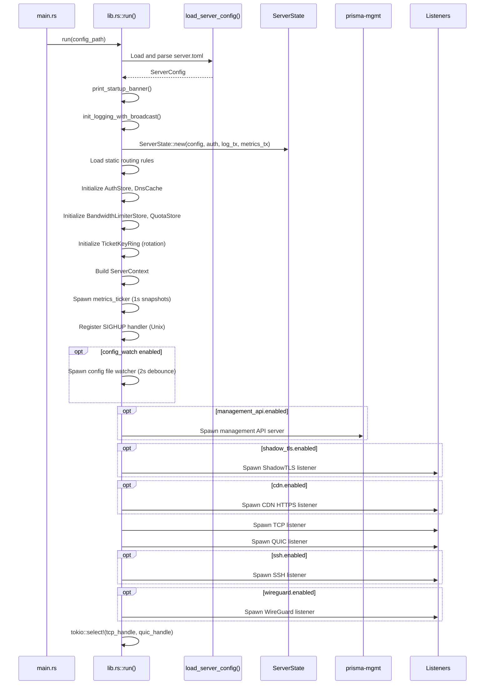
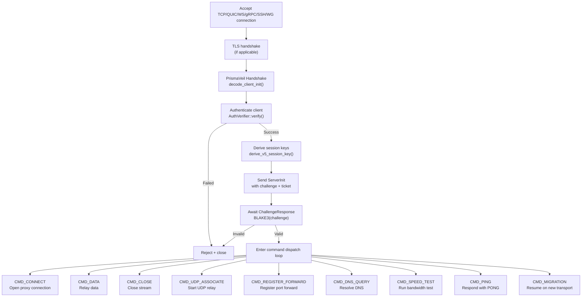

# prisma-server Reference

`prisma-server` is the server-side binary crate. It accepts encrypted connections from clients over multiple transport protocols, authenticates them, and relays traffic to the internet.

**Path:** `prisma-server/src/`

---

## Startup Sequence

---

## Module Map

| Module | Path | Purpose |
|--------|------|---------|
| `listener::tcp` | `listener/tcp.rs` | TCP listener: accept, TLS handshake, dispatch to handler |
| `listener::quic` | `listener/quic.rs` | QUIC listener: quinn-based, H3 ALPN masquerade |
| `listener::cdn` | `listener/cdn.rs` | CDN HTTPS listener: WS/gRPC/XHTTP/XPorta multiplexing |
| `listener::ws_tunnel` | `listener/ws_tunnel.rs` | WebSocket tunnel upgrade |
| `listener::grpc_tunnel` | `listener/grpc_tunnel.rs` | gRPC tunnel service |
| `listener::xhttp` | `listener/xhttp.rs` | XHTTP (HTTP-native) transport |
| `listener::xporta` | `listener/xporta.rs` | XPorta (REST API simulation) transport |
| `listener::shadowtls` | `listener/shadowtls.rs` | ShadowTLS v3 listener |
| `listener::ssh` | `listener/ssh.rs` | SSH transport listener |
| `listener::wireguard` | `listener/wireguard.rs` | WireGuard-compatible UDP listener |
| `listener::reality` | `listener/reality.rs` | PrismaTLS / REALITY listener |
| `listener::h3_masquerade` | `listener/h3_masquerade.rs` | HTTP/3 masquerade for QUIC |
| `listener::reverse_proxy` | `listener/reverse_proxy.rs` | Reverse proxy for camouflage fallback |
| `handler` | `handler.rs` | Main connection handler pipeline |
| `auth` | `auth.rs` | Authentication store and verification |
| `relay` | `relay.rs` | Bidirectional data relay |
| `relay_uring` | `relay_uring.rs` | io_uring-based relay (Linux) |
| `mux_handler` | `mux_handler.rs` | XMUX multiplexed connection handler |
| `forward` | `forward.rs` | Port forward system: registration, listeners, mux |
| `udp_relay` | `udp_relay.rs` | UDP relay handler |
| `outbound` | `outbound.rs` | Outbound connection establishment |
| `camouflage` | `camouflage.rs` | TLS camouflage (website cloning) |
| `reload` | `reload.rs` | Hot-reload: config diff, apply changes |
| `state` | `state.rs` | ServerContext wrapping ServerState with bandwidth/quota stores |
| `bandwidth` | `bandwidth/` | Server-side bandwidth limiter and quota enforcement |
| `ws_stream` | `ws_stream.rs` | WebSocket stream adapter |
| `grpc_stream` | `grpc_stream.rs` | gRPC stream adapter |
| `xhttp_stream` | `xhttp_stream.rs` | XHTTP stream adapter |
| `xporta_stream` | `xporta_stream.rs` | XPorta stream adapter |
| `channel_stream` | `channel_stream.rs` | Channel-based async stream adapter |

---

## Connection Handler Pipeline

### Handler Details

**`handler::handle_connection`** is the main entry point for all connection types. It:

1. Reads and decodes the PrismaClientInit message
2. Verifies the client's auth token against the AuthStore
3. Performs ECDH key exchange (and optionally PQ-KEM)
4. Sends the PrismaServerInit (encrypted with preliminary key)
5. Derives the session key, header key, and migration token
6. Enters the main command dispatch loop
7. Tracks the connection in ServerState for management API visibility
8. Enforces bandwidth limits and traffic quotas per frame
9. Updates metrics (bytes transferred, connection count)

---

## Listener Types

### TCP Listener (`listener::tcp`)

Accepts raw TCP connections. When `tls_on_tcp` is enabled, performs a TLS handshake (rustls) before handing off to the handler. Supports PrismaTLS for stealth.

### QUIC Listener (`listener::quic`)

Quinn-based QUIC listener. Supports QUIC v1 and v2 (RFC 9369). Uses H3 ALPN (`"h3"`) for DPI evasion. Each QUIC stream is handled independently.

### CDN Listener (`listener::cdn`)

HTTPS listener that multiplexes multiple transport protocols based on the request path:

- **WebSocket** (`/ws` or configured path): Upgrades to WebSocket tunnel
- **gRPC** (`/grpc` or configured path): gRPC bidirectional streaming
- **XHTTP** (`/xhttp` or configured path): HTTP-native chunked streaming
- **XPorta** (`/api` or configured path): REST API simulation

Falls back to reverse proxy or camouflage for unrecognized requests.

### ShadowTLS Listener (`listener::shadowtls`)

Implements ShadowTLS v3 protocol. Performs a real TLS handshake with a legitimate server (e.g., `www.microsoft.com`), then hijacks the connection for Prisma data.

### SSH Listener (`listener::ssh`)

SSH transport: tunnels Prisma protocol inside SSH channel data.

### WireGuard Listener (`listener::wireguard`)

WireGuard-compatible UDP listener. Encapsulates Prisma protocol inside WireGuard packet format.

---

## Relay Modes

| Mode | Module | Description |
|------|--------|-------------|
| Encrypted | `relay.rs` | Standard bidirectional relay with per-frame encryption/decryption |
| Transport-only | `relay.rs` | BLAKE3 MAC integrity check only, no encryption (for TLS/QUIC transports) |
| Splice | `relay.rs` | Zero-copy splice on Linux with `splice(2)` syscall |
| io_uring | `relay_uring.rs` | Linux io_uring-based relay for maximum throughput |

All relay modes enforce bandwidth limits and track bytes transferred for quota accounting.

---

## Forward System

The port forward system allows clients to expose local services through the server.

1. **Registration:** Client sends `CMD_REGISTER_FORWARD` with remote port, name, protocol, and ACL
2. **Server listener:** Server opens a listener on the requested port
3. **Inbound connection:** When a third party connects, server sends `CMD_FORWARD_CONNECT` to the client
4. **Data relay:** Client opens a local connection and relays data through the tunnel
5. **Multiplexing:** Multiple forwards share the same tunnel using stream IDs

---

## Reload System

Config hot-reload can be triggered by:

1. **SIGHUP signal** (Unix only): Caught by a signal handler
2. **Management API:** `POST /api/reload`
3. **File watcher:** Automatic detection of config file changes (2-second debounce)

The reload process (`reload::reload_config`):

1. Loads and validates the new config
2. Diffs against the current config
3. Applies changes atomically:
   - Updates authorized clients (add/remove/modify)
   - Updates bandwidth limits and quotas
   - Updates routing rules
   - Updates logging level
4. Returns a summary of what changed

---

## Graceful Shutdown

The server runs TCP and QUIC listeners in a `tokio::select!` loop. When either exits (signal, error), the runtime drops all spawned tasks. Active connections receive TCP RST or QUIC CONNECTION_CLOSE.
