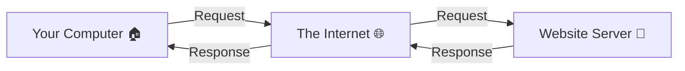
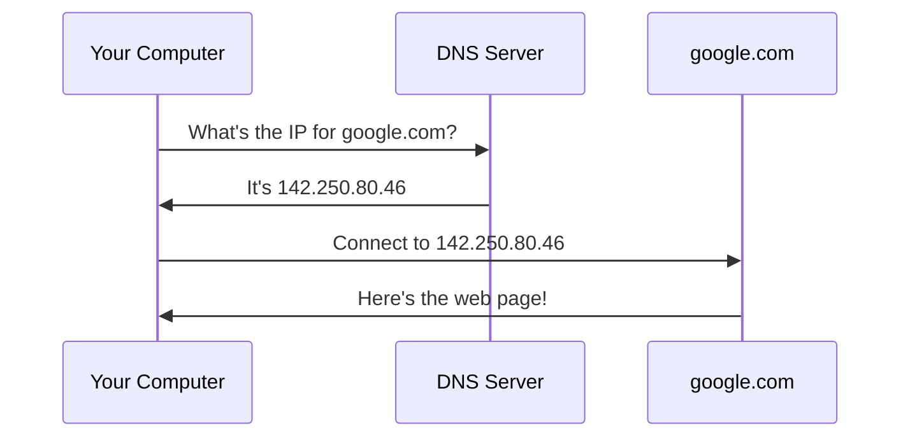
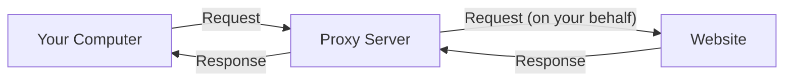
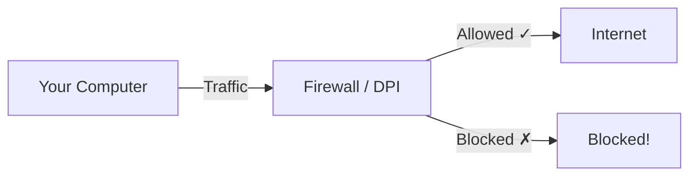

# Understanding the Basics

Before we set up Prisma, let's understand some fundamental concepts about how the internet works. Don't worry -- we will use simple analogies and diagrams to explain everything.

## What is the Internet?

The internet is a giant network of computers connected together. When you visit a website, your computer talks to another computer (called a **server**) somewhere in the world, and that server sends back the web page you see.

Think of it like the postal system:

> Your computer is your **home**. Websites live in big **office buildings** (servers). When you want to see a website, you send a **letter** (a request) to that office building, and they send a **package** back with the web page.



## What is an IP Address?

Every device on the internet has a unique address called an **IP address** (Internet Protocol address). It is like a home address for your computer.

An IP address looks like this: `192.168.1.100` or `203.0.113.45`

> **Analogy:** Think of IP addresses like postal addresses. Just as every house has a unique street address (e.g., 123 Main Street), every device on the internet has a unique IP address. Without it, data wouldn't know where to go.

There are two types:
- **Public IP** -- Your address on the internet (assigned by your ISP). Websites can see this.
- **Private IP** -- Your address on your home network (like `192.168.x.x`). Only devices on your local network can see this.

## What is a Domain Name?

Nobody wants to remember numbers like `142.250.80.46`. That's where **domain names** come in. A domain name is a human-friendly name for a website.

| Domain Name | IP Address |
|-------------|-----------|
| google.com | 142.250.80.46 |
| github.com | 140.82.121.4 |

> **Analogy:** Domain names are like **contact names in your phone**. Instead of memorizing your friend's phone number (the IP address), you just tap their name (the domain).

## What is DNS?

DNS stands for **Domain Name System**. It is the service that translates domain names into IP addresses.

When you type `google.com` in your browser:
1. Your computer asks a DNS server: "What is the IP address of google.com?"
2. The DNS server replies: "It's 142.250.80.46"
3. Your computer connects to that IP address



> **Analogy:** DNS is like a **phone book**. You look up a person's name (domain) and find their phone number (IP address).

## What is a Port?

A single server can run many services at once -- a website, email, file sharing, etc. **Ports** are like apartment numbers in a building. The IP address gets you to the building, and the port number tells you which apartment (service) you want.

Common ports:
| Port | Service |
|------|---------|
| 80 | HTTP (websites, unencrypted) |
| 443 | HTTPS (websites, encrypted) |
| 22 | SSH (remote server access) |
| 1080 | SOCKS5 proxy (used by Prisma client) |

> **Analogy:** If an IP address is a **building address**, a port is the **apartment number**. "123 Main Street, Apartment 443" means "connect to this server, using the HTTPS service."

A full address looks like: `203.0.113.45:443` (IP address **:** port number)

## What is a Protocol?

A **protocol** is a set of rules for how computers communicate. Just like people need to speak the same language to understand each other, computers need to use the same protocol.

> **Analogy:** Protocols are like **languages**. English, Spanish, and Mandarin are protocols for human communication. HTTP, TCP, and QUIC are protocols for computer communication.

Some common protocols:
- **TCP** -- Reliable, ordered delivery (like registered mail -- you know it arrived)
- **UDP** -- Fast but no guarantees (like tossing a note across the room -- faster but might get lost)
- **HTTP** -- How web browsers talk to web servers
- **HTTPS** -- HTTP but encrypted (the "S" stands for "Secure")

## What is HTTP and HTTPS?

**HTTP** (HyperText Transfer Protocol) is the protocol your browser uses to load web pages.

**HTTPS** is the secure version. The "S" stands for Secure. When you see the padlock icon in your browser's address bar, that means the connection is using HTTPS.

```
http://example.com    ← NOT encrypted (anyone can read your data)
https://example.com   ← Encrypted (data is protected)
```

:::warning
Even with HTTPS, your ISP can still see **which websites** you visit (the domain names). They just can't see **what you do** on those websites. A proxy like Prisma hides even the domain names.
:::

## What is Encryption?

**Encryption** is the process of scrambling data so that only the intended recipient can read it.

> **Analogy:** Imagine writing a letter in a **secret code** that only you and your friend know. Even if the mailman reads the letter, they would see only gibberish. That is encryption.

```
Original:    "Hello, how are you?"
Encrypted:   "7f3a9b2c1d8e4f6a0b5c..."
```

Without the **key** (the secret code), the encrypted data is meaningless. Prisma uses state-of-the-art encryption (the same kind used by banks and governments) to protect your data.

## What is a Proxy?

A **proxy** is a middleman between your computer and the internet. Instead of connecting directly to a website, your computer connects to the proxy, and the proxy connects to the website for you.



Why use a proxy?

1. **Privacy** -- The website sees the proxy's IP address, not yours
2. **Access** -- If a website is blocked on your network, the proxy can reach it for you
3. **Security** -- An encrypted proxy (like Prisma) protects your data in transit

> **Analogy:** A proxy is like asking a friend to **pick up a package for you**. The store sees your friend, not you. And if your friend puts the package in a locked bag, nobody can see what's inside during the trip.

## What is the Difference Between a VPN and a Proxy?

Both VPNs and proxies route your traffic through another server, but they work differently:

| Feature | Proxy (like Prisma) | VPN |
|---------|-------------------|-----|
| What it covers | Specific apps (or all traffic with TUN mode) | Usually all traffic |
| Encryption | Application-level (Prisma adds its own) | Tunnel-level |
| Speed | Usually faster | Can be slower |
| Detection | Harder to detect (especially Prisma) | Often detectable |
| Flexibility | More transport options | Usually one protocol |

Prisma is technically a proxy, but with TUN mode enabled, it can work like a VPN and cover all your traffic. The key advantage of Prisma is that its traffic is **much harder to detect and block** compared to traditional VPNs.

## What is a Firewall / DPI?

A **firewall** is a system that monitors and controls network traffic. Think of it like a security guard at a building entrance -- it checks who comes in and out and can block certain people.

**DPI** (Deep Packet Inspection) is a more advanced technique. Instead of just checking the "envelope" (where traffic is going), DPI looks **inside the envelope** to see what kind of data is being sent.



Some networks use DPI to:
- Block VPN protocols
- Throttle (slow down) certain types of traffic
- Censor specific websites

This is where Prisma shines. Prisma is designed to **look like normal web traffic** to firewalls and DPI systems. Its traffic is almost impossible to distinguish from regular HTTPS browsing.

## Putting It All Together

Now you understand the building blocks:

1. Your computer has an **IP address** (its address on the internet)
2. Websites have **domain names** (human-friendly names)
3. **DNS** translates domain names to IP addresses
4. **Ports** identify specific services on a computer
5. **Protocols** are the languages computers speak
6. **HTTPS** encrypts web traffic, but your ISP still sees which sites you visit
7. A **proxy** acts as a middleman to add privacy
8. **Encryption** scrambles data so only the intended recipient can read it
9. **Firewalls and DPI** try to inspect and control your traffic
10. **Prisma** defeats all of this by creating an encrypted, undetectable tunnel

## What you learned

In this chapter, you learned:
- How the internet works at a basic level
- What IP addresses, domain names, DNS, and ports are
- What protocols and encryption mean
- Why you might need a proxy
- How firewalls and DPI work and why Prisma can defeat them

## Next step

Now that you understand the basics, let's learn [How Prisma Works](./how-prisma-works.md) -- what makes it different from other tools and why it is so effective.
