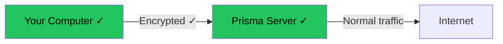

# Your First Connection

This is the moment everything comes together. In this chapter, you will start the server, start the client, connect them, and verify that everything works.

## Checklist

Before starting, make sure you have completed all previous steps:

- [ ] Server: Prisma installed on your VPS
- [ ] Server: `server.toml` configured with your credentials
- [ ] Server: Firewall port 8443 open (TCP and UDP)
- [ ] Client: Prisma installed on your local computer
- [ ] Client: `client.toml` configured (or prisma-gui profile created)
- [ ] Client: Credentials match between server and client config

## Step 1: Start the Server

SSH into your server and start Prisma:

```bash
prisma server -c /etc/prisma/server.toml
```

You should see:

```
INFO  prisma_server > Prisma server v0.6.3 starting...
INFO  prisma_server > Listening on 0.0.0.0:8443 (TCP)
INFO  prisma_server > Listening on 0.0.0.0:8443 (QUIC)
INFO  prisma_server > Authorized clients: 1
INFO  prisma_server > Server ready!
```

:::tip Run in the background
For now, leave this terminal window open. In [Going Further](./advanced-setup.md), we will set up Prisma as a system service that runs automatically in the background.
:::

## Step 2: Start the Client

### Using prisma-gui

1. Open prisma-gui
2. Select your profile
3. Click **Connect**
4. Wait for the status to show **Connected**

### Using the CLI

Open a new terminal on your local computer and run:

```bash
prisma client -c ~/client.toml
```

You should see:

```
INFO  prisma_client > Prisma client v0.6.3 starting...
INFO  prisma_client > SOCKS5 proxy listening on 127.0.0.1:1080
INFO  prisma_client > HTTP proxy listening on 127.0.0.1:8080
INFO  prisma_client > Connecting to 203.0.113.45:8443 via QUIC...
INFO  prisma_client > Connected! Handshake completed in 45ms
```

The key message is **"Connected!"** -- that means the client successfully connected to the server.

On the server side, you should see:

```
INFO  prisma_server > New client connected: "my-first-client" (a1b2c3d4...)
```

## Step 3: Verify It Works

Now let's make sure traffic is actually flowing through the proxy.

### Test 1: Check your IP address

Open a new terminal and run:

```bash
curl --socks5 127.0.0.1:1080 https://httpbin.org/ip
```

Expected output:

```json
{
  "origin": "203.0.113.45"
}
```

The IP address shown should be your **server's IP**, not your local IP. If you see your server's IP, congratulations -- it is working!

### Test 2: Visit a website

Configure your browser to use the proxy (see [Configuring the Client](./configure-client.md#setting-up-system-proxy)), then visit:

- https://whatismyipaddress.com -- Should show your server's IP
- https://www.google.com -- Should load normally
- Any website you normally use -- Should work as expected

### Test 3: Check for DNS leaks

Visit https://www.dnsleaktest.com and run the extended test. The DNS servers shown should be from your server's location, not your local ISP.

## Understanding Connection Status

### Server-side messages

| Message | Meaning |
|---------|---------|
| `Server ready!` | Server is running and waiting for connections |
| `New client connected: "name"` | A client successfully authenticated |
| `Client disconnected: "name"` | A client disconnected normally |
| `Authentication failed` | Wrong credentials -- check id/auth_secret |

### Client-side messages

| Message | Meaning |
|---------|---------|
| `Connected! Handshake completed` | Successfully connected to server |
| `SOCKS5 proxy listening on ...` | Ready to accept browser connections |
| `Connection closed, reconnecting...` | Connection dropped, trying to reconnect |
| `Failed to connect` | Cannot reach the server (check troubleshooting below) |

## Troubleshooting

If something is not working, follow these steps in order:

### Problem: "Connection refused" or "Connection timed out"

```
ERROR prisma_client > Failed to connect to 203.0.113.45:8443: Connection refused
```

**Checklist:**
1. Is the server running? SSH into your server and check:
   ```bash
   ps aux | grep prisma
   ```
2. Is the firewall open? On the server:
   ```bash
   sudo ufw status
   # Make sure 8443 is listed as ALLOW
   ```
3. Can you reach the server at all?
   ```bash
   ping YOUR-SERVER-IP
   ```
4. Is the port correct in both server and client configs?

### Problem: "Authentication failed"

```
ERROR prisma_client > Authentication failed: invalid credentials
```

**This means the server rejected your credentials.** Check:

1. The `client_id` in `client.toml` matches the `id` in `server.toml`
2. The `auth_secret` in `client.toml` matches the `auth_secret` in `server.toml`
3. There are no extra spaces or missing characters
4. Both values are copied exactly as generated by `prisma gen-key`

:::tip Copy-paste carefully
The auth_secret is 64 characters long. It is easy to accidentally miss a character when copying. Use copy-paste instead of typing it manually.
:::

### Problem: "TLS handshake failed" or certificate errors

```
ERROR prisma_client > TLS error: certificate verify failed
```

**If using self-signed certificates:** Make sure `skip_cert_verify = true` is set in your client config.

**If using Let's Encrypt:** Make sure:
1. The domain name in the certificate matches your server address
2. The certificate has not expired
3. `skip_cert_verify = false` (or not set, as false is the default)

### Problem: "Address already in use"

```
ERROR prisma_client > Address already in use: 127.0.0.1:1080
```

Another program (or another Prisma instance) is already using port 1080. Either:
1. Stop the other program
2. Change the `socks5_listen_addr` port in your client config (e.g., to `127.0.0.1:1081`)

### Problem: Connected but websites don't load

If the client says "Connected" but websites still don't load:

1. **Check proxy settings:** Make sure your browser is configured to use `127.0.0.1:1080` (SOCKS5) or `127.0.0.1:8080` (HTTP)
2. **Test with curl:** Run `curl --socks5 127.0.0.1:1080 https://httpbin.org/ip` to see if the proxy itself works
3. **Check DNS:** In Firefox, enable "Proxy DNS when using SOCKS v5" in proxy settings
4. **Check server logs:** SSH into your server and look at the log output for errors

### Problem: Very slow connection

1. **Try a different transport:** If using QUIC and it is slow, try TCP (or vice versa)
2. **Check server location:** A server geographically closer to you will be faster
3. **Check server load:** Run `top` on your server to see if CPU/memory is maxed out
4. **Check network quality:** Run a speed test from your server: `curl -o /dev/null -w "%{speed_download}" https://speed.cloudflare.com/__down?bytes=100000000`

## Success!

If you can see your server's IP when checking from the client side, **you have successfully set up Prisma!** Your internet traffic is now encrypted and routed through your server.



## What you learned

In this chapter, you learned:

- How to **start the server** and **start the client**
- How to **verify** the connection works (IP check, browser, DNS leak test)
- How to **read connection status messages** on both server and client
- How to **troubleshoot** the most common problems
- What each **error message** means and how to fix it

## Next step

Your setup is working! Now let's make it better. Head to [Going Further](./advanced-setup.md) to learn about running Prisma as a service, routing rules, CDN setup, and optimization.
