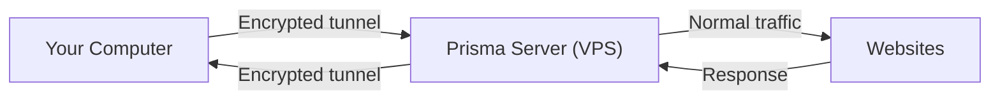
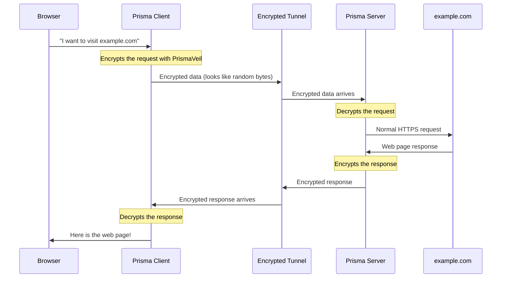
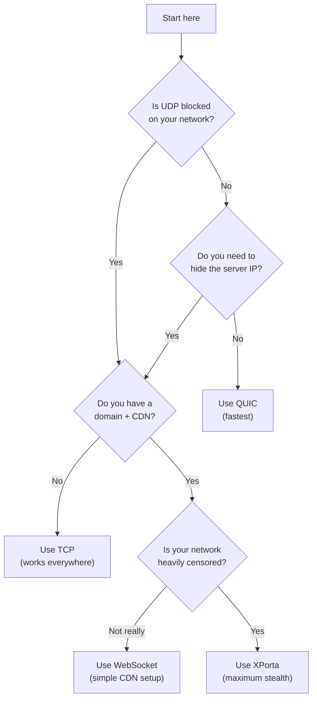

# How Prisma Works

Now that you understand the basics of the internet, let's see how Prisma uses all of those concepts to protect your privacy. This chapter explains Prisma's architecture, what happens behind the scenes when you browse the web through Prisma, and what makes it different from other tools.

## The Big Picture: Client and Server

Prisma has two main parts:

1. **Prisma Client** -- Runs on your computer (or phone). It receives your internet traffic and encrypts it.
2. **Prisma Server** -- Runs on a remote server (a VPS you control). It receives encrypted traffic from the client, decrypts it, and sends it to the destination.



> **Analogy:** Imagine you are in a building with a security guard who inspects everyone's mail. Prisma builds a **secret underground tunnel** from your desk to a trusted friend's house outside the building. You pass your mail through the tunnel, your friend sends it normally, and the guard never sees it.

## What Happens When You Visit a Website

Let's trace exactly what happens when you open `https://example.com` in your browser while using Prisma. Every step is shown below.

### Step-by-step data flow



Let's break this down:

1. **You type a URL** in your browser. The browser wants to connect to `example.com`.
2. **The browser connects to Prisma Client** instead of going directly to the internet. Your browser thinks it is talking to a local proxy (SOCKS5 or HTTP).
3. **Prisma Client encrypts everything** using the PrismaVeil protocol. The encrypted data looks like completely random noise.
4. **The encrypted data travels through the internet** to the Prisma Server. Anyone watching (your ISP, your network admin, firewalls) sees only meaningless encrypted data.
5. **Prisma Server decrypts the data** and sees that you wanted to visit `example.com`.
6. **The server fetches the website** normally and gets the response.
7. **The response is encrypted** and sent back through the tunnel.
8. **Prisma Client decrypts it** and hands it back to your browser.
9. **You see the web page** as if nothing happened.

:::info What your ISP sees
Without Prisma, your ISP sees: "User visited example.com, viewed 15 pages, downloaded 2.3 MB."

With Prisma, your ISP sees: "User is exchanging encrypted data with IP address X.X.X.X." They cannot see what websites you visit, what you download, or what you do.
:::

## The PrismaVeil Protocol

PrismaVeil is Prisma's custom encryption protocol (currently at version 5). It is designed to be both **secure** and **undetectable**.

> **Analogy:** Imagine you and your friend have a special locked box. First, you agree on a shared secret (a handshake). Then, you put your letters inside the locked box. But Prisma goes further -- it also disguises the box to look like an ordinary package, so nobody even suspects there is a secret inside.

Here is what PrismaVeil does:

### 1. Secure handshake (1-RTT)

When the client first connects to the server, they perform a **handshake** -- they exchange keys to establish a secure connection. This takes just one round trip (1-RTT), which means it is fast.

```
Client: "Here is my public key, and here is proof that I am authorized"
Server: "Here is my public key. Connection established!"
```

After reconnecting, Prisma can use **0-RTT resumption** -- meaning it can skip the handshake entirely and start sending data immediately.

### 2. Strong encryption

Every piece of data is encrypted using one of two industry-standard algorithms:

- **ChaCha20-Poly1305** -- Fast on devices without hardware AES (phones, ARM processors)
- **AES-256-GCM** -- Fast on modern desktop CPUs with hardware AES support

These are the same algorithms used by banks, governments, and messaging apps like Signal.

### 3. Anti-replay protection

Prisma uses a **1024-bit sliding window** to prevent replay attacks. This means an attacker cannot record your encrypted traffic and replay it later to trick the server.

### 4. Undetectable traffic

This is where Prisma really stands out. Many firewalls and DPI systems can detect other proxy tools by analyzing traffic patterns. Prisma counters this with:

- **Padding** -- Adds random extra bytes to each message so packet sizes are unpredictable
- **Timing jitter** -- Adds tiny random delays so timing patterns cannot be analyzed
- **Chaff injection** -- Sends fake (decoy) data packets to confuse traffic analysis
- **Entropy camouflage** -- Shapes the randomness distribution of encrypted data to match normal traffic

## Transport Types

A **transport** is the method Prisma uses to send encrypted data between the client and server. Think of it as choosing how to deliver a package -- by car, by plane, or by courier.

Prisma supports nine transports. Here is a simple explanation of each:

### TCP -- The Reliable Road

TCP is like sending a package by tracked delivery. Every piece of data is guaranteed to arrive, in order.

- **Pros:** Works almost everywhere, very reliable
- **Cons:** Can be slower than QUIC, UDP blocking is not an issue but DPI might detect it

### QUIC -- The Fast Highway (Recommended)

QUIC is a modern protocol built on UDP. It is faster than TCP, especially on unstable networks, because it can handle multiple streams at once and recover from packet loss more quickly.

- **Pros:** Fastest transport, multiplexed streams, built-in TLS 1.3
- **Cons:** Some networks block UDP traffic

### WebSocket -- The CDN-Friendly Option

WebSocket upgrades a normal HTTP connection into a two-way tunnel. This works great behind CDNs like Cloudflare.

- **Pros:** Hides behind CDN, server IP is hidden
- **Cons:** WebSocket upgrade headers can be detected by advanced DPI

### gRPC -- The Enterprise Disguise

gRPC is a protocol commonly used by large tech companies. Tunneling through gRPC makes traffic look like normal business API calls.

- **Pros:** Looks like enterprise traffic, works behind CDN
- **Cons:** Less common, slightly more overhead

### XHTTP -- The Stealthy Stream

XHTTP uses plain HTTP/2 POST requests -- no WebSocket upgrade needed. Harder to fingerprint.

- **Pros:** No special headers, harder to detect
- **Cons:** Long-lived HTTP/2 streams can still be fingerprinted

### XPorta -- Maximum Stealth

XPorta is Prisma's most advanced transport. It fragments proxy data into many short-lived REST API requests with JSON payloads and cookie-based sessions. To any observer, it looks exactly like a normal web application making API calls.

- **Pros:** Virtually undetectable, looks like normal web app traffic
- **Cons:** Slightly higher latency and overhead, more complex setup

### ShadowTLS v3 -- TLS Camouflage

ShadowTLS mimics a real TLS handshake to a cover server (e.g., a popular website). The initial handshake is indistinguishable from a genuine TLS connection, making it extremely resistant to protocol detection.

- **Pros:** Passes DPI as real TLS traffic, very hard to fingerprint
- **Cons:** Requires a cover server that supports TLS

### SSH -- Universal Compatibility

The SSH transport tunnels Prisma traffic through a standard SSH connection. SSH is almost never blocked because it is essential for server administration.

- **Pros:** Almost never blocked, widely available
- **Cons:** SSH traffic patterns can be fingerprinted by advanced DPI

### WireGuard -- Kernel-Level Performance

WireGuard is a modern VPN protocol known for its simplicity and performance. Prisma can use WireGuard as a transport layer for kernel-level forwarding speeds.

- **Pros:** Very fast, minimal overhead, well-audited protocol
- **Cons:** Uses UDP (may be blocked), WireGuard is detectable by DPI

## When to Use Which Transport

Here is a simple decision tree:



:::tip Start simple
When in doubt, start with **QUIC**. It is the fastest and works on most networks. If that does not work, try **TCP**. If you need CDN protection, use **WebSocket**. Only upgrade to **XPorta** if other transports are being blocked.
:::

## Why Prisma is Secure

Let's summarize what makes Prisma hard to detect and block:

| Threat | How Prisma Handles It |
|--------|----------------------|
| ISP reading your traffic | All traffic is encrypted with ChaCha20/AES-256 |
| Firewall blocking known proxy ports | Prisma can run on port 443 (same as HTTPS) |
| DPI detecting proxy protocols | PrismaVeil traffic looks like random data or normal HTTPS |
| Traffic pattern analysis | Padding, timing jitter, and chaff injection randomize patterns |
| Active probing (testing if a server is a proxy) | Camouflage mode shows a real website to non-Prisma visitors |
| Recording and replaying traffic | Anti-replay window prevents replay attacks |
| Server IP being blocked | CDN transports (WS, gRPC, XHTTP, XPorta) hide the server IP |

## Prisma vs Other Tools

Without naming specific tools, here is how Prisma compares to the general categories:

| Feature | Traditional VPN | Simple Proxy | Prisma |
|---------|---------------|-------------|--------|
| Encryption | Yes | Sometimes | Yes (always) |
| Hard to detect | No (easily identified) | Somewhat | Yes (multiple anti-detection layers) |
| Multiple transports | Usually 1-2 | 1-2 | 9 transports with auto-fallback |
| CDN support | Rare | Some | Full (WebSocket, gRPC, XHTTP, XPorta) |
| Traffic shaping | No | No | Yes (padding, jitter, chaff) |
| Active probe resistance | No | Some | Yes (camouflage, PrismaTLS) |
| System-wide proxy (TUN) | Yes | Rare | Yes |

## What you learned

In this chapter, you learned:

- Prisma has two parts: a **client** (on your computer) and a **server** (on a remote VPS)
- When you browse the web, your traffic goes: browser -> client -> encrypted tunnel -> server -> website
- The **PrismaVeil protocol** encrypts everything with state-of-the-art cryptography
- Prisma has **nine transport types** (QUIC, TCP, WebSocket, gRPC, XHTTP, XPorta, ShadowTLS v3, SSH, WireGuard) for different situations
- Prisma uses **padding, timing jitter, chaff injection, and camouflage** to make traffic undetectable
- **QUIC** is the recommended starting transport; **XPorta** is for maximum stealth

## Next step

Now that you understand how Prisma works, let's get ready to set it up. Head to [Preparation](./prepare.md) to learn what you need and how to prepare.
