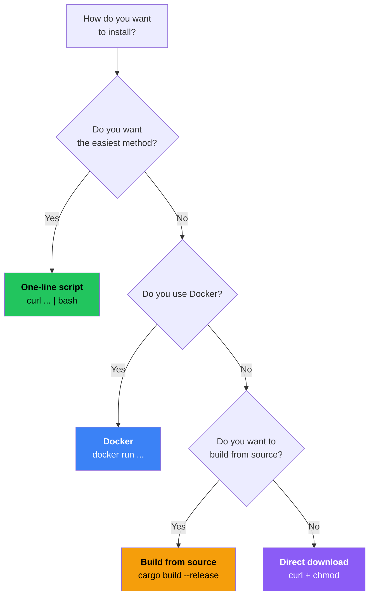

# Installing the Server

In this chapter you will install Prisma on your remote server (VPS). We cover the easiest method first, then show alternatives.

## Before you begin

Make sure you:
- Have a VPS running Ubuntu 22.04+ or Debian 12+ (see [Preparation](./prepare.md))
- Can connect via SSH
- Have updated your server (`sudo apt update && sudo apt upgrade -y`)

## Choosing an installation method



## Method 1: One-line install script (Recommended)

The install script automatically detects your OS and CPU architecture, downloads the correct binary, verifies its checksum, and places it in `/usr/local/bin/`.

```bash
curl -fsSL https://raw.githubusercontent.com/Yamimega/prisma/master/scripts/install.sh | bash
```

You should see output like:

```
[INFO] Detected platform: linux-amd64
[INFO] Downloading prisma v0.9.0...
[INFO] Verifying checksum...
[INFO] Installing to /usr/local/bin/prisma
[INFO] Installation complete!
```

### Install + setup (even easier)

Add `--setup` to also generate credentials, TLS certificates, and example config files:

```bash
curl -fsSL https://raw.githubusercontent.com/Yamimega/prisma/master/scripts/install.sh | bash -s -- --setup
```

This creates:
- `server.toml` -- example server configuration
- `client.toml` -- example client configuration
- `.prisma-credentials` -- your Client ID and Auth Secret
- `prisma-cert.pem` / `prisma-key.pem` -- self-signed TLS certificate and private key

:::tip Recommended for beginners
Using `--setup` is the fastest way to get started. It generates everything; you only need to make a few edits.
:::

## Method 2: Docker

```bash
# Install Docker (if not already installed)
curl -fsSL https://get.docker.com | bash

# Create config directory
mkdir -p /etc/prisma

# Run Prisma in Docker
docker run -d \
  --name prisma-server \
  --restart unless-stopped \
  -v /etc/prisma:/config \
  -p 8443:8443/tcp \
  -p 8443:8443/udp \
  ghcr.io/yamimega/prisma server -c /config/server.toml
```

What each flag means:
- `-d` -- run in background (detached)
- `--restart unless-stopped` -- auto-restart on crash or reboot
- `-v /etc/prisma:/config` -- mount your config directory into the container
- `-p 8443:8443/tcp` and `-p 8443:8443/udp` -- expose both TCP and UDP

:::info
You still need to create `server.toml` in `/etc/prisma/` before the container can start. We do that in the [next chapter](./configure-server.md).
:::

## Method 3: Download binary directly

```bash
# For x86_64 (most common)
curl -fsSL https://github.com/Yamimega/prisma/releases/latest/download/prisma-linux-amd64 \
  -o /usr/local/bin/prisma && chmod +x /usr/local/bin/prisma

# For ARM64 (Raspberry Pi 4, Oracle Cloud free tier, etc.)
curl -fsSL https://github.com/Yamimega/prisma/releases/latest/download/prisma-linux-arm64 \
  -o /usr/local/bin/prisma && chmod +x /usr/local/bin/prisma
```

:::info How do I know my architecture?
Run `uname -m`. If it says `x86_64`, use amd64. If `aarch64`, use arm64.
:::

## Method 4: Build from source (Advanced)

```bash
# Install Rust
curl --proto '=https' --tlsv1.2 -sSf https://sh.rustup.rs | sh
source ~/.cargo/env

# Clone and build
git clone https://github.com/Yamimega/prisma.git
cd prisma
cargo build --release

# Install
sudo cp target/release/prisma /usr/local/bin/
```

Building takes a few minutes depending on your hardware.

## Verify installation

```bash
prisma --version
```

Expected output:
```
prisma 0.9.0
```

See all commands:

```bash
prisma --help
```

```
Prisma - Next-generation encrypted proxy

Usage: prisma <COMMAND>

Commands:
  server      Start the proxy server
  client      Start the proxy client
  gen-key     Generate a client ID and auth secret
  gen-cert    Generate a self-signed TLS certificate
  init        Generate example config files
  validate    Validate a config file
  console     Launch the web management console
  help        Print this message or the help of the given subcommand(s)
```

## Daemon mode

Prisma supports a built-in daemon mode that backgrounds the process and writes a PID file:

```bash
# Start as daemon
prisma server -c /etc/prisma/server.toml --daemon

# Stop the daemon
prisma server --stop
```

:::tip Systemd vs daemon mode
For production, use **systemd** (covered in [Going Further](./advanced-setup.md)) for better logging and restart control. Daemon mode is convenient for quick testing or environments without systemd.
:::

## Systemd service file

For production servers, create a systemd unit so Prisma starts on boot and restarts on crash:

```bash
sudo nano /etc/systemd/system/prisma-server.service
```

```ini title="prisma-server.service"
[Unit]
Description=Prisma Proxy Server
After=network-online.target
Wants=network-online.target

[Service]
ExecStart=/usr/local/bin/prisma server -c /etc/prisma/server.toml
Restart=on-failure
RestartSec=5
User=root
LimitNOFILE=65536

[Install]
WantedBy=multi-user.target
```

```bash
sudo systemctl daemon-reload
sudo systemctl enable --now prisma-server
sudo systemctl status prisma-server
```

## Directory structure

After installation, files live in these locations:

```
/usr/local/bin/prisma          <- the Prisma binary
/etc/prisma/                   <- config directory (create this)
    server.toml                <- server configuration
    prisma-cert.pem            <- TLS certificate
    prisma-key.pem             <- TLS private key
    .prisma-credentials        <- generated credentials (if --setup used)
```

If you used `--setup`, move the generated files to the standard location:

```bash
sudo mkdir -p /etc/prisma
sudo mv server.toml client.toml prisma-cert.pem prisma-key.pem /etc/prisma/
sudo mv .prisma-credentials /etc/prisma/
```

## Opening firewall ports

```bash
# Ubuntu/Debian (ufw)
sudo ufw allow 8443/tcp
sudo ufw allow 8443/udp
sudo ufw status
```

:::warning Cloud provider firewalls
Many cloud providers (AWS, Google Cloud, Oracle Cloud, etc.) have their own firewall/security group settings in the web dashboard. You must open ports in **both** the server's local firewall **and** the cloud provider's firewall.
:::

## Troubleshooting

| Problem | Solution |
|---------|---------|
| `command not found` | Run with full path: `/usr/local/bin/prisma --version`. Add to PATH: `export PATH=$PATH:/usr/local/bin` |
| `Permission denied` | Make executable: `sudo chmod +x /usr/local/bin/prisma` |
| `curl: command not found` | Install curl: `sudo apt install curl -y` |
| `cannot execute binary file` | Wrong architecture. Check with `uname -m` and download the correct binary |
| Port already in use | Check what is using it: `sudo ss -tlnp \| grep 8443` |

## Next step

Prisma is installed! Now let's create the server configuration. Head to [Configuring the Server](./configure-server.md).
