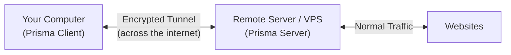

# Preparation

Before we install Prisma, let's make sure you have everything you need. This chapter covers what equipment you need, how to get a server, and the basics of using the command line.

## What You Need

To use Prisma, you need two things:

1. **A local computer** -- This is the computer you use every day (your laptop, desktop, or phone). This is where the **Prisma Client** will run.

2. **A remote server (VPS)** -- This is a computer in another location (usually a data center). This is where the **Prisma Server** will run.



> **Analogy:** Think of it like having two houses. Your main house (local computer) is where you live. Your second house (VPS) is in a different city where the mail service is better. You send all your mail through a secret tunnel to your second house, and your second house mails it normally.

## What is a VPS?

A **VPS** (Virtual Private Server) is a computer in a data center that you rent. It runs 24/7, has its own IP address, and you can control it remotely.

Think of it as renting a tiny office in a big building. You don't own the building, but your office is completely private and you can do whatever you want inside it.

### How to get a VPS

There are many companies that offer VPS hosting. Here are some general options:

| Provider Type | Examples | Price Range | Notes |
|--------------|---------|-------------|-------|
| Budget VPS | Various small providers | $3-10/month | Good for personal use |
| Major cloud | AWS, Google Cloud, Azure | $5-20/month | More reliable, free tiers available |
| Privacy-focused | Providers accepting crypto | $5-15/month | Better privacy, but verify quality |

When choosing a VPS, consider:

- **Location** -- Choose a server location that is geographically appropriate for your needs
- **Bandwidth** -- At least 500 GB/month for personal use
- **RAM** -- 512 MB is enough for Prisma (it is very lightweight)
- **OS** -- Ubuntu 22.04 or Debian 12 are recommended (this guide will use Ubuntu)

:::tip
You don't need a powerful server. Prisma is built in Rust and is extremely efficient. A $5/month VPS with 512 MB RAM can handle many concurrent connections.
:::

### Operating system recommendations

For your **server (VPS)**:
- **Ubuntu 24.04 LTS** or **Ubuntu 22.04 LTS** -- Most beginner-friendly, most guides assume Ubuntu
- **Debian 12** -- Very stable, similar to Ubuntu
- **Other Linux** -- Any modern Linux distribution works

For your **local computer** (where the client runs):
- **Windows 10/11** -- Fully supported (GUI and CLI)
- **macOS** -- Fully supported (GUI and CLI)
- **Linux** -- Fully supported (GUI and CLI)
- **Android** -- Fully supported (native app via Kotlin + JNI)
- **iOS** -- Fully supported (native app via Swift + xcframework)
- **FreeBSD** -- CLI supported

## Connecting to Your Server (SSH)

Once you have a VPS, you need a way to control it. This is done through **SSH** (Secure Shell) -- a way to open a command line on a remote computer, securely.

> **Analogy:** SSH is like a **remote control** for your server. You sit at your own computer, but every command you type runs on the remote server.

### On Windows

1. Open **Windows Terminal** or **PowerShell** (press `Win + X`, then choose "Terminal")
2. Type the following command:

```bash
ssh root@YOUR-SERVER-IP
```

Replace `YOUR-SERVER-IP` with the IP address your VPS provider gave you (e.g., `203.0.113.45`).

3. The first time, it will ask: "Are you sure you want to continue connecting?" Type `yes` and press Enter.
4. Enter the password your VPS provider gave you.
5. You're in! You should see something like:

```
root@my-server:~#
```

### On macOS

1. Open **Terminal** (press `Cmd + Space`, type "Terminal", press Enter)
2. Type:

```bash
ssh root@YOUR-SERVER-IP
```

3. Follow the same steps as Windows above.

### On Linux

1. Open your terminal application
2. Type:

```bash
ssh root@YOUR-SERVER-IP
```

3. Follow the same steps as Windows above.

:::warning First-time SSH
When connecting for the first time, you'll see a message about the server's "fingerprint." This is normal. Type `yes` to continue. This only happens once per server.
:::

## Terminal Basics

If you have never used a terminal (command line) before, here are the essential commands you need for this guide.

### What is a terminal?

A terminal is a text-based way to control your computer. Instead of clicking on icons, you type commands. It might look intimidating at first, but you only need a handful of commands.

> **Analogy:** Using a terminal is like giving instructions to an assistant over text message instead of pointing at things. It is different, but very powerful once you get used to it.

### The prompt

When you open a terminal, you see a **prompt** -- it tells you who you are and where you are:

```
root@my-server:~$
```

- `root` -- Your username (root means administrator)
- `my-server` -- The computer's name
- `~` -- Your current location (~ means your home folder)
- `$` -- Means the terminal is ready for a command (sometimes `#` for root)

### Essential commands

Here are the only commands you need for this guide:

#### `ls` -- List files

Shows what files and folders are in the current directory.

```bash
ls
```

Expected output:
```
Documents  Downloads  prisma  server.toml
```

#### `cd` -- Change directory

Moves you to a different folder.

```bash
cd /etc/prisma      # Go to /etc/prisma
cd ~                 # Go back to your home folder
cd ..                # Go up one level
```

#### `cat` -- Display a file

Shows the contents of a file.

```bash
cat server.toml
```

#### `mkdir` -- Make a directory

Creates a new folder.

```bash
mkdir /etc/prisma
```

#### `nano` -- Edit a file

Opens a simple text editor in the terminal.

```bash
nano server.toml
```

This opens the file for editing. When you are done:
- Press `Ctrl + O` (that's the letter O), then Enter to save
- Press `Ctrl + X` to exit

:::tip nano cheat sheet
The commands at the bottom of nano use `^` to mean the `Ctrl` key. So `^X` means press `Ctrl + X`.
:::

#### `sudo` -- Run as administrator

Some commands need administrator privileges. Put `sudo` before them:

```bash
sudo nano /etc/prisma/server.toml
```

#### `systemctl` -- Manage services

Used to start, stop, and check the status of system services:

```bash
sudo systemctl start prisma-server     # Start a service
sudo systemctl stop prisma-server      # Stop a service
sudo systemctl status prisma-server    # Check if it's running
sudo systemctl enable prisma-server    # Start automatically on boot
```

### Understanding file paths

File paths describe where a file lives on the system. They work like postal addresses, going from general to specific:

```
/etc/prisma/server.toml
│   │       │
│   │       └── The file name
│   └────────── The "prisma" folder
└────────────── The "etc" folder (system config files)
```

- `/` at the beginning means "starting from the root (top) of the file system"
- Each `/` separates folder names
- `~` is a shortcut for your home directory (usually `/root` for the root user)

## Updating Your Server

Before installing anything, it is good practice to update your server's software. Run these commands:

```bash
sudo apt update && sudo apt upgrade -y
```

This updates the package list and installs any available updates. It might take a minute or two.

:::info What does `apt` mean?
`apt` is the package manager on Ubuntu and Debian. It's like an app store for the terminal -- you use it to install, update, and remove software.
:::

## What you learned

In this chapter, you learned:

- You need a **local computer** (for the client) and a **remote server / VPS** (for the server)
- How to **get a VPS** and what specs to look for
- How to **connect to your server** using SSH
- **Basic terminal commands**: `ls`, `cd`, `cat`, `nano`, `mkdir`, `sudo`, `systemctl`
- How **file paths** work on Linux
- How to **update your server** before installing software

## Next step

Your server is ready! Let's install Prisma on it. Head to [Installing the Server](./install-server.md).
