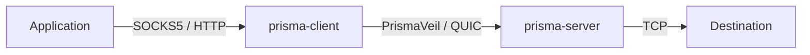
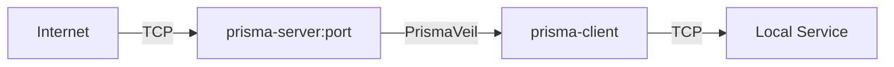
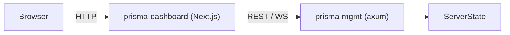

# Introduction

Prisma is a next-generation encrypted proxy infrastructure suite built in Rust. It implements the **PrismaVeil** wire protocol with modern cryptographic primitives, supporting both QUIC and TCP transports with local SOCKS5 and HTTP CONNECT proxy interfaces.

## Features

- **Dual transport** — QUIC (primary) with TCP fallback for UDP-blocked networks
- **Double encryption** — PrismaVeil encryption inside QUIC/TLS for defense-in-depth
- **Modern cryptography** — X25519 ECDH, BLAKE3 KDF, ChaCha20-Poly1305 / AES-256-GCM AEAD
- **HMAC-SHA256 authentication** with constant-time verification
- **Anti-replay protection** via 1024-bit sliding window
- **Traffic shaping** — bucket padding, chaff injection, timing jitter, frame coalescing
- **PrismaTLS** — active probing resistance with padding beacon auth, mask server pool, browser fingerprint mimicry
- **Entropy camouflage** — GFW exemption via byte distribution shaping
- **Camouflage (anti-active-detection)** — TLS-on-TCP wrapping, decoy fallback, standard ALPN
- **XPorta transport** — next-gen CDN transport indistinguishable from normal REST API traffic
- **SOCKS5 proxy interface** (RFC 1928) for application compatibility
- **HTTP CONNECT proxy** for browsers and HTTP-aware clients
- **Port forwarding / reverse proxy** — expose local services through the server (frp-style)
- **Routing rules engine** — domain/IP/port-based allow/block filtering
- **Management API** — REST + WebSocket API for live monitoring and control
- **Web dashboard** — real-time Next.js dashboard with metrics, client management, and log streaming
- **DNS caching** with async resolution
- **Connection backpressure** via configurable max connection limits
- **Structured logging** (pretty or JSON) via `tracing` with broadcast support

## Architecture

Prisma is organized into six crates plus a dashboard:

```
prisma/
├── prisma-core/       # Shared library: crypto, protocol, config, types, state
├── prisma-server/     # Proxy server (TCP + QUIC inbound)
├── prisma-client/     # Proxy client (SOCKS5 + HTTP CONNECT inbound)
├── prisma-mgmt/       # Management API (REST + WebSocket via axum)
├── prisma-cli/        # CLI wrapper with key/cert generation
├── prisma-dashboard/  # Web dashboard (Next.js + shadcn/ui)
└── prisma-docs/       # Documentation site (Docusaurus)
```

### Data flow — outbound proxy

When used as an outbound proxy, applications connect to the local SOCKS5 or HTTP CONNECT interface. The client encrypts traffic with the PrismaVeil protocol and sends it over QUIC or TCP to the server, which forwards it to the destination.



### Data flow — port forwarding (reverse proxy)

Port forwarding allows you to expose local services behind NAT/firewalls through the Prisma server. External connections arrive at the server and are relayed through the encrypted tunnel to the client's local service.



### Data flow — management & dashboard

The management API provides live observability and control. The dashboard communicates with the management API via a server-side proxy to keep the API token secure.


