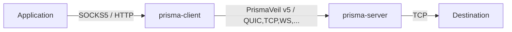
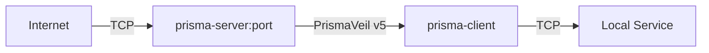
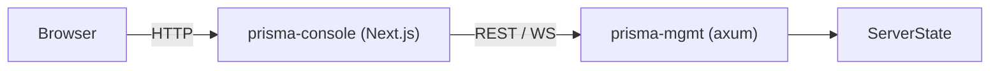

# Introduction

Prisma is a next-generation encrypted proxy infrastructure suite built in Rust. It implements the **PrismaVeil v5** wire protocol — combining modern cryptography (including post-quantum hybrid key exchange), nine transport options, multi-protocol inbound support (VMess/VLESS/Shadowsocks/Trojan), and advanced anti-censorship features. Version **1.3.0** ships with multi-protocol compatibility, daemon mode, subscription management, hot config reload, buffer pooling, client permissions, transport fallback, and many more production-grade features.

## Features

### Protocol and Cryptography

- **PrismaVeil v5 protocol** — 1-RTT handshake, 0-RTT session resumption, X25519 + BLAKE3 + ChaCha20-Poly1305 / AES-256-GCM / Transport-Only cipher modes, header-authenticated encryption (AAD), connection migration, enhanced KDF
- **Multi-protocol inbounds** — VMess, VLESS, Shadowsocks (AEAD), and Trojan compatibility via `[[inbounds]]` config, allowing Prisma servers to accept connections from third-party clients
- **Post-quantum hybrid key exchange** — ML-KEM-768 (Kyber) combined with X25519 for forward-secure key agreement resistant to quantum computers. Negotiated automatically when both sides support it.
- **Modern cryptography** — X25519 ECDH, BLAKE3 KDF, ChaCha20-Poly1305 / AES-256-GCM AEAD
- **Anti-replay protection** via 1024-bit sliding-window nonce bitmap
- **Session ticket rotation** — automatic key ring rotation with configurable retention of expired keys for graceful forward secrecy

### Transports

- **9 transports** with auto-fallback:

| Transport | Description |
|-----------|-------------|
| **TCP** | TLS-encrypted TCP with PrismaTLS active-probing resistance |
| **QUIC** | QUIC v2 (RFC 9369) with Salamander UDP obfuscation and BBR/Brutal/Adaptive congestion control |
| **WebSocket** | WebSocket over TLS, CDN-compatible |
| **gRPC** | gRPC streaming over HTTP/2, CDN-compatible |
| **XHTTP** | Chunked HTTP transport for restrictive CDN environments |
| **XPorta** | Next-gen CDN transport indistinguishable from normal REST API traffic |
| **ShadowTLS v3** | Mimics a real TLS handshake to a cover server for protocol-level stealth |
| **SSH** | Tunnels through standard SSH connections for maximum compatibility |
| **WireGuard** | Uses WireGuard protocol for kernel-level performance |

### Proxy and Routing

- **SOCKS5 proxy interface** (RFC 1928) for application compatibility
- **HTTP CONNECT proxy** for browsers and HTTP-aware clients
- **TUN mode** — system-wide proxy via virtual network interface (Windows/Linux/macOS)
- **Port forwarding / reverse proxy** — expose local services through the server (frp-style)
- **Routing rules engine** — domain/IP/port/GeoIP-based allow/block filtering, ACL files, rule providers
- **Proxy groups** — load balancing, failover, and URL-test-based auto-selection
- **GeoIP routing** — country-level smart routing via v2fly geoip.dat, on both client and server
- **Smart DNS** — fake IP, tunnel, smart (GeoSite), and direct modes

### Subscription and Import

- **Subscription management** — add, update, list, and test subscriptions with auto-update
- **Multi-protocol import** — import server configs from SS, VMess, Trojan, and VLESS URIs (single URI, file, or subscription URL)
- **Latency testing** — measure RTT to subscription servers or manually specified server lists

### Anti-Censorship

- **Traffic shaping** — bucket padding, chaff injection, timing jitter, frame coalescing
- **PrismaTLS** — active probing resistance with padding beacon auth, mask server pool, browser fingerprint mimicry
- **Entropy camouflage** — byte distribution shaping for DPI exemption
- **Salamander UDP obfuscation**, HTTP/3 masquerade, port hopping, TLS camouflage

### Performance

- **io_uring support** — zero-copy I/O on Linux 5.6+ for maximum relay throughput
- **Buffer pool** — pre-allocated, reusable frame buffers to eliminate allocation overhead on hot relay paths
- **XMUX** — connection multiplexing and pooling for CDN transports
- **Connection pool** — reuses transport connections across SOCKS5/HTTP requests
- **Zero-copy relay** — `FrameEncoder` with pre-allocated buffers and in-place encryption/decryption
- **PrismaUDP** — UDP relay with FEC Reed-Solomon forward error correction
- **Congestion control** — BBR, Brutal, and Adaptive modes for QUIC

### Operations and Management

- **Daemon CLI mode** — run server, client, and console as background daemons with PID files, log files, and `stop`/`status` subcommands
- **Hot config reload** — SIGHUP signal handler and automatic config file watcher for live configuration updates without restart
- **Graceful shutdown** — drain active connections before stopping
- **Config file watcher** — automatically detects config file changes and triggers hot-reload
- **Management API** — REST + WebSocket API for live monitoring and control
- **Web console** — real-time Next.js + shadcn/ui console with metrics, client management, and log streaming
- **Per-client bandwidth and quota limits** — upload/download rate limiting with configurable quotas
- **Per-client metrics** — track bandwidth, connection count, and usage per authorized client
- **Connection backpressure** via configurable max connection limits
- **Structured logging** (pretty or JSON) via `tracing` with broadcast support

### Platform and Integration

- **Mobile FFI** — C ABI shared library (`prisma-ffi`) for GUI and mobile app integration (Android/iOS)
- **Cross-platform** — Linux, macOS, Windows, FreeBSD, with platform-specific TUN, system proxy, and auto-update support

## Architecture

Prisma is organized into six crates plus a console and documentation site:

```
prisma/
├── prisma-core/       # Shared library: crypto, protocol (PrismaVeil v5), config, DNS, routing,
│                      #   GeoIP, bandwidth, buffer pool, traffic shaping, import, types
├── prisma-server/     # Proxy server: TCP/QUIC/WS/gRPC/XHTTP/XPorta/ShadowTLS/SSH/WireGuard
│                      #   listeners, relay (standard + io_uring), auth, camouflage, hot-reload
├── prisma-client/     # Proxy client: SOCKS5/HTTP CONNECT/TUN inbound, transport selection,
│                      #   connection pool, proxy groups, DNS resolver, metrics
├── prisma-mgmt/       # Management API: REST + WebSocket via axum, auth middleware,
│                      #   handlers for clients/connections/metrics/bandwidth/config/routes
├── prisma-cli/        # CLI binary (clap 4): server/client/console runners with daemon mode,
│                      #   gen-key, gen-cert, init, validate, import, subscription, latency-test,
│                      #   management commands, shell completions
├── prisma-ffi/        # C FFI shared library: lifecycle, profiles, QR import/export,
│                      #   system proxy, auto-update, subscription import, stats poller
├── prisma-console/    # Web console (Next.js + shadcn/ui)
├── prisma-docs/       # Documentation site (Docusaurus)
└── scripts/           # Install scripts and benchmarks
```

### Data flow — outbound proxy

When used as an outbound proxy, applications connect to the local SOCKS5 or HTTP CONNECT interface. The client encrypts traffic with the PrismaVeil v5 protocol and sends it over one of nine transports to the server, which forwards it to the destination.



### Data flow — port forwarding (reverse proxy)

Port forwarding allows you to expose local services behind NAT/firewalls through the Prisma server. External connections arrive at the server and are relayed through the encrypted tunnel to the client's local service.



### Data flow — management & console

The management API provides live observability and control. The console communicates with the management API via a server-side proxy to keep the API token secure.



## What's New in 1.3.0

- **Multi-protocol inbounds** — VMess/VLESS/Shadowsocks/Trojan compatibility via `[[inbounds]]` config
- **Client permissions** — fine-grained per-client access control and permissions
- **Transport fallback** — ordered transport fallback with automatic failover
- **Post-quantum hybrid key exchange** — ML-KEM-768 + X25519
- **Daemon mode** for server, client, and console (`-d` flag with `stop`/`status` subcommands)
- **Subscription management** CLI commands (`add`, `update`, `list`, `test`)
- **Multi-protocol import** — `prisma import --uri/--file/--url`
- **Latency testing** — `prisma latency-test`
- **Hot config reload** — SIGHUP and automatic file watcher
- **Session ticket key rotation** — automatic key ring with forward secrecy
- **Buffer pool** — pre-allocated relay buffers
- **Graceful shutdown** — drain connections on SIGTERM
- **Per-client metrics** tracking
- **Config file watcher** — automatic reload on file change
- **`--verbose/-v` global flag** for debug output
- **Management API additions** — `/api/inbounds`, `/api/clients/:id/permissions`, `/api/clients/:id/kick`, `/api/clients/:id/block`
