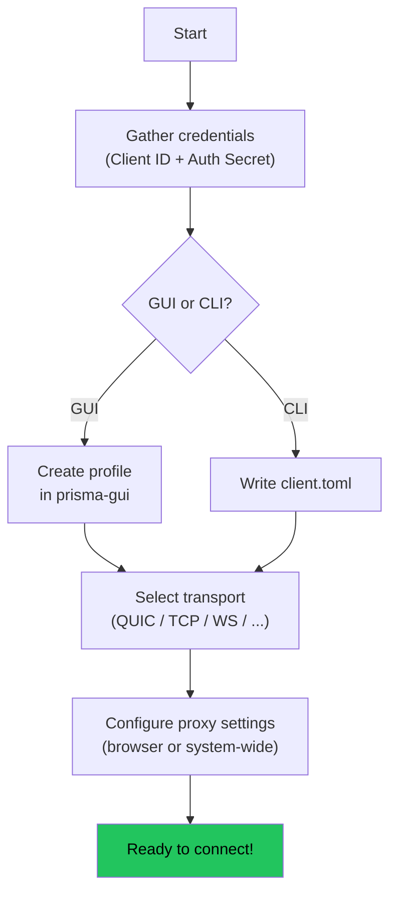
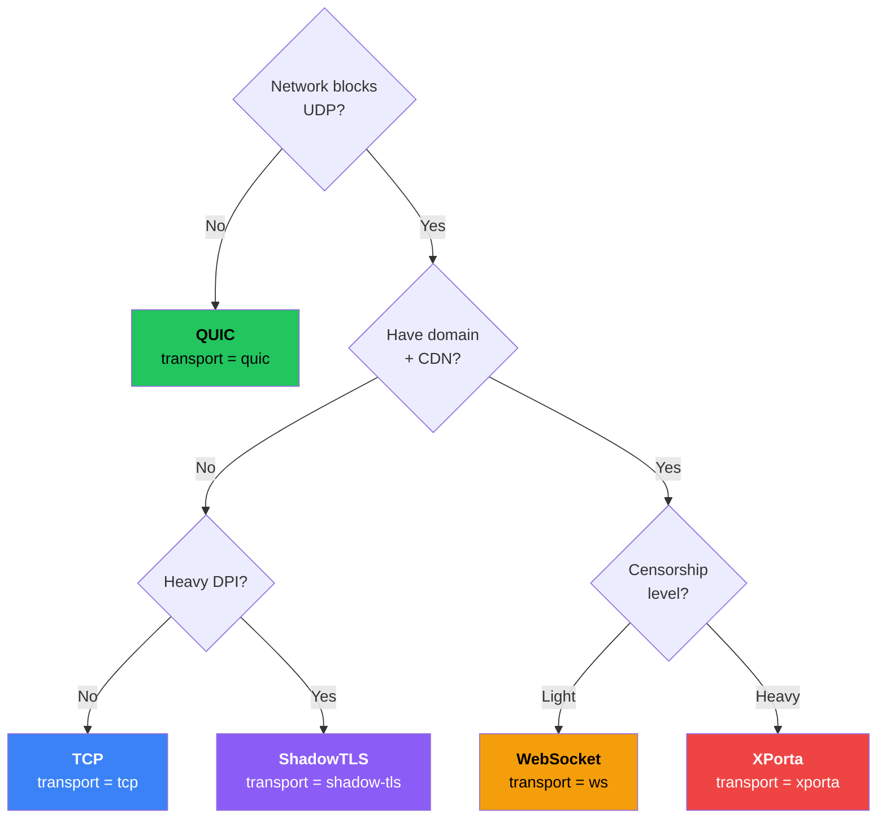
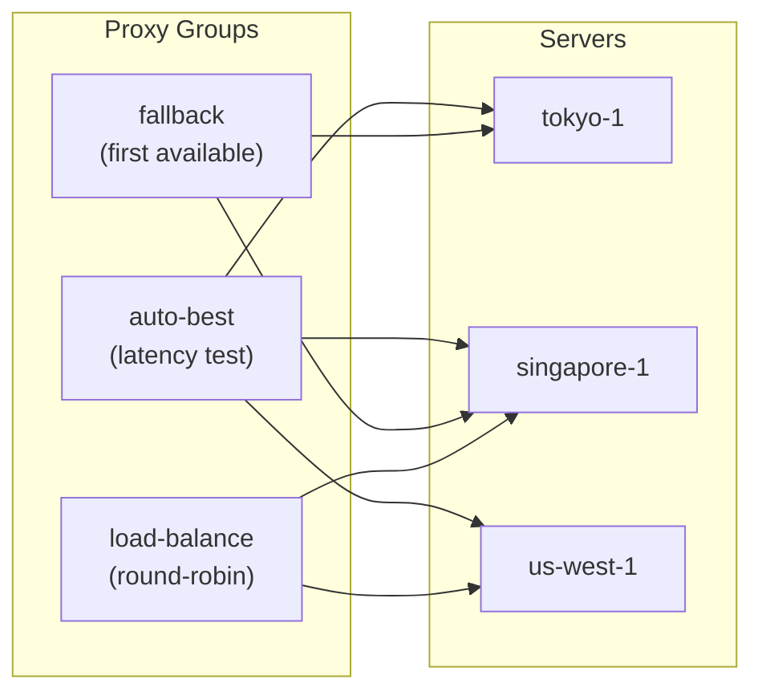

# Configuring the Client

In this chapter you will configure the Prisma client to connect to your server. We cover both the GUI app and CLI configuration, transport selection, subscription management, proxy groups, port forwarding, and DNS settings.

## What you need

Before starting, gather:

- Your **server's IP address** (e.g. `203.0.113.45`)
- Your **Client ID** (from `prisma gen-key`)
- Your **Auth Secret** (from `prisma gen-key`)
- The **port** (default: `8443`)

:::tip
If you used `--setup` on the server, view credentials with:
```bash
cat /etc/prisma/.prisma-credentials
```
:::

## Client config flow



## Option 1: prisma-gui

### Creating a profile

1. Open prisma-gui
2. Click **"New Profile"** or the **+** button
3. Fill in:

| Field | What to enter | Example |
|-------|--------------|---------|
| Profile Name | Any friendly name | `My Server` |
| Server Address | IP:port | `203.0.113.45:8443` |
| Client ID | From gen-key | `a1b2c3d4-e5f6-...` |
| Auth Secret | From gen-key | `4f8a2b1c9d3e7f...` |
| Transport | Start with QUIC | `QUIC` |
| Cipher Suite | Encryption algorithm | `ChaCha20-Poly1305` |

4. Enable **Skip Certificate Verify** (for self-signed certs)
5. Click **Save**

### Import via QR code or subscription

prisma-gui also supports one-click import:
- Paste a **subscription URL** or scan a **QR code**
- Profiles are created automatically
- Enable **Auto-update** to refresh periodically

## Option 2: CLI configuration

Create `client.toml` on your local machine:

```bash
nano ~/client.toml
```

```toml title="client.toml"
# ============================================================
# Prisma Client Configuration
# ============================================================

# Local proxy addresses (your browser connects here)
socks5_listen_addr = "127.0.0.1:1080"
http_listen_addr = "127.0.0.1:8080"

# Server connection
server_addr = "YOUR-SERVER-IP:8443"
cipher_suite = "chacha20-poly1305"
transport = "quic"
skip_cert_verify = true       # true for self-signed certs

# Identity (must match server config exactly)
[identity]
client_id = "YOUR-CLIENT-ID"
auth_secret = "YOUR-AUTH-SECRET"

# Logging
[logging]
level = "info"
format = "pretty"
```

Replace `YOUR-SERVER-IP`, `YOUR-CLIENT-ID`, and `YOUR-AUTH-SECRET` with your actual values.

### Validate

```bash
prisma validate -c ~/client.toml
```

## Transport selection guide



| Situation | Transport | Config value |
|-----------|-----------|-------------|
| Normal network, best speed | QUIC | `transport = "quic"` |
| UDP blocked | TCP | `transport = "tcp"` |
| Hide server IP (CDN) | WebSocket | `transport = "ws"` |
| Enterprise disguise (CDN) | gRPC | `transport = "grpc"` |
| HTTP/2 stealth (CDN) | XHTTP | `transport = "xhttp"` |
| Maximum stealth (CDN) | XPorta | `transport = "xporta"` |
| TLS-level camouflage | ShadowTLS v3 | `transport = "shadow-tls"` |
| Almost never blocked | SSH | `transport = "ssh"` |
| Kernel-level performance | WireGuard | `transport = "wireguard"` |

## Subscription management

Instead of manual config, import servers from subscription URLs:

### Supported formats

- Prisma native, Shadowsocks (SS), VMess, Trojan, VLESS links
- Clash YAML subscriptions
- Base64-encoded URI lists

### CLI subscription commands

```bash
prisma subscription add --url "https://example.com/sub/token" --name "My Provider"
prisma subscription list
prisma subscription update        # Refresh all
prisma subscription test          # Latency test all servers
```

### Config-based subscriptions

```toml
[[subscriptions]]
url = "https://example.com/sub/token"
name = "My Provider"
auto_update = true
update_interval_hours = 24
```

## Proxy groups

Use multiple servers with automatic selection strategies:



```toml
[[servers]]
name = "tokyo-1"
server_addr = "tokyo.example.com:8443"
transport = "quic"

[[servers]]
name = "singapore-1"
server_addr = "sg.example.com:8443"
transport = "quic"

# Auto-select lowest latency
[[proxy_groups]]
name = "auto-best"
type = "auto-url"
servers = ["tokyo-1", "singapore-1"]
test_url = "https://www.google.com/generate_204"
test_interval_secs = 300

# Fallback chain
[[proxy_groups]]
name = "fallback"
type = "fallback"
servers = ["tokyo-1", "singapore-1"]

# Load balance
[[proxy_groups]]
name = "load-balance"
type = "load-balance"
servers = ["tokyo-1", "singapore-1"]
strategy = "round-robin"    # or "random"
```

Group types: **select** (manual), **auto-url** (latency-based), **fallback** (first available), **load-balance** (round-robin/random).

## Port forwarding

Expose local services through the encrypted tunnel:

```toml
[[port_forwards]]
name = "web-app"
local_addr = "127.0.0.1:3000"
remote_port = 3000

[[port_forwards]]
name = "database"
local_addr = "127.0.0.1:5432"
remote_port = 15432
```

## DNS configuration

By default, DNS queries go through the Prisma tunnel (no DNS leaks). You can customize:

```toml
[dns]
mode = "tunnel"              # "tunnel" (default), "direct", or "doh"
doh_server = "https://1.1.1.1/dns-query"   # For DoH mode
```

## TUN mode

TUN mode creates a virtual network device that captures **all** system traffic -- no per-app proxy configuration needed:

```toml
[tun]
enabled = true
device_name = "prisma-tun0"
mtu = 1500
```

On Linux, TUN requires `CAP_NET_ADMIN` capability or root privileges. On macOS and Windows, prisma-gui handles this automatically.

## Setting up browser/system proxy

### Browser only (Firefox)

1. Settings > Network Settings > Manual proxy
2. SOCKS Host: `127.0.0.1`, Port: `1080`, SOCKS v5
3. Check "Proxy DNS when using SOCKS v5"

### Browser only (Chrome/Edge via SwitchyOmega)

1. Install SwitchyOmega extension
2. Create SOCKS5 profile: `127.0.0.1:1080`
3. Select the profile from the extension icon

### System-wide proxy

**Windows:** Settings > Network > Proxy > Manual > `127.0.0.1:8080`

**macOS:** System Settings > Network > Wi-Fi > Details > Proxies > SOCKS: `127.0.0.1:1080`

**Linux (GNOME):** Settings > Network > Proxy > Manual > Socks: `127.0.0.1:1080`

### Testing from the command line

```bash
curl --socks5 127.0.0.1:1080 https://httpbin.org/ip
curl --proxy http://127.0.0.1:8080 https://httpbin.org/ip
```

You should see your **server's IP**, not your local IP.

## Next step

Everything is configured! Let's connect and verify. Head to [Your First Connection](./first-connection.md).
