# Configuring the Server

In this chapter you will create the server configuration file. Every setting is explained line by line, with a diagram showing how the config sections relate to each other.

## Server config overview

```mermaid
graph TD
    ROOT["server.toml"] --> LISTEN["listen_addr / quic_listen_addr\n(network binding)"]
    ROOT --> TLS["[tls]\ncert_path, key_path"]
    ROOT --> AUTH["[[authorized_clients]]\nid, auth_secret, name, ACLs"]
    ROOT --> LOG["[logging]\nlevel, format"]
    ROOT --> PERF["[performance]\nmax_connections, timeout"]
    ROOT --> PAD["[padding]\nmin, max"]
    ROOT --> MGMT["[management_api]\nlisten_addr, auth_token"]
    ROOT --> PF["[port_forwarding]\nenabled, allowed_ports"]
    ROOT --> CAM["[camouflage]\nserve_dir, fallback_domain"]
    ROOT --> STLS["[shadow_tls]\ncover_server, password"]
    ROOT --> SSHT["[ssh_transport]\nlisten_addr, host_key_path"]
    ROOT --> WG["[wireguard_transport]\nlisten_addr, private_key"]
    ROOT --> WATCH["config_watch\n(hot reload)"]
    ROOT --> TICKET["ticket_rotation_hours\n(forward secrecy)"]
```



## Understanding TOML

Prisma uses **TOML** for configuration -- a simple, human-readable format. Quick crash course:

```toml
# Comment (ignored by Prisma)
listen_addr = "0.0.0.0:8443"    # String value (in quotes)
max_connections = 1024           # Number (no quotes)
enabled = true                   # Boolean (true or false)

[section]                        # Groups related settings
key = "value"

[[array_section]]                # Multiple items of the same type
name = "first"

[[array_section]]
name = "second"
```

That is all the TOML you need to know.

## Step 1: Generate credentials

Generate a **Client ID** and **Auth Secret** -- like a username and password pair that the client uses to prove its identity.

```bash
prisma gen-key
```

Output:
```
Client ID:   a1b2c3d4-e5f6-7890-abcd-ef1234567890
Auth Secret: 4f8a2b1c9d3e7f6a0b5c8d2e1f4a7b3c9d0e6f2a8b4c1d7e3f9a5b0c6d2e8f
```

:::warning Save these values!
Copy both values somewhere safe. You need them for both server and client config. The auth_secret is 64 hex characters -- use copy-paste, not manual typing.
:::

## Step 2: Generate TLS certificate

```bash
sudo mkdir -p /etc/prisma
prisma gen-cert --output /etc/prisma --cn prisma-server
```

Output:
```
Certificate written to /etc/prisma/prisma-cert.pem
Private key written to /etc/prisma/prisma-key.pem
```

:::info Self-signed vs. Let's Encrypt
A **self-signed certificate** is fine for personal use. For production (especially with CDN transports), use **Let's Encrypt** (free). See the Let's Encrypt section at the end of this chapter.
:::

## Step 3: Write the server config

```bash
sudo nano /etc/prisma/server.toml
```

Paste the following -- every line has a comment explaining its purpose:

```toml title="server.toml"
# ============================================================
# Prisma Server Configuration
# ============================================================

# Address and port for TCP connections.
# "0.0.0.0" = listen on all interfaces. ":8443" = port number.
listen_addr = "0.0.0.0:8443"

# Address and port for QUIC (UDP) connections.
quic_listen_addr = "0.0.0.0:8443"

# ── TLS Certificate ──────────────────────────────────────────
[tls]
cert_path = "/etc/prisma/prisma-cert.pem"
key_path = "/etc/prisma/prisma-key.pem"

# ── Authorized Clients ───────────────────────────────────────
# Each connecting client must be listed here.
# Add multiple [[authorized_clients]] sections for multiple devices.
[[authorized_clients]]
id = "PASTE-YOUR-CLIENT-ID-HERE"
auth_secret = "PASTE-YOUR-AUTH-SECRET-HERE"
name = "my-first-client"

# ── Logging ──────────────────────────────────────────────────
[logging]
level = "info"      # trace > debug > info > warn > error
format = "pretty"   # "pretty" or "json"

# ── Performance ──────────────────────────────────────────────
[performance]
max_connections = 1024
connection_timeout_secs = 300

# ── Padding ──────────────────────────────────────────────────
# Random extra bytes per frame to defeat packet-size analysis.
[padding]
min = 0
max = 256
```

### Replace the placeholders

Replace `PASTE-YOUR-CLIENT-ID-HERE` and `PASTE-YOUR-AUTH-SECRET-HERE` with the values from Step 1.

## Step 4: Validate the config

```bash
prisma validate -c /etc/prisma/server.toml
```

If valid:
```
Configuration is valid.
```

Common errors:

| Error | Meaning | Fix |
|-------|---------|-----|
| `authorized_clients must not be empty` | No clients configured | Add `[[authorized_clients]]` |
| `invalid hex in auth_secret` | Bad auth_secret format | Copy exactly from `prisma gen-key` |
| `cert_path: file not found` | Certificate file missing | Run `prisma gen-cert` again |

## Step 5: Test run

```bash
prisma server -c /etc/prisma/server.toml
```

Expected output:
```
INFO  prisma_server > Prisma server v0.9.0 starting...
INFO  prisma_server > Listening on 0.0.0.0:8443 (TCP)
INFO  prisma_server > Listening on 0.0.0.0:8443 (QUIC)
INFO  prisma_server > Authorized clients: 1
INFO  prisma_server > Server ready!
```

Press `Ctrl+C` to stop. We will set up a system service later.

## Adding multiple clients

Generate a new key per device:

```bash
prisma gen-key    # Run once per device
```

Add each to the config:

```toml
[[authorized_clients]]
id = "first-client-uuid"
auth_secret = "first-client-secret"
name = "laptop"

[[authorized_clients]]
id = "second-client-uuid"
auth_secret = "second-client-secret"
name = "phone"
bandwidth_down = "100mbps"   # Optional: limit download speed
quota = "50GB"               # Optional: monthly data limit
quota_period = "monthly"
```

## Advanced server options

These sections are all optional. Add them to `server.toml` as needed.

### ShadowTLS v3 transport

```toml
[shadow_tls]
enabled = true
listen_addr = "0.0.0.0:8444"
cover_server = "www.google.com:443"
password = "your-shadow-tls-password"
```

### SSH transport

```toml
[ssh_transport]
enabled = true
listen_addr = "0.0.0.0:22222"
host_key_path = "/etc/prisma/ssh_host_key"
fake_shell = true
```

Generate a host key: `ssh-keygen -t ed25519 -f /etc/prisma/ssh_host_key -N ""`

### WireGuard transport

```toml
[wireguard_transport]
enabled = true
listen_addr = "0.0.0.0:51820"
private_key = "YOUR-WG-PRIVATE-KEY"
```

### Per-client ACLs

```toml
[[authorized_clients]]
id = "client-uuid"
auth_secret = "client-secret"
name = "restricted-user"

[[authorized_clients.acl]]
type = "domain-suffix"
value = "example.com"
policy = "allow"

[[authorized_clients.acl]]
type = "all"
policy = "deny"
```

### Port forwarding

```toml
[port_forwarding]
enabled = true
allowed_ports = [3000, 8080, 8443]
max_forwards_per_client = 5
```

### Camouflage mode

```toml
[camouflage]
serve_dir = "/var/www/html"         # Serve this website to non-Prisma visitors
fallback_domain = "www.nginx.com"   # Or reverse-proxy to this domain
```

### Config hot reload

```toml
config_watch = true
```

Changes to `server.toml` are picked up automatically. You can also trigger manual reload:

```bash
kill -HUP $(pidof prisma)
# or via API:
curl -X POST http://127.0.0.1:9090/api/reload -H "Authorization: Bearer YOUR-TOKEN"
```

### Session ticket rotation

```toml
ticket_rotation_hours = 6    # Default: 6 hours. Lower = better forward secrecy
```

### Management API

```toml
[management_api]
enabled = true
listen_addr = "127.0.0.1:9090"
auth_token = "your-secure-random-token"
```

## TLS with Let's Encrypt (production)

For production deployments, use a free Let's Encrypt certificate:

```bash
# 1. Point your domain to your server (A record in DNS)
# 2. Install certbot
sudo apt install certbot -y

# 3. Get a certificate
sudo certbot certonly --standalone -d proxy.yourdomain.com

# 4. Update server.toml
```

```toml
[tls]
cert_path = "/etc/letsencrypt/live/proxy.yourdomain.com/fullchain.pem"
key_path = "/etc/letsencrypt/live/proxy.yourdomain.com/privkey.pem"
```

Certbot auto-renews every 90 days via a systemd timer.

## Common mistakes

1. **Using placeholder text literally** -- replace `PASTE-YOUR-CLIENT-ID-HERE` with the actual UUID
2. **Mismatched credentials** -- server and client values must match exactly
3. **Wrong file paths** -- verify with `ls -la /etc/prisma/prisma-cert.pem`
4. **Firewall not open** -- check `sudo ufw status` shows port 8443 as ALLOW

## Complete annotated example

See the [Configuration Examples](/docs/deployment/config-examples) documentation for production-ready templates with all options.

## Next step

The server is configured! Now let's install the client on your device. Head to [Installing the Client](./install-client.md).
