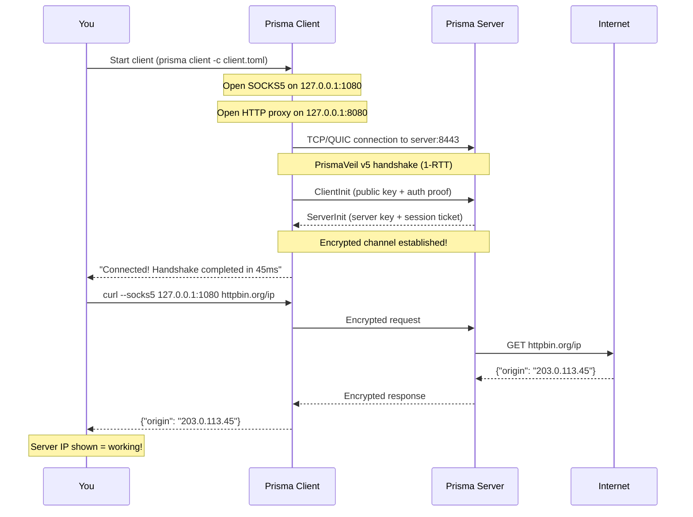
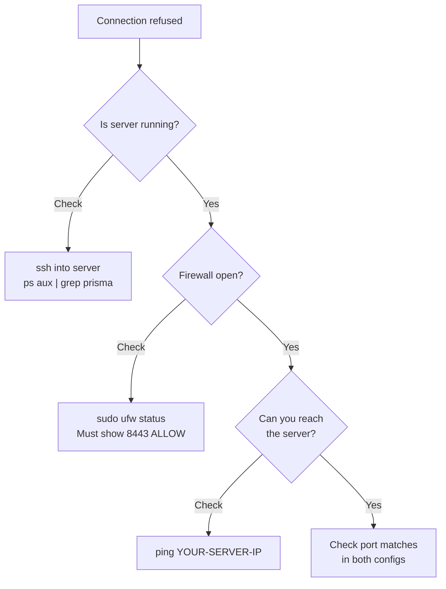

# Your First Connection

This is the moment everything comes together. You will start the server, start the client, verify the connection, and learn how to troubleshoot common problems.

## Pre-flight checklist

- [ ] Server: Prisma installed on your VPS
- [ ] Server: `server.toml` configured with your credentials
- [ ] Server: Firewall port 8443 open (TCP and UDP)
- [ ] Client: Prisma installed on your local device
- [ ] Client: Config ready (prisma-gui profile or `client.toml`)
- [ ] Client: Credentials match the server config exactly

## What happens when you connect



## Step 1: Start the server

SSH into your server:

```bash
prisma server -c /etc/prisma/server.toml
```

You should see:

```
INFO  prisma_server > Prisma server v0.9.0 starting...
INFO  prisma_server > Listening on 0.0.0.0:8443 (TCP)
INFO  prisma_server > Listening on 0.0.0.0:8443 (QUIC)
INFO  prisma_server > Authorized clients: 1
INFO  prisma_server > Server ready!
```

:::tip
Leave this terminal open. In [Going Further](./advanced-setup.md), we cover running as a system service.
:::

## Step 2: Start the client

### Using prisma-gui

1. Open prisma-gui
2. Select your profile
3. Click **Connect**
4. Wait for the status to show **Connected**

### Using the CLI

```bash
prisma client -c ~/client.toml
```

Expected output:

```
INFO  prisma_client > Prisma client v0.9.0 starting...
INFO  prisma_client > SOCKS5 proxy listening on 127.0.0.1:1080
INFO  prisma_client > HTTP proxy listening on 127.0.0.1:8080
INFO  prisma_client > Connecting to 203.0.113.45:8443 via QUIC...
INFO  prisma_client > Connected! Handshake completed in 45ms
```

On the server side, you should see:

```
INFO  prisma_server > New client connected: "my-first-client" (a1b2c3d4...)
```

## Step 3: Verify it works

### Test 1: Check your IP

```bash
curl --socks5 127.0.0.1:1080 https://httpbin.org/ip
```

Expected output:

```json
{
  "origin": "203.0.113.45"
}
```

The IP should be your **server's IP**, not your local IP.

### Test 2: Visit websites

Configure your browser (see [Configuring the Client](./configure-client.md#setting-up-browsersystem-proxy)), then visit:

- https://whatismyipaddress.com -- should show your server's IP
- https://www.google.com -- should load normally
- Any site you normally use -- should work

### Test 3: DNS leak test

Visit https://www.dnsleaktest.com and run the extended test. DNS servers should be from your server's location, not your local ISP.

## Understanding connection messages

### Server messages

| Message | Meaning |
|---------|---------|
| `Server ready!` | Listening for connections |
| `New client connected: "name"` | Client authenticated successfully |
| `Client disconnected: "name"` | Client disconnected normally |
| `Authentication failed` | Wrong credentials |

### Client messages

| Message | Meaning |
|---------|---------|
| `Connected! Handshake completed` | Successfully connected |
| `SOCKS5 proxy listening on ...` | Ready for browser connections |
| `Connection closed, reconnecting...` | Auto-reconnecting |
| `Failed to connect` | Cannot reach server |

## Troubleshooting

### Connection refused / timed out

```
ERROR prisma_client > Failed to connect to 203.0.113.45:8443: Connection refused
```

**Checklist:**



### Authentication failed

```
ERROR prisma_client > Authentication failed: invalid credentials
```

- `client_id` in `client.toml` must match `id` in `server.toml`
- `auth_secret` must match exactly (64 hex characters)
- No extra spaces or missing characters
- Use copy-paste, not manual typing

### TLS handshake failed

```
ERROR prisma_client > TLS error: certificate verify failed
```

- **Self-signed cert:** Set `skip_cert_verify = true` in client config
- **Let's Encrypt:** Domain must match, certificate must not be expired

### Address already in use

```
ERROR prisma_client > Address already in use: 127.0.0.1:1080
```

Another program is using port 1080. Either stop it or change the port in your client config.

### Connected but websites don't load

1. Check browser proxy settings (SOCKS5 to `127.0.0.1:1080`)
2. Test with curl: `curl --socks5 127.0.0.1:1080 https://httpbin.org/ip`
3. Enable "Proxy DNS when using SOCKS v5" in Firefox
4. Check server logs for errors

### Very slow connection

1. Try a different transport (QUIC vs TCP)
2. Check server location -- closer is faster
3. Check server load: `top` on the server
4. Try a different cipher: `aes-256-gcm` on desktop, `chacha20-poly1305` on mobile

## Success!

If you see your server's IP in the curl output, **Prisma is working!** Your traffic is encrypted and routed through your server.


## Next step

Your setup works! Let's make it better. Head to [Going Further](./advanced-setup.md) for system services, routing rules, CDN deployment, performance tuning, and more.
