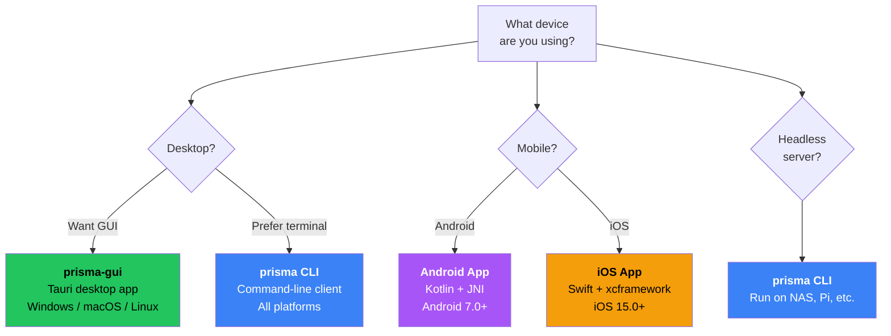

# Installing the Client

In this chapter you will install the Prisma client on your local device -- the computer or phone you use every day.

## Choose your client

Prisma offers four client options:



| Client | Best for | Platforms |
|--------|----------|-----------|
| **prisma-gui** | Most users -- visual interface | Windows, macOS, Linux |
| **prisma CLI** | Power users, servers, automation | Windows, macOS, Linux, FreeBSD |
| **Android App** | Android phones and tablets | Android 7.0+ |
| **iOS App** | iPhones and iPads | iOS 15.0+ |

:::tip Recommendation
Use **prisma-gui** for desktop. Use the native **mobile apps** on Android/iOS. Use **CLI** for headless machines or if you prefer the terminal.
:::

## Option 1: prisma-gui (Desktop App)

prisma-gui is built with Tauri (Rust + React). It provides a visual interface for managing profiles, connecting, and monitoring your connection.

### Windows

1. Download `prisma-gui-windows-x64-setup.exe` from [GitHub Releases](https://github.com/Yamimega/prisma/releases/latest)
2. Run the installer
3. Launch from the Start Menu

:::info Windows SmartScreen
You may see "Windows protected your PC" because the app is not commercially signed. Click "More info" then "Run anyway".
:::

### macOS

1. Download `prisma-gui-macos.dmg` from [GitHub Releases](https://github.com/Yamimega/prisma/releases/latest)
2. Open the `.dmg` and drag Prisma to Applications
3. Open from Applications

:::info macOS Gatekeeper
If macOS says the app "can't be opened": open **System Settings > Privacy & Security**, scroll down, and click **Open Anyway**.
:::

### Linux

**Ubuntu/Debian (.deb):**
```bash
sudo dpkg -i prisma-gui_0.9.0_amd64.deb
```

**AppImage (universal):**
```bash
chmod +x prisma-gui-0.9.0.AppImage
./prisma-gui-0.9.0.AppImage
```

## Option 2: prisma CLI

The CLI client is the same binary you installed on the server.

**Linux / macOS:**
```bash
curl -fsSL https://raw.githubusercontent.com/Yamimega/prisma/master/scripts/install.sh | bash
```

**Windows (PowerShell):**
```powershell
irm https://raw.githubusercontent.com/Yamimega/prisma/master/scripts/install.ps1 | iex
```

**Verify:**
```bash
prisma --version
# Expected: prisma 0.9.0
```

## Option 3: Android App

The native Android app is built with Kotlin and JNI, powered by the same Rust core.

1. Download `prisma-android.apk` from [GitHub Releases](https://github.com/Yamimega/prisma/releases/latest)
2. Install the APK (enable "Install from unknown sources" if needed)
3. Open the app and add a profile or import via QR code / subscription URL
4. Tap **Connect**

Features: all 9 transports, per-app proxy, TUN mode, subscription import, QR code sharing, background operation.

## Option 4: iOS App

The native iOS app is built with Swift and xcframework, powered by the same Rust core.

1. Download from [GitHub Releases](https://github.com/Yamimega/prisma/releases/latest) or TestFlight
2. Add a profile or import via QR code / subscription URL
3. Tap **Connect**

Features: TUN mode via Network Extension, all transports, subscription management.

## Option 5: CLI on local network (alternative mobile setup)

Run the CLI on a home device (Raspberry Pi, NAS, always-on computer) and point your phone's proxy settings to it:

1. Install Prisma CLI on the home device
2. Set `socks5_listen_addr = "0.0.0.0:1080"` (listen on all interfaces)
3. Configure your phone: SOCKS5 proxy, host = device's local IP, port = 1080

## Verify the client

**prisma-gui:** Open the app -- you should see the main window with a Profiles section.

**CLI:**
```bash
prisma --help
# Should show: server, client, gen-key, gen-cert, validate, etc.
```

## Next step

The client is installed! Now let's configure it. Head to [Configuring the Client](./configure-client.md).
