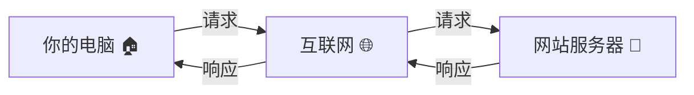
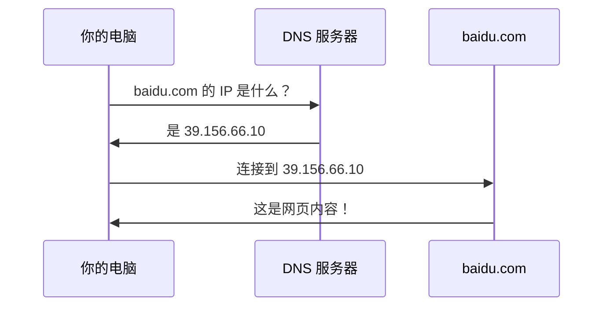
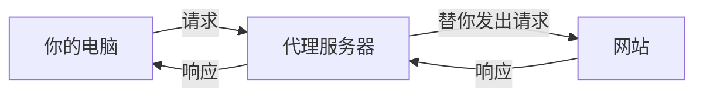
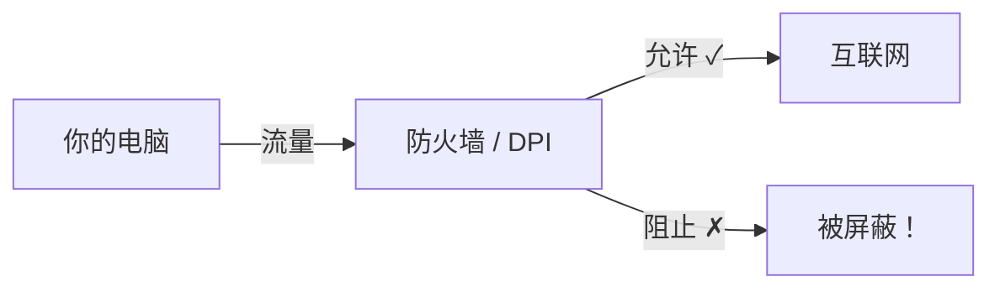

# 理解基础概念

在安装 Prisma 之前，让我们先了解一些关于互联网工作原理的基本概念。别担心——我们会用简单的类比和图表来解释所有内容。

## 什么是互联网？

互联网是一个由相互连接的计算机组成的巨大网络。当你访问一个网站时，你的电脑会与世界上某个地方的另一台电脑（称为**服务器**）通信，那台服务器会把你看到的网页发送回来。

你可以把它想象成邮政系统：

> 你的电脑就是你的**家**。网站住在大的**办公楼**（服务器）里。当你想看一个网站时，你向那栋办公楼发送一封**信**（请求），他们会把一个**包裹**（网页）寄回来。



## 什么是 IP 地址？

互联网上的每台设备都有一个唯一的地址，叫做 **IP 地址**（互联网协议地址）。它就像是你电脑的家庭住址。

IP 地址长这样：`192.168.1.100` 或 `203.0.113.45`

> **类比：** 把 IP 地址想象成邮寄地址。就像每栋房子都有唯一的街道地址（比如北京市朝阳区XX路123号），互联网上的每台设备都有唯一的 IP 地址。没有它，数据就不知道该发送到哪里。

有两种类型：
- **公网 IP** —— 你在互联网上的地址（由你的网络服务提供商分配）。网站可以看到这个。
- **内网 IP** —— 你在家庭网络上的地址（比如 `192.168.x.x`）。只有你本地网络上的设备可以看到。

## 什么是域名 (Domain Name)？

没有人想记住像 `142.250.80.46` 这样的数字。这就是**域名 (Domain Name)**的用途。域名是网站的人类友好名称。

| 域名 | IP 地址 |
|------|---------|
| google.com | 142.250.80.46 |
| github.com | 140.82.121.4 |
| baidu.com | 39.156.66.10 |

> **类比：** 域名就像手机里的**联系人名称**。你不需要记住朋友的电话号码（IP 地址），只需要点击他们的名字（域名）。

## 什么是 DNS？

DNS 代表**域名系统 (Domain Name System)**。它是将域名翻译成 IP 地址的服务。

当你在浏览器中输入 `baidu.com` 时：
1. 你的电脑问 DNS 服务器："baidu.com 的 IP 地址是什么？"
2. DNS 服务器回答："是 39.156.66.10"
3. 你的电脑连接到那个 IP 地址



> **类比：** DNS 就像一本**电话簿**。你查找一个人的名字（域名），然后找到他们的电话号码（IP 地址）。

## 什么是端口 (Port)？

一台服务器可以同时运行多个服务——网站、邮件、文件共享等。**端口 (Port)**就像大楼里的房间号。IP 地址让你找到大楼，端口号告诉你要去哪个房间（服务）。

常用端口：
| 端口 | 服务 |
|------|------|
| 80 | HTTP（网站，未加密） |
| 443 | HTTPS（网站，加密） |
| 22 | SSH（远程服务器访问） |
| 1080 | SOCKS5 代理（Prisma 客户端使用） |

> **类比：** 如果 IP 地址是一栋**大楼的地址**，端口就是**房间号**。"朝阳区XX路123号，443室"就意味着"连接到这台服务器的 HTTPS 服务。"

完整地址长这样：`203.0.113.45:443`（IP 地址 **:** 端口号）

## 什么是协议 (Protocol)？

**协议 (Protocol)**是计算机之间通信的一套规则。就像人们需要说同一种语言才能相互理解一样，计算机也需要使用相同的协议。

> **类比：** 协议就像**语言**。中文、英语、日语是人类通信的协议。HTTP、TCP、QUIC 是计算机通信的协议。

一些常见的协议：
- **TCP** —— 可靠的、有序的传输（就像挂号信——你知道它送到了）
- **UDP** —— 快速但不保证送达（就像把纸条扔过去——更快但可能丢失）
- **HTTP** —— 浏览器和网站服务器之间的通信方式
- **HTTPS** —— 加密版的 HTTP（"S"代表"安全"）

## 什么是 HTTP 和 HTTPS？

**HTTP**（超文本传输协议）是你的浏览器加载网页时使用的协议。

**HTTPS** 是安全版本。当你在浏览器地址栏中看到锁头图标时，说明连接正在使用 HTTPS。

```
http://example.com    ← 未加密（任何人都能读取你的数据）
https://example.com   ← 加密（数据受到保护）
```

:::warning
即使使用了 HTTPS，你的网络服务提供商仍然可以看到你访问了**哪些网站**（域名）。他们只是看不到你在那些网站上**做了什么**。像 Prisma 这样的代理甚至可以隐藏你访问的域名。
:::

## 什么是加密 (Encryption)？

**加密 (Encryption)**是将数据打乱的过程，使得只有预期的接收者才能读取它。

> **类比：** 想象你用只有你和朋友才知道的**密码**写信。即使邮递员读了这封信，他们看到的也只是一堆乱码。这就是加密。

```
原文：    "你好，最近怎么样？"
加密后：  "7f3a9b2c1d8e4f6a0b5c..."
```

没有**密钥 (Key)**（那个密码），加密数据就毫无意义。Prisma 使用最先进的加密技术（与银行和政府使用的同类技术）来保护你的数据。

## 什么是代理 (Proxy)？

**代理 (Proxy)**是你的电脑和互联网之间的中间人。你的电脑不直接连接网站，而是连接到代理，代理替你连接网站。



为什么使用代理？

1. **隐私** —— 网站看到的是代理的 IP 地址，而不是你的
2. **访问** —— 如果网站在你的网络上被屏蔽，代理可以替你访问
3. **安全** —— 加密代理（如 Prisma）保护你传输中的数据

> **类比：** 代理就像让朋友**帮你取快递**。商店看到的是你的朋友，而不是你。而且如果你的朋友把快递放在一个上锁的袋子里，在运输过程中没有人能看到里面有什么。

## VPN 和代理 (Proxy) 有什么区别？

VPN 和代理 (Proxy) 都通过另一台服务器路由 (Routing) 你的流量，但它们的工作方式不同：

| 特性 | 代理（如 Prisma） | VPN |
|------|-----------------|-----|
| 覆盖范围 | 特定应用（或使用 TUN 模式覆盖所有流量） | 通常覆盖所有流量 |
| 加密 (Encryption) | 应用层（Prisma 添加自己的加密） | 隧道 (Tunnel) 层 |
| 速度 | 通常更快 | 可能更慢 |
| 检测难度 | 更难检测（尤其是 Prisma） | 通常容易被检测 |
| 灵活性 | 更多传输选项 | 通常只有一种协议 |

Prisma 在技术上是一个代理 (Proxy)，但启用 TUN 模式后，它可以像 VPN 一样覆盖你所有的流量。Prisma 的关键优势是它的流量**比传统 VPN 更难被检测和屏蔽**。

## 什么是防火墙 (Firewall) / DPI？

**防火墙 (Firewall)**是一个监控和控制网络流量的系统。把它想象成大楼入口的保安——他检查谁进谁出，并可以阻止某些人。

**DPI**（Deep Packet Inspection，深度包检测）是一种更高级的技术。它不只是检查"信封"（流量去往何处），DPI 还会**查看信封里面的内容**，看看发送的是什么类型的数据。



一些网络使用 DPI 来：
- 屏蔽 VPN 协议
- 限速（降低）某些类型的流量
- 审查特定网站

这就是 Prisma 大显身手的地方。Prisma 被设计成在防火墙和 DPI 系统看来像是**正常的网络流量**。它的流量几乎无法与普通的 HTTPS 浏览区分开来。

## 总结

现在你理解了所有基础知识：

1. 你的电脑有一个 **IP 地址**（它在互联网上的地址）
2. 网站有**域名**（人类友好的名称）
3. **DNS** 将域名翻译成 IP 地址
4. **端口**标识计算机上的特定服务
5. **协议**是计算机说的语言
6. **HTTPS** 加密网络流量，但你的网络提供商仍能看到你访问了哪些网站
7. **代理**作为中间人增加隐私
8. **加密**将数据打乱，只有预期的接收者才能读取
9. **防火墙和 DPI** 试图检查和控制你的流量
10. **Prisma** 通过创建加密的、不可检测的隧道 (Tunnel) 来应对这一切

## 你学到了什么

在本章中，你学到了：
- 互联网如何在基本层面上工作
- 什么是 IP 地址、域名 (Domain)、DNS 和端口 (Port)
- 协议 (Protocol) 和加密 (Encryption) 是什么意思
- 为什么你可能需要代理 (Proxy)
- 防火墙 (Firewall) 和 DPI 如何工作，以及为什么 Prisma 能够应对它们

## 下一步

现在你理解了基础概念，让我们来学习 [Prisma 的工作原理](./how-prisma-works.md)——了解它与其他工具有何不同，以及为什么它如此有效。
