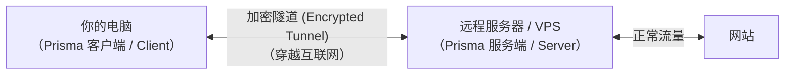

# 准备工作

在安装 Prisma 之前，让我们确保你已经准备好了所有需要的东西。本章涵盖你需要什么设备、如何获取服务器，以及使用命令行的基础知识。

## 你需要什么

使用 Prisma 需要两样东西：

1. **一台本地电脑** —— 这是你每天使用的电脑（笔记本、台式机或手机）。**Prisma 客户端**将在这里运行。

2. **一台远程服务器（VPS）** —— 这是位于另一个位置（通常是数据中心）的电脑。**Prisma 服务端**将在这里运行。



> **类比：** 想象一下你有两套房子。你的主要住所（本地电脑）是你居住的地方。你的第二套房子（VPS）在另一个城市，那里的邮政服务更好。你通过一条秘密隧道把所有邮件送到第二套房子，然后从那里正常寄出。

## 什么是 VPS？

**VPS**（虚拟专用服务器）是数据中心里的一台你租用的电脑。它 24 小时不间断运行，有自己的 IP 地址，你可以远程控制它。

把它想象成在一栋大楼里租一间小办公室。你不拥有这栋楼，但你的办公室完全是你的私人空间，你可以在里面做任何想做的事。

### 如何获取 VPS

有很多公司提供 VPS 服务。以下是一些选择类型：

| 提供商类型 | 价格范围 | 备注 |
|-----------|---------|------|
| 经济型 VPS | ¥20-70/月 | 适合个人使用 |
| 大型云服务 | ¥35-140/月 | 更可靠，部分有免费套餐 |
| 注重隐私的提供商 | ¥35-100/月 | 更好的隐私保护，但需验证质量 |

选择 VPS 时需要考虑：

- **位置** —— 选择地理位置适合你需求的服务器位置
- **带宽 (Bandwidth)** —— 个人使用至少 500 GB/月
- **内存** —— 512 MB 对 Prisma 来说足够了（它非常轻量）
- **操作系统** —— 推荐 Ubuntu 22.04 或 Debian 12（本指南将使用 Ubuntu）

:::tip
你不需要强大的服务器。Prisma 用 Rust 编写，非常高效。一台每月几十元的 VPS，512 MB 内存就能处理大量并发连接。
:::

### 操作系统推荐

**服务器（VPS）方面：**
- **Ubuntu 22.04 LTS** —— 对新手最友好，大多数教程都假设使用 Ubuntu
- **Debian 12** —— 非常稳定，与 Ubuntu 类似
- **其他 Linux** —— 任何现代 Linux 发行版都可以

**本地电脑**（运行客户端的地方）：
- **Windows 10/11** —— 完全支持
- **macOS** —— 完全支持
- **Linux** —— 完全支持

## 连接到你的服务器 (SSH)

当你有了 VPS 后，你需要一种方式来控制它。这通过 **SSH**（Secure Shell，安全外壳协议）完成——一种安全地在远程电脑上打开命令行的方式。

> **类比：** SSH 就像你服务器的**遥控器**。你坐在自己的电脑前，但你输入的每个命令都在远程服务器上执行。

### Windows 系统

1. 打开 **Windows 终端**或 **PowerShell**（按 `Win + X`，然后选择"终端"）
2. 输入以下命令：

```bash
ssh root@你的服务器IP
```

将 `你的服务器IP` 替换为你的 VPS 提供商给你的 IP 地址（例如 `203.0.113.45`）。

3. 第一次连接时，它会问："Are you sure you want to continue connecting?"（你确定要继续连接吗？）输入 `yes` 并按回车。
4. 输入你的 VPS 提供商给你的密码。
5. 你成功登录了！你应该看到类似这样的内容：

```
root@my-server:~#
```

### macOS 系统

1. 打开**终端**（按 `Cmd + Space`，输入"Terminal"，按回车）
2. 输入：

```bash
ssh root@你的服务器IP
```

3. 按照上面 Windows 的相同步骤操作。

### Linux 系统

1. 打开你的终端应用程序
2. 输入：

```bash
ssh root@你的服务器IP
```

3. 按照上面 Windows 的相同步骤操作。

:::warning 第一次 SSH 连接
第一次连接时，你会看到一条关于服务器"指纹"的消息。这是正常的。输入 `yes` 继续。每台服务器只会在第一次连接时出现这个提示。
:::

## 终端基础

如果你以前从未使用过终端（命令行），以下是本指南所需的基本命令。

### 什么是终端？

终端是一种基于文本的方式来控制你的电脑。你不是点击图标，而是输入命令。一开始可能看起来很吓人，但你只需要掌握几个命令。

> **类比：** 使用终端就像通过短信给助手发指令，而不是对着东西指指点点。方式不同，但一旦习惯了就非常强大。

### 提示符

当你打开终端时，你会看到一个**提示符**——它告诉你你是谁以及你在哪里：

```
root@my-server:~$
```

- `root` —— 你的用户名（root 代表管理员）
- `my-server` —— 电脑的名称
- `~` —— 你当前的位置（~ 代表你的主文件夹）
- `$` —— 表示终端已准备好接受命令（root 用户有时显示 `#`）

### 基本命令

以下是本指南中你需要的所有命令：

#### `ls` —— 列出文件

显示当前目录中有哪些文件和文件夹。

```bash
ls
```

预期输出：
```
Documents  Downloads  prisma  server.toml
```

#### `cd` —— 切换目录

移动到不同的文件夹。

```bash
cd /etc/prisma      # 进入 /etc/prisma
cd ~                 # 回到主文件夹
cd ..                # 上一层目录
```

#### `cat` —— 显示文件内容

显示文件的内容。

```bash
cat server.toml
```

#### `mkdir` —— 创建目录

创建一个新文件夹。

```bash
mkdir /etc/prisma
```

#### `nano` —— 编辑文件

在终端中打开一个简单的文本编辑器。

```bash
nano server.toml
```

这会打开文件进行编辑。完成后：
- 按 `Ctrl + O`（字母 O），然后按回车保存
- 按 `Ctrl + X` 退出

:::tip nano 快捷键
nano 底部的命令用 `^` 表示 `Ctrl` 键。所以 `^X` 意味着按 `Ctrl + X`。
:::

#### `sudo` —— 以管理员身份运行

有些命令需要管理员权限。在命令前加上 `sudo`：

```bash
sudo nano /etc/prisma/server.toml
```

#### `systemctl` —— 管理系统服务

用于启动、停止和检查系统服务的状态：

```bash
sudo systemctl start prisma-server     # 启动服务
sudo systemctl stop prisma-server      # 停止服务
sudo systemctl status prisma-server    # 检查运行状态
sudo systemctl enable prisma-server    # 设置开机自启
```

### 理解文件路径

文件路径描述文件在系统中的位置。它们的工作方式像邮政地址，从大范围到小范围：

```
/etc/prisma/server.toml
│   │       │
│   │       └── 文件名
│   └────────── "prisma" 文件夹
└────────────── "etc" 文件夹（系统配置文件）
```

- 开头的 `/` 表示"从文件系统的根目录（顶层）开始"
- 每个 `/` 分隔文件夹名
- `~` 是主目录的快捷方式（root 用户通常是 `/root`）

## 更新你的服务器

在安装任何东西之前，更新服务器的软件是个好习惯。运行以下命令：

```bash
sudo apt update && sudo apt upgrade -y
```

这会更新软件包列表并安装所有可用更新。可能需要一两分钟。

:::info `apt` 是什么意思？
`apt` 是 Ubuntu 和 Debian 上的软件包管理器。它就像终端版的应用商店——你用它来安装、更新和删除软件。
:::

## 你学到了什么

在本章中，你学到了：

- 你需要一台**本地电脑**（用于客户端）和一台**远程服务器 / VPS**（用于服务端）
- 如何**获取 VPS** 以及需要什么配置
- 如何使用 SSH **连接到你的服务器**
- **基本终端命令**：`ls`、`cd`、`cat`、`nano`、`mkdir`、`sudo`、`systemctl`
- Linux 上**文件路径**的工作方式
- 如何在安装软件前**更新你的服务器**

## 下一步

你的服务器已经准备好了！让我们在上面安装 Prisma。前往[安装服务端](./install-server.md)。
