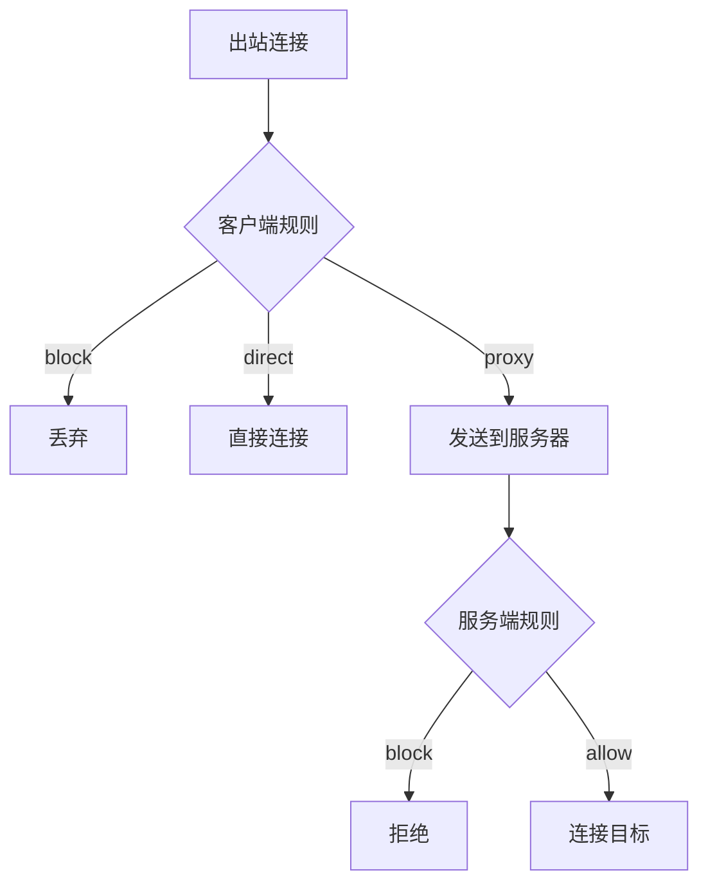

# 路由规则

Prisma 在**客户端**和**服务端**均支持路由规则，让您在每一层控制流量的处理方式。

## 客户端路由

客户端路由规则决定每个出站连接在到达服务器**之前**如何处理：

| 操作 | 行为 |
|------|------|
| `proxy` | 通过 PrismaVeil 隧道发送（默认） |
| `direct` | 直接连接，绕过代理 |
| `block` | 丢弃连接 |

规则按**从上到下**的顺序评估——第一个匹配的规则生效。如果没有规则匹配，流量将被代理。

### 规则类型

| 类型 | 值 | 匹配 |
|------|-----|------|
| `domain` | 精确域名（如 `example.com`） | 精确域名匹配（不区分大小写） |
| `domain-suffix` | 域名后缀（如 `google.com`） | 域名及所有子域名 |
| `domain-keyword` | 关键词（如 `ads`） | 域名包含关键词 |
| `ip-cidr` | CIDR（如 `192.168.0.0/16`） | 范围内的 IPv4 目标 |
| `geoip` | 国家代码（如 `cn`、`private`） | GeoIP 数据库中对应国家的 IP |
| `port` | 端口或范围（如 `80` 或 `8000-9000`） | 目标端口 |
| `all` | — | 所有连接（兜底规则） |

### 客户端配置示例

```toml
[routing]
geoip_path = "/etc/prisma/geoip.dat"

# 私有网络直连
[[routing.rules]]
type = "geoip"
value = "private"
action = "direct"

# 中国 IP 直连
[[routing.rules]]
type = "geoip"
value = "cn"
action = "direct"

# 屏蔽广告
[[routing.rules]]
type = "domain-keyword"
value = "ads"
action = "block"

# 其他流量走代理
[[routing.rules]]
type = "all"
action = "proxy"
```

### GeoIP 集成

要使用 `geoip` 规则，请下载 v2fly GeoIP 数据库：

```bash
# 下载最新的 geoip.dat
curl -L -o /etc/prisma/geoip.dat \
  https://github.com/v2fly/geoip/releases/latest/download/geoip.dat
```

在 `[routing]` 部分设置 `geoip_path`。常用国家代码：

| 代码 | 描述 |
|------|------|
| `cn` | 中国 |
| `us` | 美国 |
| `jp` | 日本 |
| `private` | RFC1918 + 回环 + 链路本地 |

如果未设置 `geoip_path` 或文件无法加载，`geoip` 规则将被静默跳过（永不匹配）。

---

## 服务端路由

服务端路由规则控制客户端可以通过代理连接到哪些目标。它们作为**访问控制层**运行。

| 操作 | 行为 |
|------|------|
| `Allow` | 允许连接 |
| `Block` | 拒绝连接（客户端收到错误信息） |

如果**没有规则匹配**，默认**允许**流量。

### 静态规则（配置文件）

规则可以在服务端配置文件的 `[routing]` 部分定义。这些规则在重启后保持不变，并以较高的基础优先级（10000+）加载，以便动态规则可以覆盖它们。

```toml
[routing]
[[routing.rules]]
type = "ip-cidr"
value = "10.0.0.0/8"
action = "block"

[[routing.rules]]
type = "ip-cidr"
value = "172.16.0.0/12"
action = "block"

[[routing.rules]]
type = "domain-keyword"
value = "torrent"
action = "block"

[[routing.rules]]
type = "all"
action = "direct"
```

服务端规则使用与客户端规则相同的 `type`/`value` 语法。有效的 `action` 值为 `proxy`、`direct` 和 `block` — 与客户端规则相同。

### 动态规则（管理 API）

规则也可以通过[管理 API](/docs/features/management-api) 或[控制台](/docs/features/dashboard)在运行时管理。动态规则的优先级数值较低，优先于静态配置规则。

```bash
# 列出规则
curl -H "Authorization: Bearer $TOKEN" http://127.0.0.1:9090/api/routes

# 创建规则
curl -X POST -H "Authorization: Bearer $TOKEN" \
  -H "Content-Type: application/json" \
  -d '{
    "name": "Block ads",
    "priority": 10,
    "condition": {"type": "DomainMatch", "value": "*.doubleclick.net"},
    "action": "Block",
    "enabled": true
  }' \
  http://127.0.0.1:9090/api/routes

# 删除规则
curl -X DELETE -H "Authorization: Bearer $TOKEN" \
  http://127.0.0.1:9090/api/routes/<rule-id>
```

通过控制台，导航到**路由**页面可视化管理规则。

### 服务端规则条件（管理 API 格式）

| 类型 | 值 | 匹配 |
|------|-----|------|
| `DomainMatch` | Glob 模式（如 `*.google.com`） | 匹配 glob 的域名目标 |
| `DomainExact` | 精确域名（如 `example.com`） | 精确域名匹配（不区分大小写） |
| `IpCidr` | CIDR 表示法（如 `192.168.0.0/16`） | CIDR 范围内的 IPv4 目标 |
| `PortRange` | 两个数字（如 `[80, 443]`） | 端口在范围内的目标 |
| `All` | — | 所有流量 |

---

## 路由工作原理



1. **客户端**首先评估路由规则（域名、IP、GeoIP、端口）
2. 如果操作是 `proxy`，连接将通过 PrismaVeil 隧道发送
3. **服务端**对传入的代理请求评估路由规则
4. 如果服务端允许，将建立到目标的出站连接

## 行为说明

- 域名匹配仅适用于带有域名类型地址的连接。IP 地址不会被反向解析。
- `domain-suffix` 使用 `google.com` 匹配 `google.com`、`www.google.com`、`mail.google.com`，但**不**匹配 `notgoogle.com`。
- `IpCidr` 目前仅支持 IPv4。
- GeoIP 规则需要 v2fly 格式的 `.dat` 文件。数据库在启动时加载一次。
- 静态服务端规则（来自配置文件）在重启后保持不变。动态规则（来自管理 API）在重启后清除。
