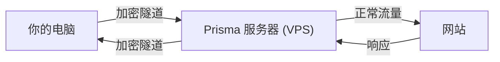
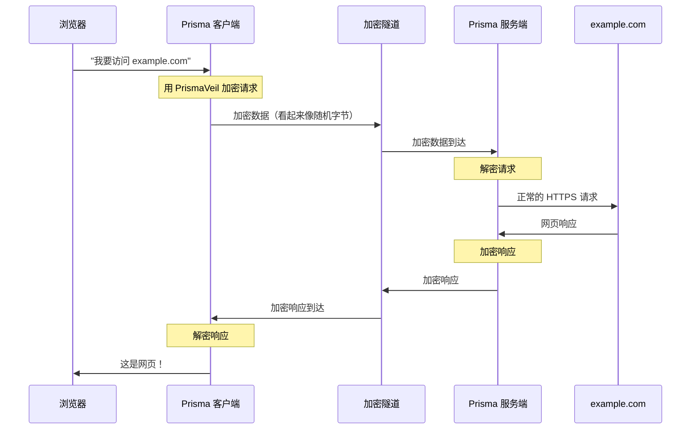
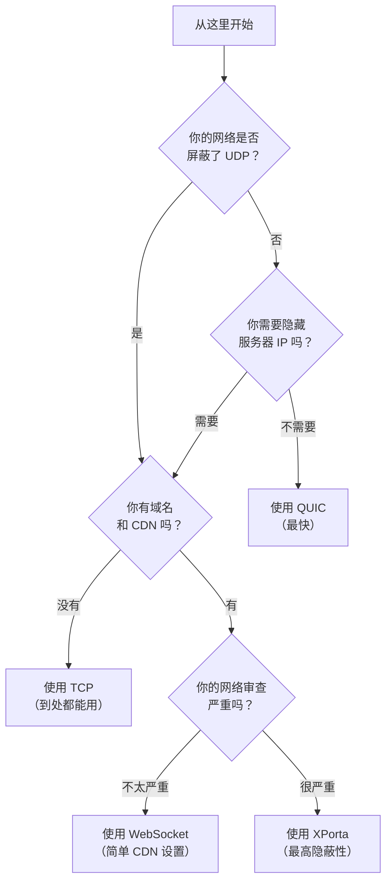

# Prisma 的工作原理

现在你已经了解了互联网的基础知识，让我们看看 Prisma 如何利用这些概念来保护你的隐私。本章解释 Prisma 的架构、当你通过 Prisma 浏览网页时幕后发生了什么，以及它与其他工具的不同之处。

## 全貌：客户端和服务端

Prisma 有两个主要部分：

1. **Prisma 客户端** —— 运行在你的电脑（或手机）上。它接收你的网络流量并将其加密。
2. **Prisma 服务端** —— 运行在远程服务器（你控制的 VPS）上。它接收来自客户端的加密流量，解密后发送到目标网站。



> **类比：** 想象你在一栋有保安检查所有邮件的大楼里。Prisma 从你的办公桌建了一条**秘密地下隧道**通向大楼外面一个你信任的朋友家。你通过隧道传递邮件，你的朋友正常寄出去，保安永远看不到。

## 当你访问网站时发生了什么

让我们精确追踪当你通过 Prisma 在浏览器中打开 `https://example.com` 时发生的每一步。

### 逐步数据流



详细分解：

1. **你输入一个网址**。浏览器想要连接到 `example.com`。
2. **浏览器连接到 Prisma 客户端**而不是直接上网。浏览器认为它在与本地代理（SOCKS5 或 HTTP）通信。
3. **Prisma 客户端加密所有内容**，使用 PrismaVeil 协议。加密后的数据看起来完全像随机噪声。
4. **加密数据通过互联网传输**到 Prisma 服务端。任何监控者（你的运营商、网络管理员、防火墙）看到的只是无意义的加密数据。
5. **Prisma 服务端解密数据**，看到你想访问 `example.com`。
6. **服务端正常获取网站**并得到响应。
7. **响应被加密**并通过隧道发回。
8. **Prisma 客户端解密**并将其交还给浏览器。
9. **你看到网页**，就好像什么都没发生一样。

:::info 你的运营商看到了什么
没有 Prisma 时，你的运营商看到："用户访问了 example.com，浏览了 15 个页面，下载了 2.3 MB。"

有 Prisma 时，你的运营商看到："用户正在与 IP 地址 X.X.X.X 交换加密数据。"他们无法看到你访问了什么网站、下载了什么、或者做了什么。
:::

## PrismaVeil 协议 (Protocol)

PrismaVeil 是 Prisma 的自定义加密 (Encryption) 协议（目前是第 5 版）。它被设计为既**安全**又**不可检测**。

> **类比：** 想象你和朋友有一个特殊的锁箱。首先，你们商定一个共享密码（握手 / Handshake）。然后，你把信放进锁箱。但 Prisma 更进一步——它还把箱子伪装 (Camouflage) 成普通的包裹，这样没人会怀疑里面有秘密。

以下是 PrismaVeil 的功能：

### 1. 安全握手 (Handshake)（1-RTT）

当客户端首次连接到服务端时，它们执行一次**握手 (Handshake)**——交换密钥 (Key) 以建立安全连接。这只需要一个往返（1-RTT），意味着非常快。

```
客户端："这是我的公钥，这是我被授权的证明"
服务端："这是我的公钥。连接建立！"
```

重新连接时，Prisma 可以使用 **0-RTT 恢复**——意味着它可以完全跳过握手，立即开始发送数据。

### 2. 强加密 (Encryption)

每条数据都使用以下两种行业标准算法之一加密：

- **ChaCha20-Poly1305** —— 在没有硬件 AES 的设备上（手机、ARM 处理器）速度快
- **AES-256-GCM** —— 在有硬件 AES 支持的现代桌面 CPU 上速度快

这些算法和银行、政府以及 Signal 等加密通讯应用使用的相同。

### 3. 防重放保护 (Anti-Replay)

Prisma 使用 **1024 位滑动窗口**来防止重放攻击 (Replay Attack)。这意味着攻击者无法录制你的加密流量然后重放来欺骗服务器。

### 4. 不可检测的流量 (Undetectable Traffic)

这是 Prisma 真正出色的地方。许多防火墙 (Firewall) 和 DPI 系统可以通过分析流量模式来检测其他代理工具。Prisma 通过以下方式应对：

- **填充（Padding）** —— 给每条消息添加随机的额外字节，使数据包大小不可预测
- **时间抖动（Timing Jitter）** —— 添加微小的随机延迟，使时间模式无法被分析
- **干扰注入（Chaff Injection）** —— 发送假的（诱饵）数据包来干扰流量分析
- **熵伪装（Entropy Camouflage）** —— 调整加密数据的随机性分布以匹配正常流量

## 传输方式 (Transport)

**传输方式 (Transport)**是 Prisma 在客户端和服务端之间发送加密数据的方法。把它想象成选择如何快递包裹——用汽车、飞机还是快递员。

Prisma 支持六种传输方式。以下是每种的简单解释：

### TCP —— 可靠的公路

TCP 就像用挂号信寄送包裹。每条数据都保证按顺序到达。

- **优点：** 几乎在任何地方都能用，非常可靠
- **缺点：** 比 QUIC 慢，DPI 可能检测到

### QUIC —— 快速高速公路（推荐）

QUIC 是基于 UDP 构建的现代协议。它比 TCP 更快，特别是在不稳定的网络上，因为它可以同时处理多个流并更快地从丢包中恢复。

- **优点：** 最快的传输方式，多路复用 (Multiplexing)，内置 TLS 1.3
- **缺点：** 某些网络会屏蔽 UDP 流量

### WebSocket —— CDN 友好选项

WebSocket 将普通的 HTTP 连接升级为双向隧道。这在 Cloudflare 等 CDN 后面效果很好。

- **优点：** 隐藏在 CDN 后面，服务器 IP 被隐藏
- **缺点：** WebSocket 升级头部可能被高级 DPI 检测到

### gRPC —— 企业伪装

gRPC 是大型科技公司常用的协议。通过 gRPC 隧道传输使流量看起来像正常的企业 API 调用。

- **优点：** 看起来像企业流量，可在 CDN 后面工作
- **缺点：** 不太常见，开销略高

### XHTTP —— 隐蔽流

XHTTP 使用普通的 HTTP/2 POST 请求——不需要 WebSocket 升级。更难被识别。

- **优点：** 没有特殊头部，更难检测
- **缺点：** 长寿命的 HTTP/2 流仍可能被识别

### XPorta —— 最高隐蔽性 (Maximum Stealth)

XPorta 是 Prisma 最先进的传输方式。它将代理数据分割成许多短暂的 REST API 请求，使用 JSON 负载和基于 Cookie 的会话。对于任何观察者来说，它看起来完全像一个正常的网页应用在进行 API 调用。

- **优点：** 几乎不可检测，看起来像正常的网页应用流量
- **缺点：** 延迟 (Latency) 和开销略高，设置更复杂

## 何时使用哪种传输方式

以下是一个简单的决策树：



:::tip 从简单开始
如果不确定，先用 **QUIC**。它是最快的，在大多数网络上都能工作。如果不行，试试 **TCP**。如果需要 CDN 保护，用 **WebSocket**。只有当其他传输方式被屏蔽时才升级到 **XPorta**。
:::

## 为什么 Prisma 是安全的

让我们总结一下是什么让 Prisma 难以被检测和屏蔽：

| 威胁 | Prisma 的应对方式 |
|------|-----------------|
| 运营商读取你的流量 | 所有流量都用 ChaCha20/AES-256 加密 |
| 防火墙屏蔽已知代理端口 | Prisma 可以运行在 443 端口（和 HTTPS 相同） |
| DPI 检测代理协议 | PrismaVeil 流量看起来像随机数据或正常 HTTPS |
| 流量模式分析 | 填充 (Padding)、时间抖动 (Timing Jitter) 和干扰注入 (Chaff Injection) 随机化模式 |
| 主动探测（测试服务器是否是代理） | 伪装 (Camouflage) 模式向非 Prisma 访客展示真实网站 |
| 录制并重放流量 | 防重放窗口阻止重放攻击 (Replay Attack) |
| 服务器 IP 被屏蔽 | CDN 传输（WS、gRPC、XHTTP、XPorta）隐藏服务器 IP |

## Prisma 与其他工具的比较

以下是 Prisma 与一般类别工具的比较（不提及具体工具名称）：

| 特性 | 传统 VPN | 简单代理 | Prisma |
|------|---------|---------|--------|
| 加密 | 是 | 有时 | 是（始终） |
| 难以检测 | 否（容易被识别） | 部分 | 是（多层防检测） |
| 多种传输 | 通常 1-2 种 | 1-2 种 | 6 种传输方式，自动回退 |
| CDN 支持 | 罕见 | 部分 | 完整支持（WebSocket、gRPC、XHTTP、XPorta） |
| 流量整形 (Traffic Shaping) | 否 | 否 | 是（填充、抖动、干扰） |
| 防主动探测 (Active Probing) | 否 | 部分 | 是（伪装、PrismaTLS） |
| 全系统代理（TUN） | 是 | 罕见 | 是 |

## 你学到了什么

在本章中，你学到了：

- Prisma 有两个部分：**客户端**（在你的电脑上）和**服务端**（在远程 VPS 上）
- 当你浏览网页时，流量走向是：浏览器 -> 客户端 -> 加密隧道 -> 服务端 -> 网站
- **PrismaVeil 协议**使用最先进的密码学加密所有内容
- Prisma 有**六种传输方式**（QUIC、TCP、WebSocket、gRPC、XHTTP、XPorta）适用于不同场景
- Prisma 使用**填充 (Padding)、时间抖动 (Timing Jitter)、干扰注入 (Chaff Injection) 和伪装 (Camouflage)**来使流量不可检测
- **QUIC** 是推荐的入门传输方式；**XPorta** 用于最高隐蔽性

## 下一步

现在你了解了 Prisma 的工作原理，让我们准备开始安装。前往[准备工作](./prepare.md)了解你需要什么以及如何准备。
