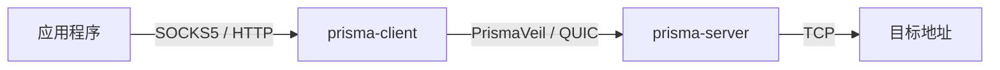
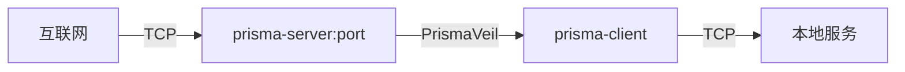
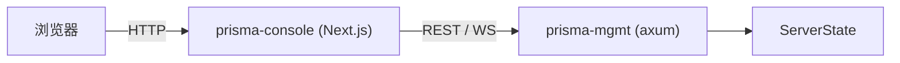

# 简介

Prisma 是一个基于 Rust 构建的新一代加密代理基础设施套件。它实现了 **PrismaVeil v4** 线路协议，融合现代密码学、多种传输方式和高级抗审查特性。

## 功能特性

- **PrismaVeil v4 协议** — 1-RTT 握手、0-RTT 恢复，X25519 + BLAKE3 + ChaCha20-Poly1305 / AES-256-GCM / Transport-Only 加密模式
- **6 种传输方式** — QUIC v2、TCP、WebSocket、gRPC、XHTTP、XPorta（CDN 兼容），支持自动回退
- **双重加密** — 在 QUIC/TLS 内嵌入 PrismaVeil 加密，实现纵深防御
- **现代密码学** — X25519 ECDH、BLAKE3 KDF、ChaCha20-Poly1305 / AES-256-GCM AEAD
- **抗重放保护** — 基于 1024 位滑动窗口
- **TUN 模式** — 通过虚拟网络接口实现系统级代理（Windows/Linux/macOS）
- **GeoIP 路由** — 基于 v2fly geoip.dat 的国家级智能分流，客户端和服务端均支持
- **智能 DNS** — Fake IP、隧道、智能（GeoSite）和直连模式
- **流量整形** — 桶填充、杂音注入、时序抖动、帧合并
- **PrismaTLS** — 主动探测抵抗，通过 padding 信标认证、掩护服务器池、浏览器指纹模拟
- **熵伪装** — 通过字节分布整形实现 DPI 豁免
- **抗审查** — Salamander UDP 混淆、HTTP/3 伪装、端口跳跃、TLS 伪装
- **XPorta 传输** — 新一代 CDN 传输，与普通 REST API 流量无法区分
- **SOCKS5 代理接口**（RFC 1928），兼容各类应用程序
- **HTTP CONNECT 代理** — 适用于浏览器和 HTTP 感知客户端
- **端口转发 / 反向代理** — 通过服务器暴露本地服务（frp 风格）
- **路由规则引擎** — 基于域名/IP/端口/GeoIP 的允许/阻止过滤，客户端和服务端均支持
- **PrismaUDP** — UDP 中继，支持 FEC Reed-Solomon 前向纠错
- **拥塞控制** — BBR、Brutal 和 Adaptive 模式（QUIC）
- **管理 API** — REST + WebSocket API，用于实时监控和控制
- **Web 控制台** — 基于 Next.js + shadcn/ui 的实时控制台，包含指标、客户端管理和日志流
- **按客户端带宽和配额限制** — 上传/下载速率限制和可配置配额
- **连接背压** — 通过可配置的最大连接数限制实现
- **结构化日志**（pretty 或 JSON 格式），基于 `tracing`，支持广播

## 架构

Prisma 由六个 crate 和一个控制台组成：

```
prisma/
├── prisma-core/       # 共享库：加密、协议、配置、DNS、路由、GeoIP
├── prisma-server/     # 代理服务端（TCP、QUIC、CDN 入站）
├── prisma-client/     # 代理客户端（SOCKS5、HTTP CONNECT、TUN 入站）
├── prisma-mgmt/       # 管理 API（REST + WebSocket，基于 axum）
├── prisma-cli/        # CLI 工具：密钥/证书生成、初始化、校验
├── prisma-console/    # Web 控制台（Next.js + shadcn/ui）
├── prisma-docs/       # 文档站点（Docusaurus）
└── scripts/           # 安装脚本和基准测试
```

### 数据流 — 出站代理

作为出站代理使用时，应用程序连接到本地 SOCKS5 或 HTTP CONNECT 接口。客户端使用 PrismaVeil 协议加密流量，并通过 QUIC 或 TCP 发送到服务器，服务器将其转发到目标地址。



### 数据流 — 端口转发（反向代理）

端口转发允许您通过 Prisma 服务器暴露 NAT/防火墙后面的本地服务。外部连接到达服务器后，通过加密隧道中继到客户端的本地服务。



### 数据流 — 管理与控制台

管理 API 提供实时可观测性和控制。控制台通过服务端代理与管理 API 通信，以保护 API 令牌安全。


