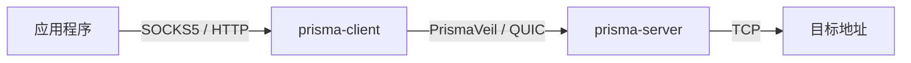
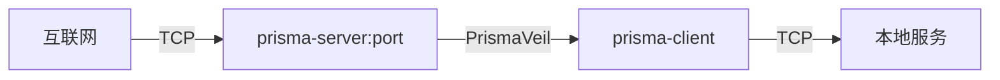
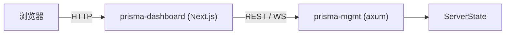

# 简介

Prisma 是一个基于 Rust 构建的新一代加密代理基础设施套件。它实现了 **PrismaVeil** 线路协议，采用现代密码学原语，支持 QUIC 和 TCP 双重传输，并提供本地 SOCKS5 和 HTTP CONNECT 代理接口。

## 功能特性

- **双重传输** — QUIC（主要）+ TCP 备用，适用于 UDP 被阻断的网络
- **双重加密** — 在 QUIC/TLS 内嵌入 PrismaVeil 加密，实现纵深防御
- **现代密码学** — X25519 ECDH、BLAKE3 KDF、ChaCha20-Poly1305 / AES-256-GCM AEAD
- **HMAC-SHA256 身份认证**，采用常量时间比较
- **抗重放保护** — 基于 1024 位滑动窗口
- **随机填充** — 握手消息添加随机填充以抵抗流量指纹识别
- **伪装（抗主动探测）** — TLS-on-TCP 包裹、诱饵回落、可配置 ALPN
- **XPorta 传输** — 新一代 CDN 传输，与普通 REST API 流量无法区分
- **SOCKS5 代理接口**（RFC 1928），兼容各类应用程序
- **HTTP CONNECT 代理** — 适用于浏览器和 HTTP 感知客户端
- **端口转发 / 反向代理** — 通过服务器暴露本地服务（frp 风格）
- **路由规则引擎** — 基于域名/IP/端口的允许/阻止过滤
- **管理 API** — REST + WebSocket API，用于实时监控和控制
- **Web 仪表盘** — 基于 Next.js 的实时仪表盘，包含指标、客户端管理和日志流
- **DNS 缓存**，支持异步解析
- **连接背压** — 通过可配置的最大连接数限制实现
- **结构化日志**（pretty 或 JSON 格式），基于 `tracing`，支持广播

## 架构

Prisma 由六个 crate 和一个仪表盘组成：

```
prisma/
├── prisma-core/       # 共享库：加密、协议、配置、类型、状态
├── prisma-server/     # 代理服务端（TCP + QUIC 入站）
├── prisma-client/     # 代理客户端（SOCKS5 + HTTP CONNECT 入站）
├── prisma-mgmt/       # 管理 API（REST + WebSocket，基于 axum）
├── prisma-cli/        # CLI 工具，包含密钥/证书生成
├── prisma-dashboard/  # Web 仪表盘（Next.js + shadcn/ui）
└── prisma-docs/       # 文档站点（Docusaurus）
```

### 数据流 — 出站代理

作为出站代理使用时，应用程序连接到本地 SOCKS5 或 HTTP CONNECT 接口。客户端使用 PrismaVeil 协议加密流量，并通过 QUIC 或 TCP 发送到服务器，服务器将其转发到目标地址。



### 数据流 — 端口转发（反向代理）

端口转发允许您通过 Prisma 服务器暴露 NAT/防火墙后面的本地服务。外部连接到达服务器后，通过加密隧道中继到客户端的本地服务。



### 数据流 — 管理与仪表盘

管理 API 提供实时可观测性和控制。仪表盘通过服务端代理与管理 API 通信，以保护 API 令牌安全。


