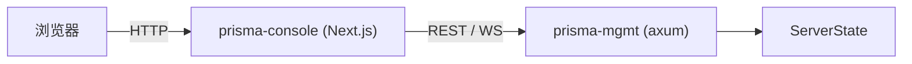

# 简介

Prisma 是一个基于 Rust 构建的新一代加密代理基础设施套件。它实现了 **PrismaVeil v5** 线路协议——融合现代密码学（包括后量子混合密钥交换）、九种传输方式、多协议入站支持（VMess/VLESS/Shadowsocks/Trojan）和高级抗审查特性。**1.4.0** 版本新增了 v5 AAD 中继激活、Shadowsocks 加密规范合规、VMess 时序加固、多协议兼容、客户端权限、传输回退、守护进程模式、订阅管理、热重载配置、缓冲池等生产级特性。

## 功能特性

### 协议与密码学

- **PrismaVeil v5 协议** — 1-RTT 握手 (Handshake)、0-RTT 会话恢复，X25519 + BLAKE3 + ChaCha20-Poly1305 / AES-256-GCM / Transport-Only 加密模式，头部认证加密（AAD）、连接迁移、增强型 KDF。协议 v4 已在 1.4.0 中移除。
- **后量子混合密钥交换** — ML-KEM-768 (Kyber) 与 X25519 组合，实现抗量子计算机的前向安全密钥协商。双方均支持时自动协商。
- **现代密码学** — X25519 ECDH、BLAKE3 KDF、ChaCha20-Poly1305 / AES-256-GCM AEAD
- **抗重放保护** — 基于 1024 位滑动窗口 nonce 位图
- **会话票据密钥轮换** — 自动密钥环轮换，可配置过期密钥保留时间以实现优雅的前向保密

### 传输方式

- **9 种传输方式**，支持自动回退：

| 传输方式 | 描述 |
|---------|------|
| **TCP** | TLS 加密的 TCP，具备 PrismaTLS 主动探测抵抗能力 |
| **QUIC** | QUIC v2 (RFC 9369)，支持 Salamander UDP 混淆和 BBR/Brutal/Adaptive 拥塞控制 |
| **WebSocket** | 基于 TLS 的 WebSocket，CDN 兼容 |
| **gRPC** | 基于 HTTP/2 的 gRPC 流式传输，CDN 兼容 |
| **XHTTP** | 分块 HTTP 传输，适用于限制性 CDN 环境 |
| **XPorta** | 新一代 CDN 传输，与普通 REST API 流量无法区分 |
| **ShadowTLS v3** | 模拟真实 TLS 握手到掩护服务器，实现协议级隐蔽 |
| **SSH** | 通过标准 SSH 连接隧道传输，兼容性极强 |
| **WireGuard** | 使用 WireGuard 协议实现内核级转发性能 |

### 代理与路由

- **SOCKS5 代理接口**（RFC 1928），兼容各类应用程序
- **HTTP CONNECT 代理** — 适用于浏览器和 HTTP 感知客户端
- **TUN 模式** — 通过虚拟网络接口实现系统级代理（Windows/Linux/macOS）
- **端口转发 / 反向代理** — 通过服务器暴露本地服务（frp 风格）
- **路由规则引擎** — 基于域名/IP/端口/GeoIP 的允许/阻止过滤、ACL 文件、规则提供者
- **代理组** — 负载均衡、故障切换和基于 URL 测试的自动选择
- **GeoIP 路由** — 基于 v2fly geoip.dat 的国家级智能分流，客户端和服务端均支持
- **智能 DNS** — Fake IP、隧道、智能（GeoSite）和直连模式

### 订阅与导入

- **订阅管理** — 添加、更新、列出和测试订阅，支持自动更新
- **多协议导入** — 从 SS、VMess、Trojan 和 VLESS URI 导入服务器配置（单个 URI、文件或订阅 URL）
- **延迟测试** — 测量到订阅服务器或手动指定服务器列表的 RTT

### 抗审查

- **流量整形** — 桶填充、杂音注入、时序抖动、帧合并
- **PrismaTLS** — 主动探测抵抗，通过 padding 信标认证、掩护服务器池、浏览器指纹模拟
- **熵伪装** — 通过字节分布整形实现 DPI 豁免
- **Salamander UDP 混淆**、HTTP/3 伪装、端口跳跃、TLS 伪装

### 性能

- **io_uring 支持** — Linux 5.6+ 上的零拷贝 I/O，实现最大中继吞吐量
- **缓冲池** — 预分配、可复用的帧缓冲区，消除热路径上的分配开销
- **XMUX** — CDN 传输的连接复用和连接池
- **连接池** — 跨 SOCKS5/HTTP 请求复用传输连接
- **零拷贝中继** — `FrameEncoder` 使用预分配缓冲区和就地加解密
- **PrismaUDP** — UDP 中继，支持 FEC Reed-Solomon 前向纠错
- **拥塞控制** — BBR、Brutal 和 Adaptive 模式（QUIC）

### 运维与管理

- **守护进程 CLI 模式** — 将 server、client 和 console 作为后台守护进程运行，支持 PID 文件、日志文件和 `stop`/`status` 子命令
- **热重载配置** — SIGHUP 信号处理和自动配置文件监控，无需重启即可实时更新配置
- **优雅关闭** — 停止前排空活跃连接
- **配置文件监控** — 自动检测配置文件变更并触发热重载
- **管理 API** — REST + WebSocket API，用于实时监控和控制
- **Web 控制台** — 基于 Next.js + shadcn/ui 的实时控制台，包含指标、客户端管理和日志流
- **按客户端带宽和配额限制** — 上传/下载速率限制和可配置配额
- **按客户端指标** — 追踪每个授权客户端的带宽、连接数和使用量
- **连接背压** — 通过可配置的最大连接数限制实现
- **结构化日志**（pretty 或 JSON 格式），基于 `tracing`，支持广播

### 平台与集成

- **移动端 FFI** — C ABI 共享库（`prisma-ffi`），用于 GUI 和移动应用集成（Android/iOS）
- **跨平台** — Linux、macOS、Windows、FreeBSD，具有平台特定的 TUN、系统代理和自动更新支持

## 架构

Prisma 由六个 crate、一个控制台和一个文档站点组成：

```
prisma/
├── prisma-core/       # 共享库：加密、协议（PrismaVeil v5）、配置、DNS、路由、
│                      #   GeoIP、带宽、缓冲池、流量整形、导入、类型
├── prisma-server/     # 代理服务端：TCP/QUIC/WS/gRPC/XHTTP/XPorta/ShadowTLS/SSH/WireGuard
│                      #   监听器、中继（标准 + io_uring）、认证、伪装、热重载
├── prisma-client/     # 代理客户端：SOCKS5/HTTP CONNECT/TUN 入站、传输选择、
│                      #   连接池、代理组、DNS 解析器、指标
├── prisma-mgmt/       # 管理 API：基于 axum 的 REST + WebSocket，认证中间件，
│                      #   客户端/连接/指标/带宽/配置/路由处理器
├── prisma-cli/        # CLI 工具（clap 4）：server/client/console 运行器（支持守护进程模式）、
│                      #   gen-key、gen-cert、init、validate、import、subscription、latency-test、
│                      #   管理命令、Shell 补全
├── prisma-ffi/        # C FFI 共享库：生命周期、配置文件、QR 导入/导出、
│                      #   系统代理、自动更新、订阅导入、统计轮询
├── prisma-console/    # Web 控制台（Next.js + shadcn/ui）
├── prisma-docs/       # 文档站点（Docusaurus）
└── scripts/           # 安装脚本和基准测试
```

### 数据流 — 出站代理

作为出站代理使用时，应用程序连接到本地 SOCKS5 或 HTTP CONNECT 接口。客户端使用 PrismaVeil v5 协议加密流量，并通过九种传输方式之一发送到服务器，服务器将其转发到目标地址。


### 数据流 — 端口转发（反向代理）

端口转发允许您通过 Prisma 服务器暴露 NAT/防火墙后面的本地服务。外部连接到达服务器后，通过加密隧道中继到客户端的本地服务。


### 数据流 — 管理与控制台

管理 API 提供实时可观测性和控制。控制台通过服务端代理与管理 API 通信，以保护 API 令牌安全。



## 1.4.0 新特性

- **v5 AAD 中继激活** — 头部认证加密已在所有中继热路径中激活（1.3.0 中为死代码）
- **Shadowsocks 加密规范合规** — EVP_BytesToKey 使用 MD5，子密钥派生使用 HKDF-SHA1，符合标准规范
- **VMess 时序加固** — `verify_auth_id` 常量时间完整遍历，防止时序侧信道泄漏
- **服务端中继缓冲池** — 消除中继热路径上的每会话堆分配
- **多协议入站** — 通过 `[[inbounds]]` 配置支持 VMess/VLESS/Shadowsocks/Trojan 兼容
- **客户端权限** — 细粒度的按客户端访问控制和权限
- **传输回退** — 有序传输回退，自动故障转移
- **后量子混合密钥交换** — ML-KEM-768 + X25519
- **守护进程模式** — 用于 server、client 和 console（`-d` 标志，配合 `stop`/`status` 子命令）
- **订阅管理** CLI 命令（`add`、`update`、`list`、`test`）
- **多协议导入** — `prisma import --uri/--file/--url`
- **延迟测试** — `prisma latency-test`
- **热重载配置** — SIGHUP 和自动文件监控
- **会话票据密钥轮换** — 自动密钥环，实现前向保密
- **缓冲池** — 服务端和客户端预分配中继缓冲区
- **优雅关闭** — SIGTERM 时排空连接
- **按客户端指标**追踪
- **配置文件监控** — 文件变更时自动重载
- **`--verbose/-v` 全局标志** — 调试输出
- **管理 API 新增** — `/api/inbounds`、`/api/clients/:id/permissions`、`/api/clients/:id/kick`、`/api/clients/:id/block`
